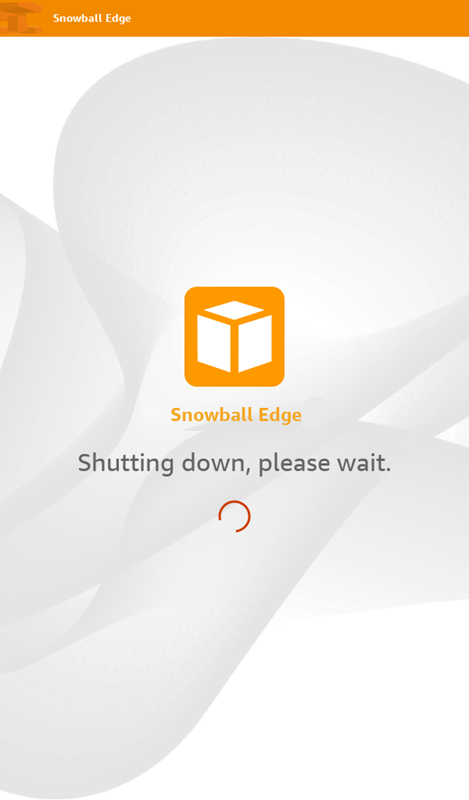
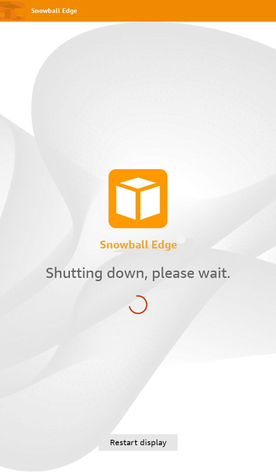

# Powering off the device

When you've finished using the device, prepare it to return to AWS.

When all communication with the device has ended, turn it off by pressing the
power button located above the LCD screen. It takes about 20 seconds for the device to
shut down. While the device is shutting down, the LCD screen displays a message indicating the device is shutting down.

###### Note

If the LCD screen is displaying the shutdown message when the device is not actually being shut down, press the **Restart display** button on the screen to return the screen to normal operation.

