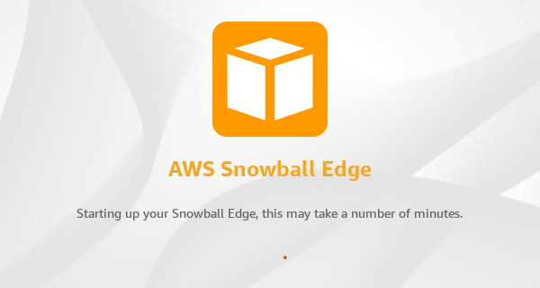
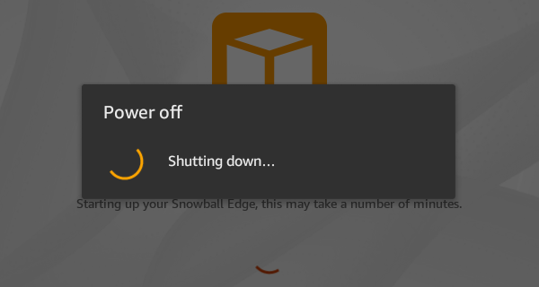

Effective November 7, 2025, AWS Snowball Edge will only be available to existing customers. If you would like to use AWS Snowball Edge,
sign up prior to that date. New customers should explore [AWS DataSync](https://aws.amazon.com/datasync/ "https://aws.amazon.com/datasync/") for online transfers, [AWS Data Transfer Terminal](https://aws.amazon.com/data-transfer-terminal/ "https://aws.amazon.com/data-transfer-terminal/") for
secure physical transfers, or AWS Partner solutions. For edge computing, explore [AWS Outposts](https://aws.amazon.com/outposts/ "https://aws.amazon.com/outposts/").

# Troubleshooting boot‐up problems with Snowball Edge

The following information can help you troubleshoot certain issues you might have with booting‐up your Snowball Edge.

- Allow 10 minutes for a device to boot up. Avoid moving or using the device during this time.
- Ensure both ends of the cable supplying power are connected securely.
- Replace the cable supplying power with another cable that you know is good.
- Connect the cable supplying power to another source of power that you know is good.

## Troubleshooting problems with the LCD display of a Snowball Edge device during boot-up

Sometimes, after powering on a Snowball Edge device, the LCD display may encounter a problem.

- The LCD screen is black and does not display an image after you connect the Snowball Edge device to power and press the power button above the LCD screen.
- The LCD screen does not advance past the **Setting you your Snowball Edge, this may take a number of minutes.** message and the network configuration screen does not appear.

###### Action to take when the LCD screen is black after pressing the power button

1. Ensure the Snowball Edge device is connected to a power source and the power source is providing power.
2. Leave the device connected to the power source for 1 to 2 hours. Ensure the doors on the front and back of the device are open.
3. Return to the device and the LCD screen will be ready to use.

###### Action to take when the Snowball Edge does not advance to the network configuration screen

1. Let the screen stay on the **Setting you your Snowball Edge, this may take a number of minutes.** message for 10 minutes.
2. On the screen, choose the **Restart display** button. The **Shutting down…** message will appear, then the **Setting you your Snowball Edge, this may take a number of minutes.** message will appear and the device will start normally.

If the LCD screen does not advance past the **Setting you your Snowball Edge, this may take a number of minutes.** message after using the **Restart display** button, use the following procedure.

###### Action to take

1. Above the LCD screen, press the power button to power off the device.
2. Disconnect all cables from the device.
3. Leave the device powered off and disconnected for 20 minutes.
4. Connect the power and network cables.
5. Above the LCD screen, press the power button to power on the device.

If the problem persists, contact AWS Support to return the device and receive a new Snowball Edge device.

## Troubleshooting problems with the E Ink display during boot-up

Sometimes, after powering on a Snowball Edge device, the E Ink display on top of the device may display the following message:

`The appliance has timed out`

This message does not indicate a problem with the device. Use it normally and when you turn it off to return it to AWS, the return shipping information will appear as expected.
