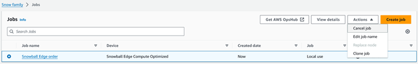
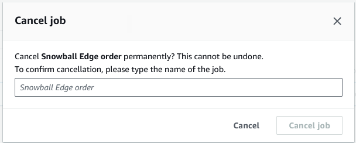

Effective November 7, 2025, AWS Snowball Edge will only be available to existing customers. If you would like to use AWS Snowball Edge,
sign up prior to that date. New customers should explore [AWS DataSync](https://aws.amazon.com/datasync/ "https://aws.amazon.com/datasync/") for online transfers, [AWS Data Transfer Terminal](https://aws.amazon.com/data-transfer-terminal/ "https://aws.amazon.com/data-transfer-terminal/") for
secure physical transfers, or AWS Partner solutions. For edge computing, explore [AWS Outposts](https://aws.amazon.com/outposts/ "https://aws.amazon.com/outposts/").

# Cancelling a job to order a Snowball Edge

After creating a job to order a Snowball Edge device, you can cancel the job through the AWS Snow Family Management Console. If you cancel the job, you won't receive the device you ordered. You can only cancel the job while the job status is _Job created_. After the job progresses past this status, you cannot cancel the job. For more information, see [Job Statuses](jobstatuses.md "jobstatuses.md").

When you cancel a job while it's in the _Job created_ status, you will not be charged for the Snowball Edge device. Billing only begins after the device has been prepared and shipped to you.

1. Log in to the [AWS Snow Family Management Console](https://console.aws.amazon.com/snowfamily/home "https://console.aws.amazon.com/snowfamily/home").
2. Choose the job to cancel.
3. Choose **Actions**. From the menu that appears, choose **Cancel job**.

 4. The **Cancel job** window appears. To confirm cancelling the job, enter the `job name` and choose **Cancel job**. In the list of jobs, **Cancelled** appears in the **Status** column.

