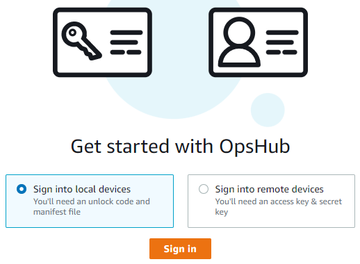
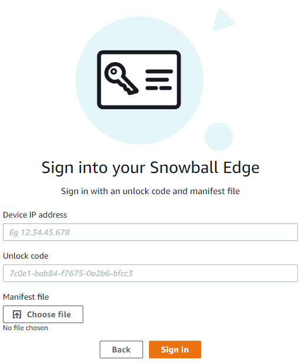
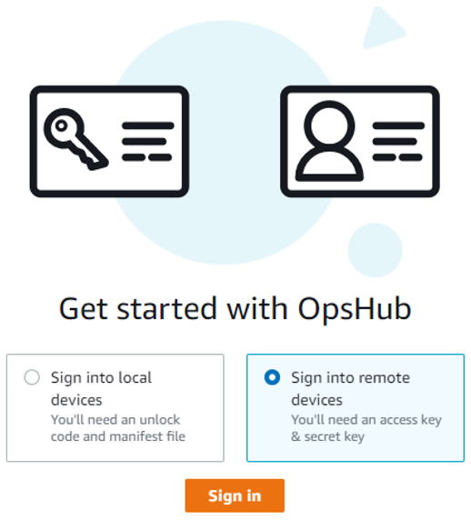
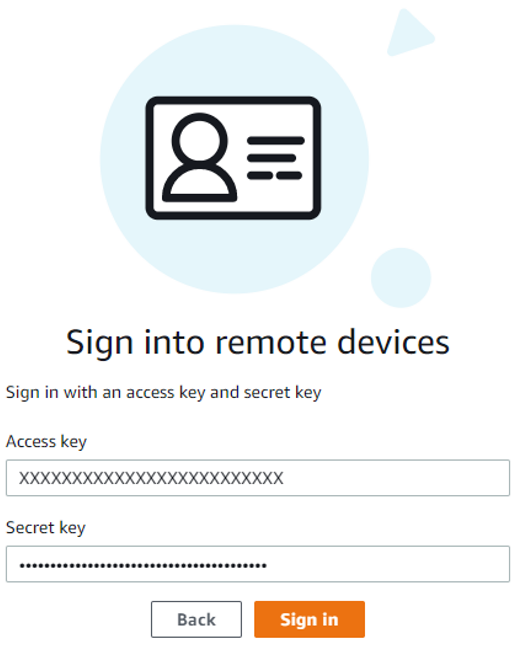
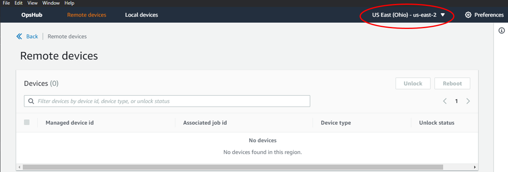
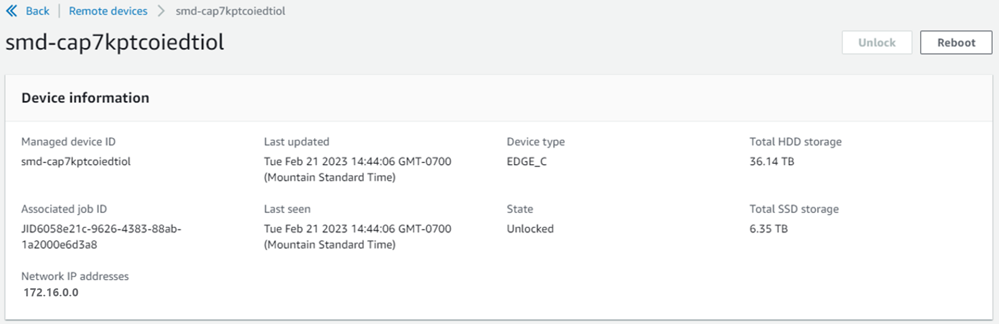

AWS Snowball Edge is no longer available to new customers. New customers should explore [AWS DataSync](https://aws.amazon.com/datasync/ "https://aws.amazon.com/datasync/") for online transfers, [AWS Data Transfer Terminal](https://aws.amazon.com/data-transfer-terminal/ "https://aws.amazon.com/data-transfer-terminal/") for
secure physical transfers, or AWS Partner solutions. For edge computing, explore [AWS Outposts](https://aws.amazon.com/outposts/ "https://aws.amazon.com/outposts/").

# Unlocking a Snowball Edge device with AWS OpsHub

When your device arrives at your site, the first step is to connect and unlock it.
AWS OpsHub lets you sign in, unlock, and manage devices using the following
methods:

- **Locally** – To sign in to a device
  locally, you must power on the device and connect it to your local network. Then
  provide an unlock code and a manifest file.
- **Remotely** – To sign in to a device
  remotely, you must power on the device and make sure that it can connect to
  ``device-order-region`.amazonaws.com`
  through your network. Then provide the AWS Identity and Access Management (IAM) credentials (access key
  and secret key) for the AWS account that is linked to your device.

For information on enabling remote management and creating an associated
account, see [Activating Snowball Edge Device Management on a Snowball Edge](aws-sdm.md#enable-sdm "aws-sdm.md#enable-sdm").

###### Topics

- [Unlocking a Snowball Edge device locally with AWS OpsHub](#connect-unlock-local "#connect-unlock-local")
- [Unlocking a Snowball Edge device remotely with AWS OpsHub](#connect-unlock-remote "#connect-unlock-remote")

## Unlocking a Snowball Edge device locally with AWS OpsHub

This
video shows how to unlock a Snowball Edge device locally using
AWS OpsHub.

###### To connect and unlock your device locally

1. Open the flap on your device, locate the power cord, and connect it to a
   power source.
2. Connect the device to your network using a network cable (typically an Ethernet
   RJ45 cable), then open the front panel and power on the device.
3. Open the AWS OpsHub application. If you are a first-time user, you are
   prompted to choose a language. Then choose **Next**.
4. On the **Get started with OpsHub** page, choose
   **Sign in to local devices**, and then choose
   **Sign in**.

 5. On the **Sign in to local devices** page, choose your
Snowball Edge type, and then choose **Sign in**. 6. On the **Sign in** page, enter the **Device IP
address** and **Unlock code**. To select the
device manifest, choose **Choose file**, and then choose
**Sign in**.

 7. (Optional) Save your device's credentials as a
_profile_. Name the profile and choose **Save
profile name**. For more information about profiles, see [Managing profiles with AWS OpsHub](aws-opshub.md#manage-profile "aws-opshub.md#manage-profile"). 8. On the **Local devices** tab, choose a device to see its
details, such as the network interfaces and AWS services that
are running on the device. You can also see details for clusters from this
tab, or manage your devices just as you do with the AWS Command Line Interface (AWS CLI). For
more information, see [Managing AWS services on the Snowball Edge with AWS OpsHub](manage-services.md "manage-services.md").

For devices that have AWS Snowball Edge Device Management installed, you can choose **Enable
remote management** to turn on the feature. For more
information, see [Using AWS Snowball Edge Device Management to manage Snowball Edge](aws-sdm.md "aws-sdm.md").

## Unlocking a Snowball Edge device remotely with AWS OpsHub

To unlock a Snowball Edge not

###### To connect and unlock your device remotely

1. Open the flap on your device, locate the power cord, and connect it to a
   power source.
2. Connect the device to your network using an Ethernet cable (typically an
   RJ45 cable), then open the front panel and power on the device.

###### Note

To be unlocked remotely, your device must be able to connect to
``device-order-region`.amazonaws.com`. 3. Open the AWS OpsHub application. If you are a first-time user, you are
prompted to choose a language. Then choose **Next**. 4. On the **Get started with OpsHub** page, choose
**Sign into remote devices**, and then choose
**Sign in**.

 5. On the **Sign in to remote devices** page, enter the
AWS Identity and Access Management (IAM) credentials (access key and secret key) for the
AWS account that is linked to your device, and then choose **Sign
in**.

 6. At the top of the **Remote devices** tab, choose the region of the Snow device to unlock remotely.

 7. On the **Remote devices** tab, choose your device to see
its details, such as its state and network interfaces. Then choose
**Unlock** to unlock the device.

From the remote device's details page, you can also reboot your devices
and manage them just as you do with the AWS Command Line Interface (AWS CLI). To view remote
devices in different AWS Regions, choose the current Region on the
navigation bar, and then choose the Region that you want to view. For more
information, see [Managing AWS services on the Snowball Edge with AWS OpsHub](manage-services.md "manage-services.md").
