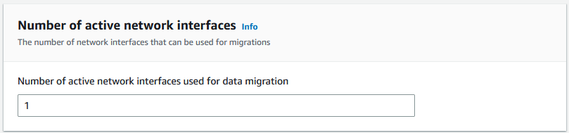
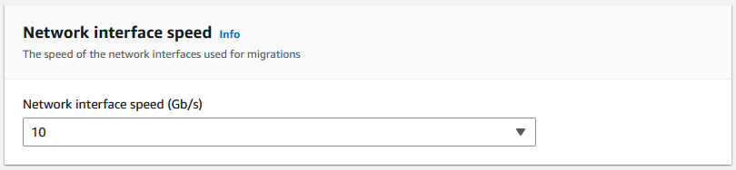
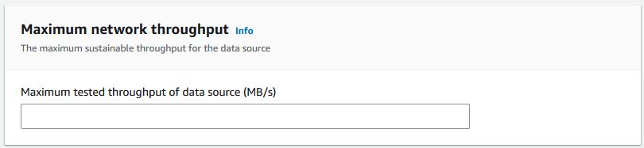
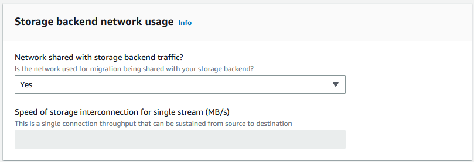
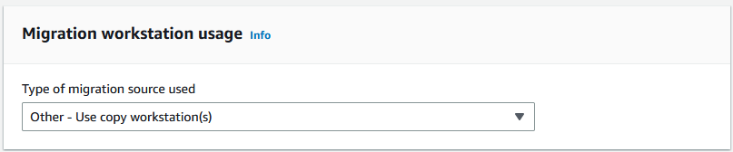
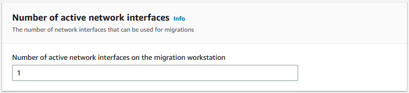
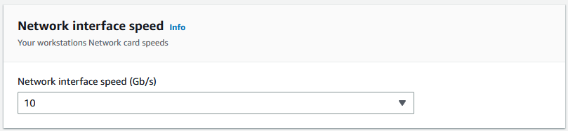
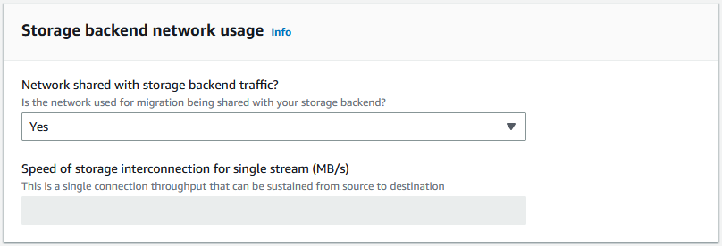
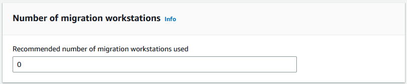
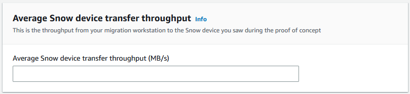

AWS Snowball Edge is no longer available to new customers. New customers should explore [AWS DataSync](https://aws.amazon.com/datasync/ "https://aws.amazon.com/datasync/") for online transfers, [AWS Data Transfer Terminal](https://aws.amazon.com/data-transfer-terminal/ "https://aws.amazon.com/data-transfer-terminal/") for
secure physical transfers, or AWS Partner solutions. For edge computing, explore [AWS Outposts](https://aws.amazon.com/outposts/ "https://aws.amazon.com/outposts/").

# Creating a large data migration

plan with Snowball Edge

The Snowball Edge large data migration plan feature enables you to plan, track,
monitor, and manage large data migrations from 500 TB to multiple petabytes using
multiple Snowball Edge service products.

Use the large data migration plan feature to collect information about data migration
goals, such as the size of the data to move to AWS and the number of Snowball Edge
needed to migrate the data simultaneously. Use the plan to create a projected schedule
for your data migration project and the recommended job ordering schedule to meet your
goals.

###### Note

Currently, the data migration plan is available for import jobs larger than 500 TB.

###### Topics

- [Step 1: Choose your migration details](#migration-details "#migration-details")
- [Step 2: Choose your shipping, security, and notification preferences](#shipping-security-notifications "#shipping-security-notifications")
- [Step 3: Review and create your plan](#review-create-plan "#review-create-plan")

## Step 1: Choose your migration details

###### Note

A large data migration plan is available for data migrations larger than 500 TB. Create job
orders individually on Snowball Edge for your data transfer projects that are
less than 500 TB. For more information, see [Creating a job to order a Snowball Edge device](create-job-common.md "create-job-common.md") in this guide.

1. Sign in to the [AWS Snow Family Management Console](https://console.aws.amazon.com/snowfamily/home "https://console.aws.amazon.com/snowfamily/home"). If this is your first time using the AWS Snow Family Management Console in
   this AWS Region, you see the Snowball Edge page. Otherwise, you see the
   list of existing jobs.
2. If this is your first data migration plan, choose **Create your large data
   migration plan** from the main page. Otherwise, choose
   **Large data migration plan**. Choose **Create
   data migration plan** to open the plan creation wizard.
3. In **Name your data migration plan**, provide a **Data
   migration plan name**. The plan name can have up to 64
   characters. Valid characters are A-Z, a-z, 0-9, and . - (hyphen). A plan
   name must not start with `aws:`.
4. For **Total data to be migrated to AWS**, enter the amount of data
   that you want to migrate to AWS.
5. In **Snow devices**, choose a Snowball Edge device.

###### Note

Supported device options might vary based on device availability in certain
AWS Regions. 6. For **Concurrent devices**, enter the number of Snowball Edge to
which you can simultaneously copy data at your location. If you're not
sure, skip to the next section for information about using the concurrent
devices estimator wizard to determine this. 7. Choose **Next**.

### Using the concurrent devices estimator

wizard

The concurrent devices estimator wizard helps you to determine the number of
concurrent devices that you can use during large data migrations.

Prerequisites:

- You performed a proof of concept to test your data transfer methodology and measured
  performance with a Snowball Edge device in your environment.
- You know about the network and connection to back-end storage.

#### Step 1: Enter data source information

First, determine the maximum theoretical throughput for copying data from your
storage source.

1. For **Total data to be migrated**, enter the amount of data that you plan to
   migrate.

For **Unit**, choose the unit of measurement (GB or TB) for the
amount of data you plan to migrate. 2. For **Number of active network interfaces**, enter the number of active
network interfaces that you have available for data migration from
the storage source.

 3. For **Network interface speed**, choose the speed of the network interface
for the storage source. Network speeds are in Gb/s.

 4. For **Maximum network throughput**, enter the maximum tested network
throughput to your storage source that you determined during the
proof of concept. Throughput is in MB/S.

 5. For **Storage backend network usage**, indicate whether the storage source
shares a network with the back-end storage.

    * Choose **Yes** if the network is not shared. You don't need to enter
     the speed of the storage interconnection for a single
     stream.
    * Choose **No** if the network is shared. Enter the speed of the storage interconnection for a single stream in MB/s.

Based on your choice, the wizard updates the **Max migration throughput for
the data source (MB/s)** value at the bottom of the
page.

 6. Choose **Next**.

#### Step 2: Input migration workstation parameters

You can connect yourSnowball Edge directly to your storage source (a Microsoft Windows
server, for example). You might choose instead to connect yourSnowball Edge
to one or more workstations to copy data from the storage source.

1. For **Migration workstation usage**, indicate your workstation usage
   choice.
   - Choose **None - Use data source directly** to transfer data directly from a
     data source without using a workstation, and then choose
     **Next**.
   - Choose **Other - Use copy workstation(s)** to use one or more workstations
     for transferring data.

 2. For **Number of active network interfaces**, enter the number of ports to use
for data migration.

 3. For **Network interface speed**, choose the speed in Gb/s of the network
interfaces.

 4. In **Storage backend network usage**, indicate whether the network that the
workstations are on is shared with back-end storage.

    * Choose **Yes** if it's shared.
    * Choose **No** if it's not shared. Enter the speed of the storage
     interconnection for a single stream in MB/s.

Based on your input, the wizard displays a recommendation in **Number of
migration workstations**. You can manually change the number if
you disagree with the recommendation. This number will appear in
**Concurrent devices** in the large data migration
plan.

#### Step 3: Input average transfer throughput of Snowball Edge

1. In the **Average Snow device transfer throughput** field, enter the transfer
   throughput in MB/s that you saw during your proof of concept.

Based on your average throughput, the wizard updates the **Recommended
number of concurrent Snow devices** and
**Maximum number of concurrent devices** in the
migration plan details. 2. Choose **Use this number** to continue and return to choosing your migration details. Choose **Next** and go the next step ([Step 2: Choose your shipping, security, and notification preferences](#shipping-security-notifications "#shipping-security-notifications")).

###### Note

You can use up to 5 concurrent Snow devices.

## Step 2: Choose your shipping, security, and notification preferences

1. In the **Shipping Address** section, choose an existing
   address or create a new one.
   - ###### Note

   The country in the address must match the destination country
   for the device, and must be valid for that country.

2. In **Choose service access type**, do one of the following:
   - Allow Snowball Edge to create a new service-linked role for you with all of the necessary
     permissions to publish CloudWatch metrics and Amazon SNS notifications for your
     Snowball Edge jobs.
   - Add an existing service role that has the necessary permissions. For an example of
     how to set up this role, see [Example 4:
     Expected Role Permissions and Trust Policy](access-policy-examples-for-sdk-cli.md#expected-role-permissions-and-trust-policy "access-policy-examples-for-sdk-cli.md#expected-role-permissions-and-trust-policy").

3. For **Send notifications**, choose whether to send notifications.
   Note that if you choose **Do not send notification about data
   migration plans**, you won't receive notifications from this
   plan, but you will still receive job notifications.
4. For **Set notifications**,
   - choose **Use an existing SNS topic**
   - or **Create a new SNS topic**.

## Step 3: Review and create your plan

1. Review your information in **Plan details** and
   **Shipping, security, and notification preferences**,
   and edit if necessary.
2. Choose **Create data migration plan** to create the
   plan.
