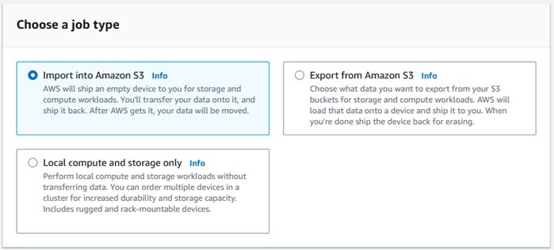
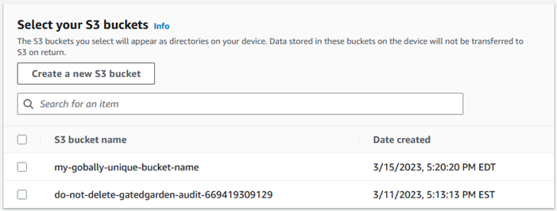
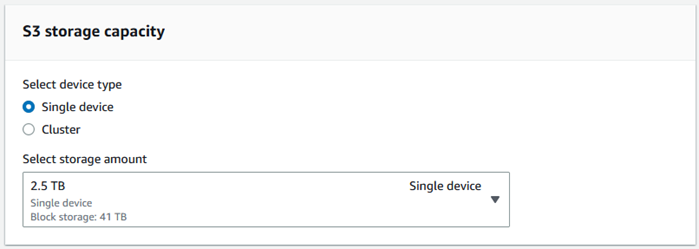
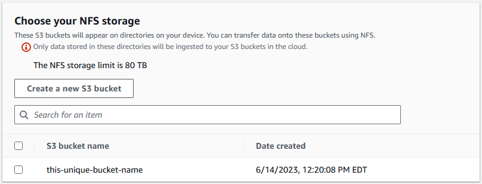

Effective November 7, 2025, AWS Snowball Edge will only be available to existing customers. If you would like to use AWS Snowball Edge,
sign up prior to that date. New customers should explore [AWS DataSync](https://aws.amazon.com/datasync/ "https://aws.amazon.com/datasync/") for online transfers, [AWS Data Transfer Terminal](https://aws.amazon.com/data-transfer-terminal/ "https://aws.amazon.com/data-transfer-terminal/") for
secure physical transfers, or AWS Partner solutions. For edge computing, explore [AWS Outposts](https://aws.amazon.com/outposts/ "https://aws.amazon.com/outposts/").

# Creating a job to order a Snowball Edge device

To order a Snowball Edge device, you create a job to order a Snowball Edge device in the AWS Snow Family Management Console. A _job_ is a term that AWS uses to describe the lifecycle of the use of a Snowball Edge device by a customer. A job begins when you order a device, continues when AWS prepares the device and ships it to you and you use it, and completes after AWS receives and processes the device after you return it. Jobs are categorized by type: export, import, and local compute and storage. For more information, see [Understanding AWS Snowball Edge jobs](jobs.md "jobs.md").

After you create the job to order a device, you can use the AWS Snow Family Management Console to view the job status and monitor the progress of the device you ordered as AWS prepares the device to ship to you and after it is returned. For more information, see [Job Statuses](jobstatuses.md "jobstatuses.md"). After the device is returned and processed by AWS, you can access a job completion report and logs through the AWS Snow Family Management Console. For more information, see [Getting your job completion report and logs on the console](report.md "report.md").

You can also create and manage jobs using the job management API. For more information,
see the [AWS Snowball Edge API Reference](../api-reference/api-reference.md "../api-reference/api-reference.md").

###### Topics

- [Choosing a job type](#plan-job "#plan-job")
- [Choosing your compute and storage
  options](#compute-storage "#compute-storage")
- [Choosing your features and options](#import-job-details "#import-job-details")
- [Choosing security, shipping, and
  notification preferences](#security-shipping-notification "#security-shipping-notification")
- [Reviewing the job summary and create your job](#review-job "#review-job")

## Choosing a job type

The first step in creating a job is to determine the type of job that you need and to
start planning it using the AWS Snow Family Management Console.

###### To choose your job type

1. Sign in to the AWS Management Console, and open the [AWS Snow Family Management Console](https://console.aws.amazon.com/snowfamily/home "https://console.aws.amazon.com/snowfamily/home"). If this is your first
   time creating a job in this AWS Region, you will see the
   **AWS Snowball Edge** page. Otherwise you
   will see the list of existing jobs.
2. If this is your first job to order a device, choose **Order an AWS Snowball Edge
   device**. If you're expecting multiple jobs to migrate over 500 TB
   of data, choose **Create your large data migration plan greater than 500
   TB**. Otherwise, choose **Create Job** in the left
   navigation bar. Choose **Next step** to open the **Plan
   your job** page.
3. In the **Job name** section, provide a name for your job in
   the **Job name** box.
4. Depending on your need, choose one of the following job types:
   - **Import into Amazon S3** – Choose this option to
     have AWS ship an empty Snowball Edge device to you. You connect the device
     to your local network and run the Snowball Edge client. You copy data
     onto the device using NFS share or the S3 adapter, ship it back to AWS, and
     your data is uploaded to AWS.
   - **Export from Amazon S3** – Choose this option to
     export data from your Amazon S3 bucket to your device. AWS
     loads your data on the device and ships it to you. You connect the
     device to your local network and run the Snowball Edge client. You copy
     data from your device to your servers. When you are done, ship the
     device to AWS, and your data is erased from the
     device.
   - **Local compute and storage only** – Perform
     compute and storage workloads on the device without transferring data.

 5. Choose **Next** to continue.

## Choosing your compute and storage

options

Choose the hardware specifications for your Snowball Edge device, which of your
Amazon EC2-compatible instances to include on it, how data will be stored, and pricing.

###### To choose your device's compute and storage options

1. In the **Snow devices** section, choose the Snowball Edge
   device to order.

###### Note

Some Snowball Edge might not be available depending on the AWS Region you are ordering from and the job type you chose. 2. In the **Choose your pricing option** section, from the **Choose your pricing option** menu, choose the type of pricing to apply to this job. If you choose 1 year or 3 year commit upfront pricing, in **Auto-renew**, choose **On** to automatically renew the pricing when the current period ends or **Off** to not automatically renew the pricing when the current period ends. For more information about long-term pricing options for Snowball Edge devices, see [Long-term pricing for Snowball Edge devices](pricing.md "pricing.md") in this guide. For device pricing for your AWS Region, see [AWS Snowball Edge Pricing](https://aws.amazon.com/snowball/pricing "https://aws.amazon.com/snowball/pricing"). 3. In the **Select the storage type** section, make a choice according to your need:

    * **S3 Adapter**: Use the S3 adapter to transfer data programmatically to and from Snowball Edge using Amazon S3 REST API actions.
    * **Amazon S3 compatible storage**: Use Amazon S3 compatible storage to deploy S3 compatible durable, scalable object storage on single Snowball Edge device or in a multi-device cluster.
    * **NFS based data transfer**: Use Network File System (NFS) based data transfer to drag and drop files from your computer into Amazon S3 buckets on Snowball Edge.

###### Warning

NFS based data transfer doesn't support the S3 adapter. If you proceed
with NFS based data transfer, you must mount the NFS share to transfer
objects. Using the AWS CLI to transfer objects will fail.

See [Using NFS
for Offline Data Transfer](shared-using-nfs.md "shared-using-nfs.md") in the AWS Snowball Edge Edge Developer Guide for more information.

###### Note

Storage type options available depend on the job type and Snow device you chose. 4. If you selected _S3 Adapter_ as the storage type or if you selected a device that supports block storage, do the following to select one or more S3 buckets to include on the device:

    1. In the **Select your S3 buckets** section, do one or more of the following to select one or more S3 buckets:

    	1. Choose the S3 bucket that you want to use in the **S3 bucket name** list.
    	2. In the **Search for an item** field, enter all or part a bucket name to filter the list of available buckets
    	 on your entry, then choose the bucket.
    	3. Choose the **Create a new S3 bucket** to create a new S3 bucket. The new bucket name appears in the **Bucket name** list. Choose it.
    You can include one or more
     S3 buckets. These buckets appear on your device as local S3
     buckets.

    

5. If you selected _Amazon S3 compatible storage_ as the storage type, in the **S3 storage capacity** section, do the following:
   1. Select to use Amazon S3 compatible storage on Snowball Edge on a single device or a cluster of devices. See [Using a AWS Snowball Edge cluster](UsingCluster.md "UsingCluster.md") in this guide.
   2. Select the amount of device storage to use for Amazon S3 compatible storage on Snowball Edge.###### Note

When using Amazon S3 compatible storage on Snowball Edge, you can manage and create Amazon S3 buckets after you receive the device, so you don't need to choose them while ordering. See [Amazon S3 compatible storage on Snowball Edge](s3compatible-on-snow.md "s3compatible-on-snow.md") in this guide.

 6. If you selected _NFS based data transfer_ as the storage type, in the **Select your S3 buckets** section, do one or more of the following to select one or more S3 buckets:

    1. Choose the S3 bucket that you want to use in the **S3 bucket name** list.
    2. In the **Search for an item** field, enter all or part a bucket name to filter the list of available buckets
     on your entry, then choose the bucket.
    3. Choose the **Create a new S3 bucket** to create a new S3 bucket. The new bucket name appears in the **Bucket name** list. Choose it.
    4. After choosing S3 buckets to use with NFS data transfer, also choose an S3 bucket to use as block storage for AMIs. See the steps to choose an [S3](#s3-adapter "#s3-adapter") bucket.You can include one or more

S3 buckets. These buckets appear on your device as local S3
buckets.

 7. In the **Compute using EC2-compatible instances - _optional_** section,
choose Amazon EC2-compatible AMIs from your account to include on the device. Or, in the search
field, enter all or part the name of an AMI to filter the list of available AMIs
on your entry, then choose the AMI.

To learn about configuring an AMI for secure shell (SSH), see [Configuring an AMI for a Snowball Edge and SSH](ssh-ec2-edge.md "ssh-ec2-edge.md")

For more information, see [Adding an AMI When Ordering Your Device](using-ami.md#add-ami-order "using-ami.md#add-ami-order") in this guide.

This feature incurs additional charges. For more information, see [AWS Snowball Edge
Pricing.](https://aws.amazon.com/snowball/pricing/ "https://aws.amazon.com/snowball/pricing/") 8. Choose the **Next** button.

## Choosing your features and options

Choose the features and options to include in your AWS Snowball Edge device job,
including Amazon EKS Anywhere for Snow, an AWS IoT Greengrass instance, and remote device management capability.

###### To choose your features and options

1. In the **Amazon EKS Anywhere on AWS Snow** section, to include Amazon EKS Anywhere on AWS Snow, select **Include Amazon EKS Anywhere on Snow** and then do the following.

###### Note

We recommend that you create your Kubernetes cluster with the latest available Kubernetes version supported by Amazon EKS Anywhere. For more information, see [Amazon EKS-Anywhere Versioning](https://anywhere.eks.amazonaws.com/docs/concepts/support-versions/ "https://anywhere.eks.amazonaws.com/docs/concepts/support-versions/"). If your application requires a specific version of Kubernetes, use any version of Kubernetes offered in standard or extended support by Amazon EKS. Consider the release and support dates of Kubernetes versions when planning the lifecycle of your deployment. This will help you avoid the potential loss of support for the version of Kubernetes you intend to use. For more information, see [Amazon EKS Kubernetes release calendar](../../../eks/latest/userguide/kubernetes-versions.md#kubernetes-release-calendar "../../../eks/latest/userguide/kubernetes-versions.md#kubernetes-release-calendar").

    1. In the **Build your own AMI** section, choose the AMIs you have built for Amazon EKS Anywhere. See [Actions to complete before ordering a Snowball Edge
     device for Amazon EKS Anywhere on AWS Snow](eksa-gettingstarted.md "eksa-gettingstarted.md").
    2. In the **High availability** section, to operate Amazon EKS Anywhere clusters across multiple Snowball Edge devices, choose the number of devices to include in your order.

2. In the **AWS IoT Greengrass on Snow** section, to include a validated
   AMI for IoT workloads, select **Install AWS IoT Greengrass validated AMI on my
   Snow device**.
3. To enable remote management of your Snowball Edge device by AWS OpsHub or
   Snowball Edge Client, select **Manage your Snow device remotely with
   AWS OpsHub or Snowball Edge Client**.
4. Select the **Next** button.

## Choosing security, shipping, and

notification preferences

###### Topics

- [Choose security preferences for the Snowball Edge](#set-security "#set-security")
- [Choose your shipping preferences for receiving and returning the Snowball Edge](#shipping-preferences "#shipping-preferences")
- [Choose preferences for notifications about the Snowball Edge job](#setup-notifications "#setup-notifications")

### Choose security preferences for the Snowball Edge

Setting security adds the permissions and encryption settings for your AWS
Snowball Edge job to help protect your data while in transit.

###### Topics

###### To set security for your job

1. In the **Encryption** section, choose the
   **KMS key** that you want to use.
   - If you want to use the default AWS Key Management Service (AWS KMS) key, choose
     **AWS/importexport (default)**. This is the
     default key that protects your import and export jobs when no other
     key is defined.
   - If you want to provide your own AWS KMS key, choose **Enter
     a key ARN**, provide the Amazon Resource Name (ARN) in
     the **key ARN** box, and choose **Use this
     KMS key**. The key ARN will be added to the
     list.

2. In the **Choose service access type** section, do one of the
   following:
   - Choose **Snow console will create and use a service-linked
     role to access AWS resources on your behalf.** to grant
     AWS Snowball Edge permissions to use Amazon S3 and Amazon Simple Notification Service (Amazon SNS) on
     your behalf. The role grants AWS Security Token Service (AWS
     STS) AssumeRole trust to the Snow service
   - Choose **Add an existing service role to use**,
     to specify the **Role ARN** that you want, or you
     can use the default role.

3. Choose **Next**.

### Choose your shipping preferences for receiving and returning the Snowball Edge

Receiving and returning a Snowball Edge device involves shipping the device back
and forth, so it's important that you provide accurate shipping information.

###### To provide shipping details

1. In the **Shipping Address** section, choose an existing
   address or add a new address.
   - If you choose **Use recent address**, the
     addresses on file are displayed. Carefully choose the address that
     you want from the list.
   - If you choose **Add a new address**, provide the
     requested address information. The AWS Snow Family Management Console saves your new
     shipping information.

   ###### Note

   The country that you provide in the address must match the
   destination country for the device and must be valid for that
   country.

2. In the **Shipping speed** section, choose a shipping
   speed for the job. The shipping speed doesn’t indicate how soon you can expect to receive the device from
   the day you created the job. Rather, it indicates the time that the device is in transit
   between AWS and your shipping address.

It may take up to 4 weeks to provision and prepare the device for your job before it is shipped. This timeline should be factored into your project plan to ensure a seamless transition.

The shipping speeds you can choose are:

    * **One-Day Shipping (1 business day)**
    * **Two-Day Shipping (2 business days)**

### Choose preferences for notifications about the Snowball Edge job

Notifications update you on the latest status of your AWS Snowball Edge jobs.
You create an SNS topic and receive emails from Amazon Simple Notification Service (Amazon SNS) as your job status
changes.

###### To set up notifications

- In the **Set notifications** section, do one of the
  following:
  - If you want to use an existing SNS topic, choose **Use an
    existing SNS topic**, and choose the topic Amazon
    Resource Name (ARN) from the list.
  - If you want to create a new SNS topic, choose **Create a
    new SNS topic**. Enter a name for your topic and
    provide an email address.

  ###### Note

  Jobs to order Snow devices created in the US West (N. California) and US West (Oregon) regions are routed through US East (N. Virginia) region. Because of this, service calls like Amazon SNS are also directed through US East (N. Virginia). We recommend creating any new SNS topics in the US East (N. Virginia) region for the best experience.

Notifications will be about one of the following states of your job:

- Job created
- Preparing device
- Preparing shipment
- In transit to you
- Delivered to you
- In transit to AWS
- At sorting facility
- At AWS
- Importing
- Completed
- Canceled

For more information about job status change notifications and encrypted SNS topics, see [Notifications for Snowball Edge](notifications.md "notifications.md") in this guide.

Select the **Next**.

## Reviewing the job summary and create your job

After you provide all the necessary information for your AWS Snowball Edge job,
review the job and create it. After you create the job, AWS will begin preparing the Snowball Edge for shipment to you.

Jobs are subject to export control laws in specific countries and might
require an export license. US export and re-export laws also apply. Diversion
from the country and US laws and regulations is prohibited.

######

1. In the **Job summary** page, review all the sections
   before you create the job. If you want to make changes, choose
   **Edit** for the appropriate section, and edit the
   information.
2. When you are done reviewing and editing, choose **Create
   job**.

###### Note

After you create a job to order a Snowball Edge device, you can cancel it while it is in the _Job created_ state
without incurring any charges. For more information, see [Cancelling a job through the AWS Snow Family Management Console](cancel-job-order.md "cancel-job-order.md").

After your job is created, you can see the status of the job in the **Job
status** section. For detailed information about job statuses, see [Job Statuses](jobstatuses.md "jobstatuses.md").
