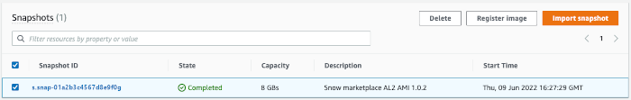

AWS Snowball Edge is no longer available to new customers. New customers should explore [AWS DataSync](https://aws.amazon.com/datasync/ "https://aws.amazon.com/datasync/") for online transfers, [AWS Data Transfer Terminal](https://aws.amazon.com/data-transfer-terminal/ "https://aws.amazon.com/data-transfer-terminal/") for
secure physical transfers, or AWS Partner solutions. For edge computing, explore [AWS Outposts](https://aws.amazon.com/outposts/ "https://aws.amazon.com/outposts/").

# Deleting a snapshot from a Snowball Edge with AWS OpsHub

If you no longer need a snapshot, you can delete it from your
device. The image file in Amazon S3 is a .raw file that is imported to your device as
a snapshot. If the snapshot that you are deleting is used by an image, it can't
be deleted. After import is completed, you can also delete the .raw file that
you uploaded to Amazon S3 on your device.

###### To delete a snapshot

1. Open the AWS OpsHub application.
2. In the **Start computing** section on the dashboard,
   choose **Get started**. Or, choose the
   **Services** menu at the top, and then choose
   **Compute (EC2)** to open the
   **Compute** page. All your compute resources appear
   in the **Resources** section.
3. Choose the **Snapshot** tab to see all snapshots that
   have been imported. You can filter by snapshot ID or state of the
   snapshot to find specific snapshots.
4. Choose the snapshot that you want to delete, and choose **Delete**. You can
   choose multiple snapshots.

 5. In the **Delete snapshot confirmation** box, choose **Delete
snapshot**. If your deletion is successful, the snapshot is
removed from the list under the **Snapshots** tab.
