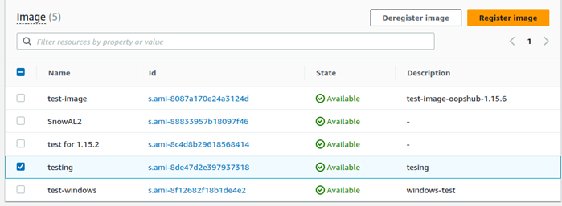
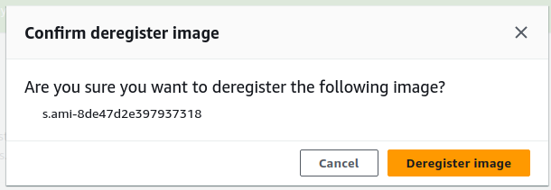

AWS Snowball Edge is no longer available to new customers. New customers should explore [AWS DataSync](https://aws.amazon.com/datasync/ "https://aws.amazon.com/datasync/") for online transfers, [AWS Data Transfer Terminal](https://aws.amazon.com/data-transfer-terminal/ "https://aws.amazon.com/data-transfer-terminal/") for
secure physical transfers, or AWS Partner solutions. For edge computing, explore [AWS Outposts](https://aws.amazon.com/outposts/ "https://aws.amazon.com/outposts/").

# Deregistering an AMI on a Snowball Edge with AWS OpsHub

###### To deregister an AMI

1. Open the AWS OpsHub application.
2. In the **Start computing** section on the dashboard,
   choose **Get started**. Or, choose the
   **Services** menu at the top, and then choose
   **Compute (EC2)** to open the
   **Compute** page. All your compute resources appear
   in the **Resources** section.
3. Choose the **Images** tab. All your images are
   listed. You can filter the images by name, ID, or state to find a
   specific image.
4. Choose the image that you want to deregister, and choose
   **Deregister**.

 5. In the **Confirm deregister image** window, confirm the image ID and choose **Deregister
image**. When deregistering is successful, the image is
removed from the list of images.

