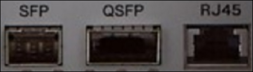
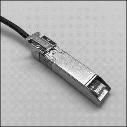
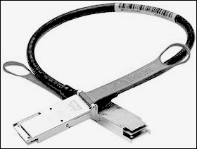

AWS Snowball Edge is no longer available to new customers. New customers should explore [AWS DataSync](https://aws.amazon.com/datasync/ "https://aws.amazon.com/datasync/") for online transfers, [AWS Data Transfer Terminal](https://aws.amazon.com/data-transfer-terminal/ "https://aws.amazon.com/data-transfer-terminal/") for
secure physical transfers, or AWS Partner solutions. For edge computing, explore [AWS Outposts](https://aws.amazon.com/outposts/ "https://aws.amazon.com/outposts/").

# AWS Snowball Edge device hardware information

All Snowball Edge devices share physical characteristics, like size and weight, but contain different types of hardware to suit their intended use. Devices designed for data transfer are configured with more storage and devices designed for compute are configured with more virtual CPUs and memory. This section provides information about the physical characteristics of Snowball Edge devices, and their compute and storage specifications.

###### Topics

- [Snowball Edge device configurations](#device-options "#device-options")
- [AWS Snowball Edge device specifications](#sbe-specifications "#sbe-specifications")
- [Network hardware supported by Snowball Edge](#sbe-network-hardware "#sbe-network-hardware")

## Snowball Edge device configurations

Snowball Edge devices have the following options for device configurations:

- **Snowball Edge storage-optimized 210 TB**
  – This Snowball Edge device option has 210 TB of usable storage
  capacity.
- **Snowball Edge compute-optimized** –
  This Snowball Edge device (with AMD EPYC Gen2) has the most compute
  functionality, with up to 104 vCPUs, 416 GB of memory, and 28 TB of dedicated
  NVMe SSD for compute instances.

###### Note

When using Amazon S3 compatible storage on Snowball Edge on these devices, usable storage will vary. See [Using Amazon S3 compatible storage on Snowball Edge on Snowball Edge](s3compatible-on-snow.md "s3compatible-on-snow.md") for storage capacity with Amazon S3 compatible storage on Snowball Edge.

For more information about the compute functionality of these three options, see [Using Amazon EC2-compatible compute instances on Snowball Edge](using-ec2.md "using-ec2.md"). Job creation and disk capacity
differences in terabytes are described [here](../api-reference/API_CreateJob.md "../api-reference/API_CreateJob.md").

###### Note

When we refer to _Snowball Edge devices_, this
includes all optional variants of the device. When information applies to one or
more specific optional configurations, we mention this
explicitly.

The following table summarizes the differences between the various device options. For
hardware specification information, see [AWS Snowball Edge device specifications](#sbe-specifications "#sbe-specifications").

|                            | Snowball Edge storage-optimized 210 TB                                                                                                               | Snowball Edge compute-optimized with AMD EPYC Gen2 and NVME                                                                                          |
| -------------------------- | ---------------------------------------------------------------------------------------------------------------------------------------------------- | ---------------------------------------------------------------------------------------------------------------------------------------------------- |
| CPU                        | AMD Rome, 64 cores, 2 GHz                                                                                                                            | AMD Rome, 64 cores, 2 GHz                                                                                                                            |
| vCPUs                      | 104                                                                                                                                                  | 104                                                                                                                                                  |
| Usable memory              | 416 GB                                                                                                                                               | 416 GB                                                                                                                                               |
| Security card              | Yes                                                                                                                                                  | Yes                                                                                                                                                  |
| SSD                        | 210 TB NVMe                                                                                                                                          | 28 TB NVMe                                                                                                                                           |
| Usable HDD                 | Not applicable                                                                                                                                       | Not applicable                                                                                                                                       |
| Network interfaces         | • 2x 10 Gbit – RJ45 (one usable) • 1x 25 Gbit – SFP28 • 1x 100 Gbit – QSFP28                                                                   | • 2x 10 Gbit – RJ45 (one usable) • 1x 25 Gbit – SFP28 • 1x 100 Gbit – QSFP28                                                                   |
| Physical security features | • Hidden magnetic screws • Intrusion switches • NFC tags • Anti-tamper inserts • Android app for tamper detection • Conformal coating | • Hidden magnetic screws • Intrusion switches • NFC tags • Anti-tamper inserts • Android app for tamper detection • Conformal coating |

## AWS Snowball Edge device specifications

In this section, you can find specifications for AWS Snowball Edge device types and the
hardware.

###### Topics

- [Snowball Edge Storage Optimized 210 TB specifications](#specs-storage-optimized-v35s "#specs-storage-optimized-v35s")
- [Snowball Edge Compute Optimized device
  specifications](#sbe-compute-specifications "#sbe-compute-specifications")

### Snowball Edge Storage Optimized 210 TB specifications

The following table contains hardware specifications for Snowball Edge Storage Optimized
210 TB devices.

| Item                                        | Snowball Edge Storage Optimized 210 TB specifications                                                                                                                                                                                    |
| ------------------------------------------- | ---------------------------------------------------------------------------------------------------------------------------------------------------------------------------------------------------------------------------------------- |
| **Compute and memory specifications**    |                                                                                                                                                                                                                                          |
| CPU                                         | 104 vCPUs                                                                                                                                                                                                                                |
| RAM                                         | 416 GB                                                                                                                                                                                                                                   |
| **Storage specifications**               |                                                                                                                                                                                                                                          |
| NVME storage capacity                       | 210 TB usable (for object and NFS data transfer)                                                                                                                                                                                         |
| SSD storage capacity                        | None                                                                                                                                                                                                                                     |
| **Power supply specifications**          |                                                                                                                                                                                                                                          |
| Power                                       | In AWS Regions in the US: NEMA 5–15p 100–220 volts. In all AWS Regions, a power cable is included                                                                                                                                     |
| Power consumption                           | 304 watts for an average use case, though the power supply is rated for 1200 watts                                                                                                                                                    |
| Voltage                                     | 100 – 240V AC                                                                                                                                                                                                                            |
| Frequency                                   | 47/63 Hz                                                                                                                                                                                                                                 |
| Data and network connections                | 2x 10 Gbit – RJ45 (one usable) 1x 25 Gbit – SFP28 1x 100 Gbit – QSFP28                                                                                                                                                             |
| Cables                                      | Each AWS Snowball Edge device ships country-specific power cables. No other cables or optics are provided. For more information, see [Network hardware supported by Snowball Edge](#sbe-network-hardware "#sbe-network-hardware"). |
| Thermal requirements                        | AWS Snowball Edge devices are designed for office operations, and are ideal for data center operations.                                                                                                                               |
| Decibel output                              | On average, an AWS Snowball Edge device produces 68 decibels of sound, typically quieter than a vacuum cleaner or living-room music.                                                                                               |
| **Dimensions and weight specifications** |                                                                                                                                                                                                                                          |
| Weight                                      | 49.7 pounds (22.54 Kg)                                                                                                                                                                                                                   |
| Height                                      | 15.5 inches (394 mm)                                                                                                                                                                                                                     |
| Width                                       | 10.6 inches (265 mm)                                                                                                                                                                                                                     |
| Length                                      | 28.3 inches (718 mm)                                                                                                                                                                                                                     |
| **Environment specifications**           |                                                                                                                                                                                                                                          |
| Vibration                                   | Non-operational use equivalent to ASTM D4169 Truck level I 0.73 GRMS                                                                                                                                                                  |
| Shock                                       | Operational use equivalent to 70G (MIL-S-901) Non-operational use equivalent to 50G (ISTA-3A)                                                                                                                                         |
| Altitude                                    | Operational use equivalent to 0–3,000 meters (0–10,000 feet) Non-operational use equivalent to 0–12,000 meters                                                                                                                     |
| Temperature range                           | 0–30°C (operational)                                                                                                                                                                                                                     |

### Snowball Edge Compute Optimized device

specifications

| Item                                        | Snowball Edge Compute Optimized specifications                                                                                                                                                                                           |
| ------------------------------------------- | ---------------------------------------------------------------------------------------------------------------------------------------------------------------------------------------------------------------------------------------- |
| **Compute and memory specifications**    |                                                                                                                                                                                                                                          |
| CPU                                         | 104 vCPUs                                                                                                                                                                                                                                |
| RAM                                         | 512 GB RAM (Up to 416 GB RAM • Customer usable)                                                                                                                                                                                       |
| **Storage specifications**               |                                                                                                                                                                                                                                          |
| SSD storage capacity                        | 28 TB NVMe SSD                                                                                                                                                                                                                           |
| **Power supply specifications**          |                                                                                                                                                                                                                                          |
| Power                                       | In AWS Regions in the US: NEMA 5–15p 100–220 volts. In all AWS Regions, a power cable is included                                                                                                                                     |
| Power consumption                           | 304 watts for an average use case, though the power supply is rated for 1200 watts                                                                                                                                                    |
| Voltage                                     | 100 – 240V AC                                                                                                                                                                                                                            |
| Frequency                                   | 47/63 Hz                                                                                                                                                                                                                                 |
| Data and network connections                | 2x 10 Gbit – RJ45 (one usable) 1x 25 Gbit – SFP28 1x 100 Gbit – QSFP28                                                                                                                                                             |
| Cables                                      | Each AWS Snowball Edge device ships country-specific power cables. No other cables or optics are provided. For more information, see [Network hardware supported by Snowball Edge](#sbe-network-hardware "#sbe-network-hardware"). |
| Thermal requirements                        | AWS Snowball Edge devices are designed for office operations, and are ideal for data center operations.                                                                                                                               |
| Decibel output                              | On average, an AWS Snowball Edge device produces 68 decibels of sound, typically quieter than a vacuum cleaner or living-room music.                                                                                               |
| **Dimensions and weight specifications** |                                                                                                                                                                                                                                          |
| Weight                                      | 49.7 pounds (22.54 Kg)                                                                                                                                                                                                                   |
| Height                                      | 15.5 inches (394 mm)                                                                                                                                                                                                                     |
| Width                                       | 10.6 inches (265 mm)                                                                                                                                                                                                                     |
| Length                                      | 28.3 inches (718 mm)                                                                                                                                                                                                                     |
| **Environment specifications**           |                                                                                                                                                                                                                                          |
| Vibration                                   | Non-operational use equivalent to ASTM D4169 Truck level I 0.73 GRMS                                                                                                                                                                  |
| Shock                                       | Operational use equivalent to 70G (MIL-S-901) Non-operational use equivalent to 50G (ISTA-3A)                                                                                                                                         |
| Altitude                                    | Operational use equivalent to 0–3,000 meters (0–10,000 feet) Non-operational use equivalent to 0–12,000 meters                                                                                                                     |
| Temperature range                           | 0–45°C (operational)                                                                                                                                                                                                                     |

## Network hardware supported by Snowball Edge

To use the AWS Snowball Edge device, you need your own network cables. For RJ45 cables, there are
no specific recommendations. SFP+ and QSFP+ cables and modules from Mellanox and Finisar
have been verified to be compatible with the device.

After you open the back panel of the AWS Snowball Edge device, you see the network ports similar
to the ports shown in the following screenshot.

Only one network interface on the AWS Snowball Edge device can be used at a time. Hence use any
one of the ports to support the following network hardware.

###### SFP

This port provides a 10G/25G SFP28 interface compatible with SFP28 and SFP+
transceiver modules and direct-attach copper (DAC) cables. You need to provide your
own transceivers or DAC cables.

- For 10G operation, you can use any SFP+ option. Examples include:
  - 10Gbase-LR (single mode fiber) transceiver
  - 10Gbase-SR (multi-mode fiber) transceiver
  - SFP+ DAC cable

- For 25G operation, you can use any SFP28 option. Examples include:
  - 25Gbase-LR (single mode fiber) transceiver
  - 25Gbase-SR (multi-mode fiber) transceiver
  - SFP28 DAC cable

###### QSFP

This port provides a 40G QSFP+ interface on storage optimized devices and a
40/50/100G QSFP+ interface on compute optimized devices. Both are compatible with
QSFP+ transceiver modules and DAC cables. You need to provide your own transceivers
or DAC cables. Examples include the following:

- 40Gbase-LR4 (single mode fiber) transceiver
- 40Gbase-SR4 (multi-mode fiber) transceiver
- QSFP+ DAC

###### RJ45

This port provides 1Gbase-TX/10Gbase-TX operation. It is connected via UTP cable
terminated with a RJ45 connector. Snowball Edge devices have two RJ45
ports. Choose one port to use.

1G operation is indicated by a blinking amber light. 1G operation is not recommended
for large-scale data transfers to the Snowball Edge device, as it dramatically
increases the time it takes to transfer data.

10G operation is indicated by a blinking green light. It requires a Cat6A UTP cable
with a maximum operating distance of 180 feet (55 meters).

