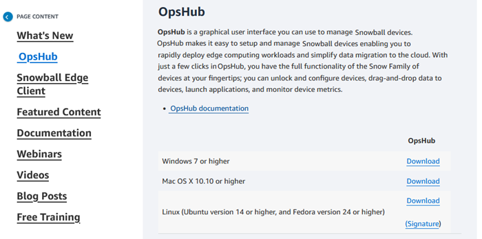

Effective November 7, 2025, AWS Snowball Edge will only be available to existing customers. If you would like to use AWS Snowball Edge,
sign up prior to that date. New customers should explore [AWS DataSync](https://aws.amazon.com/datasync/ "https://aws.amazon.com/datasync/") for online transfers, [AWS Data Transfer Terminal](https://aws.amazon.com/data-transfer-terminal/ "https://aws.amazon.com/data-transfer-terminal/") for
secure physical transfers, or AWS Partner solutions. For edge computing, explore [AWS Outposts](https://aws.amazon.com/outposts/ "https://aws.amazon.com/outposts/").

# Downloading AWS OpsHub for Snowball Edge

###### To download AWS OpsHub

1. Navigate to the [AWS Snowball resources website](https://aws.amazon.com/snowball/resources/ "https://aws.amazon.com/snowball/resources/").

 2. In the **AWS OpsHub** section, choose **Download** for your operating system, and follow the installation steps.
