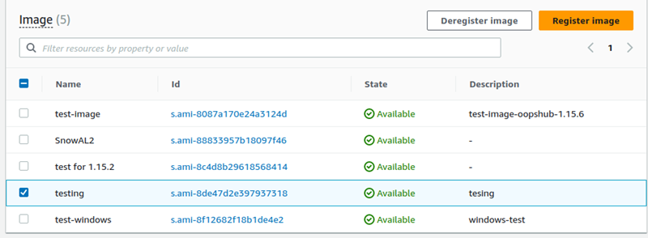

AWS Snowball Edge is no longer available to new customers. New customers should explore [AWS DataSync](https://aws.amazon.com/datasync/ "https://aws.amazon.com/datasync/") for online transfers, [AWS Data Transfer Terminal](https://aws.amazon.com/data-transfer-terminal/ "https://aws.amazon.com/data-transfer-terminal/") for
secure physical transfers, or AWS Partner solutions. For edge computing, explore [AWS Outposts](https://aws.amazon.com/outposts/ "https://aws.amazon.com/outposts/").

# Importing an image as an Amazon EC2-compatible AMI with AWS OpsHub

You can import a snapshot of your image into your Snowball Edge
device and register it as an Amazon EC2-compatible Amazon Machine Image (AMI). A snapshot is
basically a copy of your storage volume that you can use to create an AMI or
another storage volume. By doing this, you can bring your own image from an
external source onto your device and launch it as an Amazon EC2-compatible instance.

Follow these steps to complete the import of your image.

1. Upload your snapshot into an Amazon S3 bucket on your device.
2. Set up the required permissions to grant access to Amazon S3, Amazon EC2, and
   VM Import/Export, the feature that is used to import and export snapshots.
3. Import the snapshot from the S3 bucket into your device as an
   image.
4. Register the image as an Amazon EC2-compatible AMI.
5. Launch the AMI as an Amazon EC2-compatible instance.

###### Note

Be aware of the following limitations when uploading snapshots
to Snowball Edge.

- Snowball Edge currently only support importing
  snapshots that are in the RAW image format.
- Snowball Edge currently only support importing
  snapshots with sizes from 1 GB to 1 TB.

## Step 1: Upload a snapshot into an S3 bucket on your device

You must upload your snapshot to Amazon S3 on your device before you import it.
This is because snapshots can only be imported from Amazon S3 available on your
device or cluster. During the import process, you choose the S3 bucket on
your device to store the image in.

###### To upload a snapshot to Amazon S3

- To create an S3 bucket, see [Creating Amazon S3 Storage](manage-s3.md#create-s3-storage "manage-s3.md#create-s3-storage").

To upload a snapshot to an S3 bucket, see [Uploading Files to Amazon S3 Storage](manage-s3.md#upload-file "manage-s3.md#upload-file").

## Step 2: Import the snapshot from an S3 bucket

When your snapshot is uploaded to Amazon S3, you can import it to
your device. All snapshots that have been imported or are in the process of
being imported are shown in **Snapshots** tab.

This
video shows how to import and register a snapshot as an Amazon EC2-compatible AMI,
including creating a policy for an IAM user.

###### To import the snapshot to your device

1. Open the AWS OpsHub application.
2. In the **Start computing** section on the dashboard, choose **Get
   started**. Or, choose the **Services**
   menu at the top, and then choose **Compute (EC2)** to
   open the **Compute** page. All your compute resources
   appear in the **Resources** section.
3. Choose the **Snapshots** tab to see all the snapshots that have been imported
   to your device. The image file in Amazon S3 is a .raw file that is
   imported to your device as a snapshot. You can filter by snapshot ID
   or the state of the snapshot to find specific snapshots. You can
   choose a snapshot ID to see details of that snapshot.
4. Choose the snapshot that you want to import, and choose **Import snapshot**
   to open the **Import snapshot** page.
5. For **Device**, choose the IP address of the Snow
   Family device that you want to import to.
6. For **Import description** and **Snapshot description**,
   enter a description for each.
7. In the **Role** list, choose a role to use for the import. Snowball Edge use
   VM Import/Export to import snapshots. AWS assumes this role and
   uses it to import the snapshot on your behalf. If you don't have a
   role configured on your AWS Snowball Edge, open the AWS Identity and Access Management
   (IAM in AWS OpsHub where you can create a local IAM role. The role
   also needs a policy that has the required VM Import/Export permissions to
   perform the import. You must attach this policy to the role. For
   more details on this please refer to [Using IAM Locally](using-local-iam.md "using-local-iam.md").

The following is an example of the policy.

JSON

```
`{
 "Version":"2012-10-17",
 "Statement":[
 {
 "Effect":"Allow",
 "Principal":{
 "Service":"vmie.amazonaws.com"
 },
 "Action":"sts:AssumeRole"
 }
 ]
}`

```

Sign in to the AWS Management Console and open the IAM console at [https://console.aws.amazon.com/iam/](https://console.aws.amazon.com/iam/ "https://console.aws.amazon.com/iam/").

The role you create should have minimum permissions to
access Amazon S3 The following is example of a minimum policy.

JSON

```
`{
 "Version":"2012-10-17",
 "Statement":[
 {
 "Effect":"Allow",
 "Action":[
 "s3:GetBucketLocation",
 "s3:GetObject",
 "s3:ListBucket"
 ],
 "Resource":[
 "arn:aws:s3:::import-snapshot-bucket-name",
 "arn:aws:s3:::import-snapshot-bucket-name/*"
 ]
 }
 ]
}`

```

8. Choose **Browse S3** and choose the S3 bucket that contains the snapshot that
   you want to import. Choose the snapshot, and choose
   **Submit**. The snapshot begins to download
   onto your device. You can choose the snapshot ID to see the details.
   You can cancel the import process from this page.

## Step 3: Register the snapshot as an Amazon EC2-compatible AMI

The process of creating an Amazon EC2-compatible AMI from an image imported as
a snapshot is known as _registering_.
Images that are imported to your device must be registered before they can
be launched as Amazon EC2-compatible instances.

This
video shows how to register a snapshot as an Amazon EC2-compatible AMI.

###### To register an image imported as a snapshot

1. Open the AWS OpsHub application.
2. In the **Start computing** section on the
   dashboard, choose **Get started**. Or, choose the
   **Services** menu at the top, and then choose
   **Compute (EC2)** to open the
   **Compute** page. All your compute resources
   appear in the **Resources** section.
3. Choose the **Images** tab. You can filter the images by name, ID, or state to
   find a specific image.
4. Choose the image that you want to register, and choose
   **Register image**.

 5. On the **Register image** page, provide a
**Name** and
**Description**. 6. For **Root volume**, specify the name of the root
device.

In the **Block device** section, you can change
the size of the volume and the volume type. 7. If you want the volume to be deleted when the instance is
terminated, choose **Delete on
termination**. 8. If you want to add more volumes, choose **Add new
volume**. 9. When you are done, choose **Submit**.

## Step 4: Launch the Amazon EC2-compatible AMI

- For more information, see
  [Launching an Amazon EC2-compatible instance](../snowcone-guide/manage-ec2.md#launch-instance "../snowcone-guide/manage-ec2.md#launch-instance").
