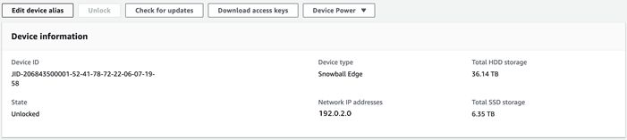
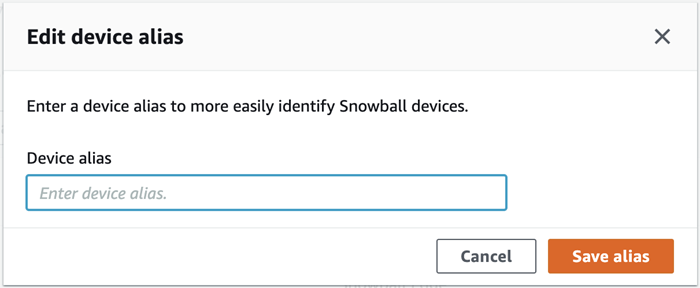

AWS Snowball Edge is no longer available to new customers. New customers should explore [AWS DataSync](https://aws.amazon.com/datasync/ "https://aws.amazon.com/datasync/") for online transfers, [AWS Data Transfer Terminal](https://aws.amazon.com/data-transfer-terminal/ "https://aws.amazon.com/data-transfer-terminal/") for
secure physical transfers, or AWS Partner solutions. For edge computing, explore [AWS Outposts](https://aws.amazon.com/outposts/ "https://aws.amazon.com/outposts/").

# Editing the device alias with AWS OpsHub

Use these steps to edit your device alias using AWS OpsHub.

###### To edit your device's alias

1. On the AWS OpsHub dashboard, find your device under **Devices**. Choose the device
   to open the device details page.
2. Choose the **Edit device alias** tab.

 3. For **Device alias**, enter a new name, and choose **Save
alias**.

