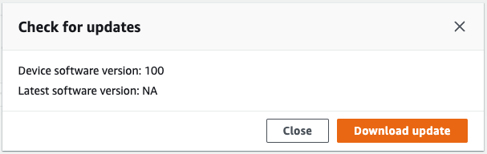

AWS Snowball Edge is no longer available to new customers. New customers should explore [AWS DataSync](https://aws.amazon.com/datasync/ "https://aws.amazon.com/datasync/") for online transfers, [AWS Data Transfer Terminal](https://aws.amazon.com/data-transfer-terminal/ "https://aws.amazon.com/data-transfer-terminal/") for
secure physical transfers, or AWS Partner solutions. For edge computing, explore [AWS Outposts](https://aws.amazon.com/outposts/ "https://aws.amazon.com/outposts/").

# Getting updates for the Snowball Edge

You can check for updates for your device and install them.
version.

**Updating the device**

Follow these steps to use AWS OpsHub to update your Snow device.

###### To update the device

1. On the AWS OpsHub dashboard, find your device under **Devices**. Choose the device
   to open the device details page.
2. Choose the **Check for updates** tab.

The **Check for updates** page displays the current
software version on your device and the latest software version, if there is
one.

 3. If there is an update, choose **Download update**. Otherwise, choose
**Close**.
