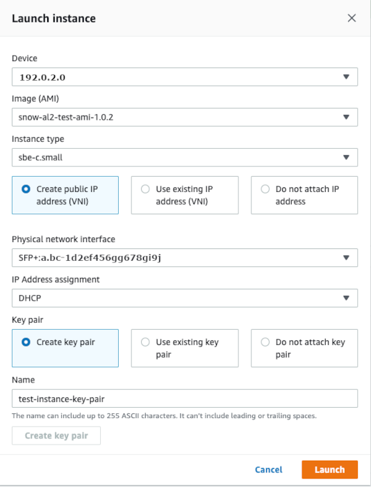

Effective November 7, 2025, AWS Snowball Edge will only be available to existing customers. If you would like to use AWS Snowball Edge,
sign up prior to that date. New customers should explore [AWS DataSync](https://aws.amazon.com/datasync/ "https://aws.amazon.com/datasync/") for online transfers, [AWS Data Transfer Terminal](https://aws.amazon.com/data-transfer-terminal/ "https://aws.amazon.com/data-transfer-terminal/") for
secure physical transfers, or AWS Partner solutions. For edge computing, explore [AWS Outposts](https://aws.amazon.com/outposts/ "https://aws.amazon.com/outposts/").

# Launching an Amazon EC2-compatible instance on a Snowball Edge with AWS OpsHub

Follow these steps to launch an Amazon EC2-compatible instance using AWS OpsHub.

This
video shows how to launch an Amazon EC2-compatible instance using AWS OpsHub.

###### To launch an Amazon EC2-compatible instance

1. Open the AWS OpsHub application.
2. In the **Start computing** section on the dashboard, choose **Get
   started**. Or, choose the **Services**
   menu at the top, and then choose **Compute (EC2)** to
   open the **Compute** page. All your compute resources
   appear in the **Resources** section.
3. If you have Amazon EC2-compatible instances running on your device, they appear in the **Instance
   name** column under **Instances**. You can
   see details of each instance on this page.
4. Choose **Launch instance**. The launch instance wizard opens.
5. For **Device**, choose the Snow device
   that you want to launch the Amazon EC2-compatible.

 6. For **Image (AMI)**, choose an Amazon Machine Image (AMI) from the list. This
AMI is used to launch your instance. 7. For **Instance type**, choose one from the list. 8. Choose how you want to attach an IP address to the instance. You have the following options:

    * **Create public IP address (VNI)** – Choose this option to create a
     new IP address using a physical network interface. Choose a
     physical network interface and IP address assignment.
    * **Use existing IP address (VNI)** – Choose this option to use an
     existing IP address and then use existing virtual network
     interfaces. Choose a physical network interface and a virtual
     network interface.
    * **Do not attach IP address** – Choose this option if you don't want to
     attach an IP address.

9. Choose how you want to attach a key pair to the instance. You have the following options:

**Create key pair** – Choose this
option to create a new key pair and launch the new instance with this
key pair.

**Use existing key pair** – Choose
this option to use an existing key pair to launch the instance.

**Do not attach IP address** –
Choose this option if you don't want to attach a key pair. You must
acknowledge that you won't able to connect to this instance unless you
already know the password that is built into this AMI.

For more information, see [Working with key pairs for EC2-compatible instances in AWS OpsHub](working-with-key-pair.md "working-with-key-pair.md"). 10. Choose **Launch**. You should see your instance launching in the
**Compute instances** section. The
**State** is **Pending** and then
changes to **Running** when done.
