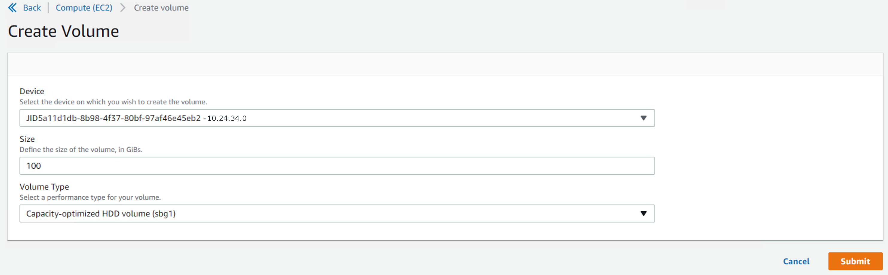
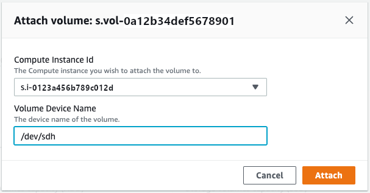

Effective November 7, 2025, AWS Snowball Edge will only be available to existing customers. If you would like to use AWS Snowball Edge,
sign up prior to that date. New customers should explore [AWS DataSync](https://aws.amazon.com/datasync/ "https://aws.amazon.com/datasync/") for online transfers, [AWS Data Transfer Terminal](https://aws.amazon.com/data-transfer-terminal/ "https://aws.amazon.com/data-transfer-terminal/") for
secure physical transfers, or AWS Partner solutions. For edge computing, explore [AWS Outposts](https://aws.amazon.com/outposts/ "https://aws.amazon.com/outposts/").

# Using storage volumes

locally on Snowball Edge with AWS OpsHub

Amazon EC2-compatible instances use Amazon EBS volumes for storage. In this procedure,
you create a storage volume and attach it to your instance using AWS OpsHub.

###### To create a storage volume

1. Open the AWS OpsHub application.
2. In the **Start computing** section on the dashboard,
   choose **Get started**. Or, choose the
   **Services** menu at the top, and then choose
   **Compute (EC2)** to open the
   **Compute** page.
3. Choose the **Storage volumes** tab. If you have storage volumes on your
   device, the details about the volumes appear under **Storage
   volumes**.
4. Choose **Create volume** to open the **Create volume**
   page.

 5. Choose the device that you want to create the volume on, enter the size (in GiBs) that you
want to create, and choose the type of volume. 6. Choose **Submit**. The **State** is
**Creating**, and changes to
**Available** when done. You can see your volume
and details about it in the **Volumes** tab.

###### To attach a storage volume to your instance

1. Choose the volume that you created, and then choose **Attach
   volume**.

 2. For **Compute instance Id**, choose the instance you
want to attach the volume to. 3. For **Volume Device Name**, enter the device name of
your volume (for example, `/dev/sdh` or
`xvdh`). 4. Choose **Attach**.
If you no longer need the volume, you can detach it from the
instance and then delete it.
