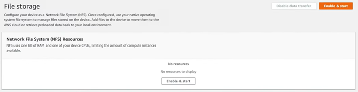
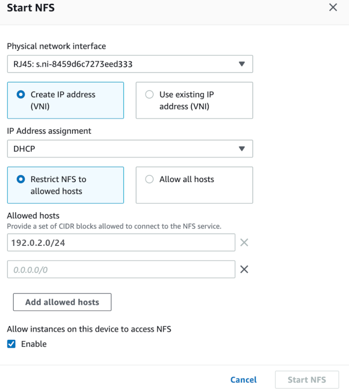

Effective November 7, 2025, AWS Snowball Edge will only be available to existing customers. If you would like to use AWS Snowball Edge,
sign up prior to that date. New customers should explore [AWS DataSync](https://aws.amazon.com/datasync/ "https://aws.amazon.com/datasync/") for online transfers, [AWS Data Transfer Terminal](https://aws.amazon.com/data-transfer-terminal/ "https://aws.amazon.com/data-transfer-terminal/") for
secure physical transfers, or AWS Partner solutions. For edge computing, explore [AWS Outposts](https://aws.amazon.com/outposts/ "https://aws.amazon.com/outposts/").

# Managing the NFS interface with AWS OpsHub

Use the Network File System (NFS) interface to upload files to the Snowball Edge as if the device is local storage to your operating system. This allows for a more user-friendly approach to transferring data because you can use features of your operating system, like copying files, dragging and dropping them, or other graphical user interface features. Each S3 bucket on the device is available as an NFS interface endpoint and can be mounted to copy data to. The NFS interface is available for import jobs.

You can use the NFS interface if the Snowball Edge device was configured to include it when the job to order the device was created. If the device is not configured to include the NFS interface, use the S3 adapter or Amazon S3 compatible storage on Snowball Edge to transfer data. For more information about the S3 adapter, see [Managing Amazon S3 adapter storage with AWS OpsHub](manage-s3.md "manage-s3.md"). For more information about Amazon S3 compatible storage on Snowball Edge, see [Set up Amazon S3 compatible storage on Snowball Edge with AWS OpsHub](s3-edge-snow-opshub.md "s3-edge-snow-opshub.md").

When started, the NFS interface uses 1 GB of memory and 1 CPU. This may limit the number of other services running on the Snowball Edge or the number of EC2-compatible instances that can run.

Data transferred through the NFS interface is not encrypted in transit. When configuring the NFS interface, you can provide CIDR blocks and the Snowball Edge will restrict access to the NFS interface from client computers with addresses in those blocks.

Files on the device will be transferred to Amazon S3 when it is returned to AWS. For more information, see [Importing Jobs into Amazon S3](importtype.md "importtype.md").

For more information about using NFS with your computer operating system, see the documentation for your operating system.

Keep the following details in mind when using the NFS interface.

- The NFS interface provides a local bucket for data storage on the device. For import jobs, no data from the local bucket will be imported to Amazon S3.
- File names are object keys in your local S3 bucket on the Snowball Edge. The key name is a sequence of Unicode
  characters whose UTF-8 encoding is at most 1,024 bytes long. We recommend
  using NFSv4.1 where possible and encode file names with Unicode UTF-8 to ensure a
  successful data import. File names that are not encoded with UTF-8 might not be uploaded
  to S3 or might be uploaded to S3 with a different file name depending on the NFS
  encoding you use.
- Ensure that the maximum length of your file path is less than 1024 characters. Snowball Edge
  do not support file paths that are greater that 1024 characters. Exceeding this file
  path length will result in file import errors.
- For more information, see [Object keys](../../../AmazonS3/latest/userguide/UsingMetadata.md "../../../AmazonS3/latest/userguide/UsingMetadata.md")
  in the Amazon Simple Storage Service User Guide.
- For NFS based transfers, standard POSIX style metadata will be added to your
  objects as they get imported to Amazon S3 from Snowball Edge. In addition, you will
  see meta-data "x-amz-meta-user-agent aws-datasync" as we currently use AWS DataSync
  as part of the internal import mechanism to Amazon S3 for Snowball Edge import with
  NFS option.
- You can transfer up to 40M files using a single Snowball Edge device. If you require to transfer more
  than 40M files in a single job, please batch the files in order to reduce the
  file numbers per each transfer. Individual files can be of any size with a
  maximum file size of 5 TB for Snowball Edge devices with the enhanced NFS interface or the S3 interface.
  You can also configure and manage the NFS interface with the Snowball Edge client, a command line interface (CLI) tool. For more information, see [Managing the NFS interface](../snowcone-guide/shared-using-nfs.md "../snowcone-guide/shared-using-nfs.md").

###### Topics

- [Starting the NFS service on a Windows
  operating system](#mount-nfs-on-window-client "#mount-nfs-on-window-client")
- [Configuring the NFS interface automatically with AWS OpsHub](#auto-configure-nfs "#auto-configure-nfs")
- [Configuring the NFS interface manually with AWS OpsHub](#configure-with-snowcone "#configure-with-snowcone")
- [Managing NFS endpoints on the Snowball Edge with AWS OpsHub](#managing-nfs-endpoint "#managing-nfs-endpoint")
- [Mounting NFS endpoints on client computers](#mounting-nfs-endpoint "#mounting-nfs-endpoint")
- [Stopping the NFS interface with AWS OpsHub](#stop-nfs "#stop-nfs")

## Starting the NFS service on a Windows

operating system

If your client computer is using the Windows 10 Enterprise or Windows 7
Enterprise operating system, start the NFS service on the client computer before configuring NFS
in the AWS OpsHub application.

1. On your client computer, open **Start**, choose **Control
   Panel** and choose **Programs**.
2. Choose **Turn Windows features on or off**.

###### Note

To turn Windows features on, you may need to provide an admin user name and password for your computer. 3. Under **Services for NFS**, choose **Client for
NFS** and choose **OK**.

## Configuring the NFS interface automatically with AWS OpsHub

The NFS interface is not running on the Snowball Edge device by default, so you need
to start it to enable data transfer on the device. With a few clicks, your Snowball Edge can quickly and
automatically configure the NFS interface for you. You can also configure the NFS interface yourself. For more information, see [Configuring the NFS interface manually with AWS OpsHub](#configure-with-snowcone "#configure-with-snowcone").

1. In the **Transfer data** section on the dashboard, choose **Enable
   & start**. This could take a minute or two to complete.

 2. When the NFS service is started, the IP address of the NFS interface
is shown on the dashboard and the **Transfer data**
section indicates that the service is active. 3. Choose **Open in Explorer** (if using a Windows or a Linux operating system) to open the file share in your operating system's file browser and start
transferring files to the Snowball Edge. You can copy
and paste or drag and drop files from your client computer into the
file share. In Windows operating system, your file share looks like the following
`buckets(\\12.123.45.679)(Z:)`.

###### Note

In Linux operating systems, mounting NFS endpoints requires root permissions.

## Configuring the NFS interface manually with AWS OpsHub

The NFS interface is not running on the Snowball Edge device by default, so you need
to start it to enable data transfer on the device. You can manually configure the NFS interface by providing the IP address of a Virtual Network Interface (VNI) running on the Snowball Edge device and restricting
access to your file share, if required. Before configuring the NFS interface manually, set up a virtual network interface (VNI) on your Snowball Edge device. For more information, see [Network Configuration for Compute Instances](network-config-ec2.md "network-config-ec2.md").

You can also have the Snowball Edge device configure the NFS interface automatically. For more information, see [Configuring the NFS interface automatically with AWS OpsHub](#auto-configure-nfs "#auto-configure-nfs").

1. At the bottom of **Transfer
   data** section, on the dashboard, choose
   **Configure manually**.
2. Choose **Enable & start** to open the
   **Start NFS** wizard. The **Physical
   network interface** field is populated.

 3. Choose **Create IP address
(VNI)** or choose **Use existing
IP address**. 4. If you choose **Create IP address
(VNI)**, then choose
**DHCP** or **Static
IP** in the **IP Address
assignment** list box.

###### Important

If you use a DHCP network, it is possible that
the NFS interface's IP address could be reassigned by
the DCHP server. This can happen after the device
has been disconnected and the IP addresses are
recycled. If you set an allowed host range and the
address of the client changes, another client can
pick up that address. In this case, the new client
will have access to the share. To prevent this,
use DHCP reservations or static IP
addresses.

If you choose **Use existing IP
address**, then choose a virtual network
interface from the **Virtual network
interface** list box. 5. Choose to restrict access to the NFS interface and provide a block of allowed network addresses, or allow any devices on the network to access the NFS interface on the Snowball Edge.

    * To restrict access to the NFS interface on the Snowball Edge, choose
     **Restrict NFS to allowed hosts**. In **Allowed hosts** enter a set of CIDR blocks. If you want to allow access to more than one CIDR block, enter another set of blocks. To remove a set of blocks, choose **X** next to the field containing the blocks. Choose **Add allowed hosts**.


    ###### Note

    If you choose **Restrict NFS to allowed hosts** and do not provide allowed CIDR blocks, the Snowball Edge will deny all requests to mount the NFS interface.
    * To allow any device on the network to access the NFS interface, choose **Allow all hosts**.

6. To allow EC2-compatible instances running on the Snowball Edge to access the NFS adapter, choose **Enable**.
7. Choose **Start NFS**. It could
   take about a minute or two to start.

###### Important

Don't turn off the Snowball Edge while the NFS interface
is starting.

From the **Network File System (NFS)
Resources** section, the
**State** of the NFS interface
shows as **Active**. You
will need the IP address listed to mount the interface as local storage on client computers.

## Managing NFS endpoints on the Snowball Edge with AWS OpsHub

Each S3 bucket on the Snowball Edge is represented as an endpoint and listed in **Mount paths**. After the NFS interface is started, mount an endpoint to transfer files to or from that endpoint. Only one endpoint can be mounted at a time. To mount a different endpoint, unmount the current endpoint first.

###### To mount an endpoint

1. In the **Mount paths** section, do one of the following to select an endpoint:
   - In the **Filter endpoints** field, enter all or part a bucket name to filter the list of available endpoints
     on your entry, then choose the endpoint.
   - Choose the endpoint to mount in the **Mount paths** list.

2. Choose **Mount NFS endpoint**. The Snowball Edge mounts the endpoint for use.

###### To unmount an endpoint

1. In the **Mount paths** section, choose the endpoint to unmount.
2. Choose **Unmount endpoint**. The Snowball Edge unmounts the endpoint and it is no longer available for use.

###### Note

Before unmounting an endpoint, ensure no data is being copied from or to it.

## Mounting NFS endpoints on client computers

After the NFS interface is started and an endpoint mounted, mount the endpoint as local storage on client computers.

1. In **Mount paths**, choose the copy icon of the endpoint to mount. Paste it in your operating system when mounting the endpoint.
2. The following are the default mount commands for Windows, Linux, and macOS operating systems.
   - Windows:

   ```

   mount -o nolock rsize=128 wsize=128 mtype=hard `nfs-interface-ip-address`:/buckets/`BucketName` *
   ```

   - Linux:

   ```

   mount -t nfs `nfs-interface-ip-address`:/buckets/`BucketName` mount_point
   ```

   - macOS:

   ```

   mount -t nfs -o vers=3,rsize=131072,wsize=131072,nolocks,hard,retrans=2 `nfs-interface-ip-address`:/buckets/$`bucketname` mount_point
   ```

## Stopping the NFS interface with AWS OpsHub

Stop the NFS interface on the Snowball Edge device when you are done transferring files to or from it.

1. From the dashboard, choose **Services** and then choose **File
   Storage**.
2. On the **File Storage** page, choose
   **Disable data transfer**. It usually takes up to 2
   minutes for the NFS endpoints to disappear from the dashboard.
