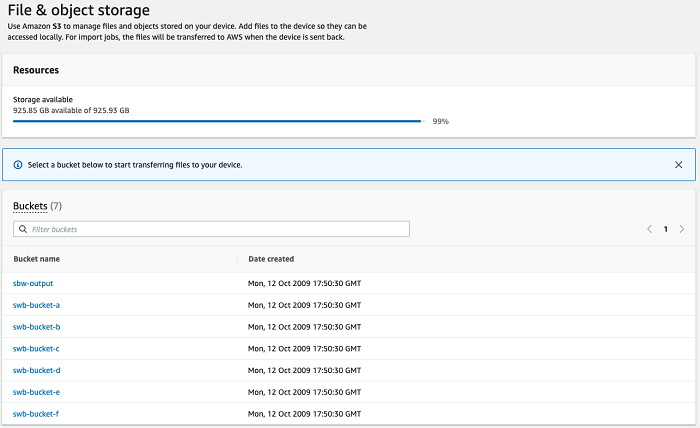
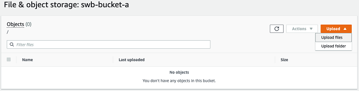
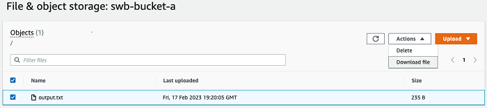

AWS Snowball Edge is no longer available to new customers. New customers should explore [AWS DataSync](https://aws.amazon.com/datasync/ "https://aws.amazon.com/datasync/") for online transfers, [AWS Data Transfer Terminal](https://aws.amazon.com/data-transfer-terminal/ "https://aws.amazon.com/data-transfer-terminal/") for
secure physical transfers, or AWS Partner solutions. For edge computing, explore [AWS Outposts](https://aws.amazon.com/outposts/ "https://aws.amazon.com/outposts/").

# Managing Amazon S3 adapter storage with AWS OpsHub

You can use AWS OpsHub to create and manage Amazon Simple Storage Service (Amazon S3) storage on your
Snowball Edge using the S3 adapter for import and export jobs.

###### Topics

- [Accessing Amazon S3 storage with AWS OpsHub](#create-s3-storage "#create-s3-storage")
- [Uploading files to Amazon S3 storage with AWS OpsHub](#upload-file "#upload-file")
- [Downloading files from Amazon S3 storage with AWS OpsHub](#download-file "#download-file")
- [Deleting files from Amazon S3 storage with AWS OpsHub](#delete-file "#delete-file")

## Accessing Amazon S3 storage with AWS OpsHub

You can upload files to your device and access the files locally. You can
physically move them to another location on the device, or import them back to
the AWS Cloud when the device is returned.

Snowball Edge use Amazon S3 buckets to store and manage files on your
device.

###### To access an S3 bucket

1. Open the AWS OpsHub application.
2. In the **Manage file storage** section of the
   dashboard, choose **Get started**.

If your device has been ordered with the Amazon S3 transfer mechanism, they appear in the **Buckets** section of the **File & object storage** page. On the **File & object storage** page, you can see details of each bucket.

###### Note

If the device was ordered with the NFS transfer mechanism, the bucket name will appear under the mount points section after NFS service is configure and activated. For more information on using the NFS interface, see [Managing the NFS interface with AWS OpsHub](manage-nfs.md "manage-nfs.md").

## Uploading files to Amazon S3 storage with AWS OpsHub

This
video shows how to upload files to Amazon S3 storage using
AWS OpsHub.

###### To upload a file

1. In the **Manage file storage** section on the
   dashboard, choose **Get started**. If you have Amazon S3 buckets on your device, they appear in the
   **Buckets** section on the **File
   storage** page. You can see details of each bucket on the
   page.
2. Choose the bucket that you want to upload files into.
3. Choose **Upload** then **Upload files** or drag and drop the files in the bucket, and choose
   **OK**.

###### Note

To upload larger files, you can use the multipart upload feature
in Amazon S3 using the AWS CLI. For more information about configuring S3 CLI
settings, see [CLI S3 Configuration](../../../cli/latest/topic/s3-config.md "../../../cli/latest/topic/s3-config.md"). For more information on multipart
upload, see [Multipart Upload
Overview](../../../AmazonS3/latest/dev/mpuoverview.md "../../../AmazonS3/latest/dev/mpuoverview.md") in the Amazon Simple Storage Service User Guide

Uploading a folder from a local machine to Snowball Edge using
the AWS OpsHub is supported. If the folder size is very large, it
takes some time for OpsHub to read the file/folder selection. While OpsHub is reading the files and folders, it does not display a progress tracker. However, it does display a progress tracker
is displayed once the upload process begins.

## Downloading files from Amazon S3 storage with AWS OpsHub

###### To download a file

1. In the **Manage file storage** section of the
   dashboard, choose **Get started**. If you have S3
   buckets on your device, they appear in the **Buckets**
   section on the **File storage** page. You can see
   details of each bucket on the page.
2. Choose the bucket that you want to download files from and navigate to the file that you want
   to download. Choose one or more files.

 3. In the **Actions** menu, choose **Download**. 4. Choose a location to download the file to, and choose **OK**.

## Deleting files from Amazon S3 storage with AWS OpsHub

If you no longer need a file, you can delete it from your Amazon S3 bucket.

###### To delete a file

1. In the **Manage file storage** section of the
   dashboard, choose **Get started**. If you have Amazon S3
   buckets on your device, they appear in the **Buckets**
   section on the **File storage** page. You can see
   details of each bucket on the page.
2. Choose the bucket you want to delete files from, and navigate to the
   file that you want to delete.
3. On the **Actions** menu, choose
   **Delete**.
4. In the dialog box that appears, choose **Confirm delete**.
