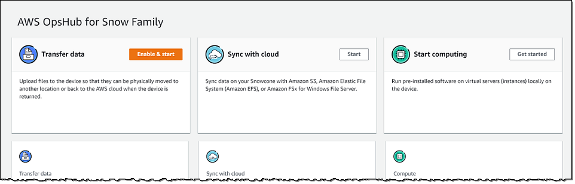

AWS Snowball Edge is no longer available to new customers. New customers should explore [AWS DataSync](https://aws.amazon.com/datasync/ "https://aws.amazon.com/datasync/") for online transfers, [AWS Data Transfer Terminal](https://aws.amazon.com/data-transfer-terminal/ "https://aws.amazon.com/data-transfer-terminal/") for
secure physical transfers, or AWS Partner solutions. For edge computing, explore [AWS Outposts](https://aws.amazon.com/outposts/ "https://aws.amazon.com/outposts/").

# Managing AWS services on the Snowball Edge with AWS OpsHub

With AWS OpsHub, you can use and manage AWS services on your Snowball Edge.
Currently, AWS OpsHub supports the following resources:

- Amazon Elastic Compute Cloud (Amazon EC2) instances – Use Amazon EC2-compatible instances to run software
  installed on a virtual server without sending it to the AWS Cloud
  for processing.
- Network File System (NFS) – Use file shares to move data to your
  device. You can ship the device to AWS to transfer your data to
  the AWS Cloud, or use DataSync to transfer to other AWS Cloud locations.
- Amazon S3 compatible storage on Snowball Edge – Delivers secure object storage with increased resiliency, scale, and an expanded Amazon S3 API feature-set to rugged, mobile edge, and disconnected environments. Using Amazon S3 compatible storage on Snowball Edge, you can store data and run highly available applications on Snowball Edge for edge computing.

###### Topics

- [Launching an Amazon EC2-compatible instance on a Snowball Edge with AWS OpsHub](launch-instance.md "launch-instance.md")
- [Stopping an Amazon EC2-compatible instance on a Snowball Edge with AWS OpsHub](stop-instance.md "stop-instance.md")
- [Starting an Amazon EC2-compatible instance on an Snowball Edge with AWS OpsHub](start-instance.md "start-instance.md")
- [Working with key pairs for EC2-compatible instances in AWS OpsHub](working-with-key-pair.md "working-with-key-pair.md")
- [Terminating an Amazon EC2-compatible
  instance with AWS OpsHub](terminate-instance.md "terminate-instance.md")
- [Using storage volumes
  locally on Snowball Edge with AWS OpsHub](manage-ebs-volumes.md "manage-ebs-volumes.md")
- [Importing an image as an Amazon EC2-compatible AMI with AWS OpsHub](ec2-ami-import.md "ec2-ami-import.md")
- [Deleting a snapshot from a Snowball Edge with AWS OpsHub](delete-snapshot.md "delete-snapshot.md")
- [Deregistering an AMI on a Snowball Edge with AWS OpsHub](deregister-ami.md "deregister-ami.md")
- [Managing an Amazon EC2 cluster on Snowball Edge with AWS OpsHub](manage-clusters.md "manage-clusters.md")
- [Set up Amazon S3 compatible storage on Snowball Edge with AWS OpsHub](s3-edge-snow-opshub.md "s3-edge-snow-opshub.md")
- [Managing Amazon S3 adapter storage with AWS OpsHub](manage-s3.md "manage-s3.md")
- [Managing the NFS interface with AWS OpsHub](manage-nfs.md "manage-nfs.md")
