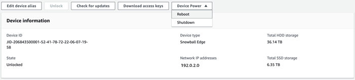
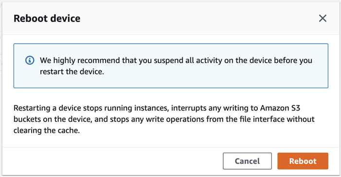

Effective November 7, 2025, AWS Snowball Edge will only be available to existing customers. If you would like to use AWS Snowball Edge,
sign up prior to that date. New customers should explore [AWS DataSync](https://aws.amazon.com/datasync/ "https://aws.amazon.com/datasync/") for online transfers, [AWS Data Transfer Terminal](https://aws.amazon.com/data-transfer-terminal/ "https://aws.amazon.com/data-transfer-terminal/") for
secure physical transfers, or AWS Partner solutions. For edge computing, explore [AWS Outposts](https://aws.amazon.com/outposts/ "https://aws.amazon.com/outposts/").

# Rebooting the device with AWS OpsHub

Follow these steps to use AWS OpsHub to reboot your Snow device.

###### Important

We highly recommend that you suspend all activities on the device before you
reboot the device. Rebooting a device stops running instances and interrupts any
writing to Amazon S3 buckets on the device.

###### To reboot a device

1. On the AWS OpsHub dashboard, find your device under
   **Devices**. Then choose the device to open the device
   details page.
2. Choose the **Device Power** menu, then choose
   **Reboot**. A dialog box appears.

 3. In the dialog box, choose **Reboot**. Your device starts to reboot.

While the device shuts down, the LCD screen displays a message indicating the device is shutting down.

