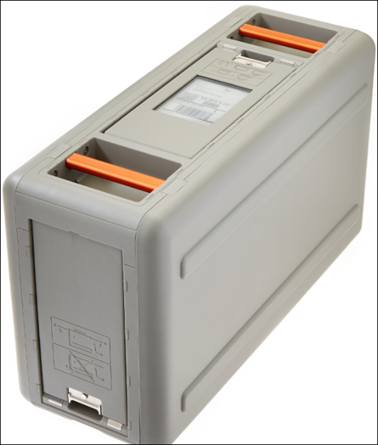

Effective November 7, 2025, AWS Snowball Edge will only be available to existing customers. If you would like to use AWS Snowball Edge,
sign up prior to that date. New customers should explore [AWS DataSync](https://aws.amazon.com/datasync/ "https://aws.amazon.com/datasync/") for online transfers, [AWS Data Transfer Terminal](https://aws.amazon.com/data-transfer-terminal/ "https://aws.amazon.com/data-transfer-terminal/") for
secure physical transfers, or AWS Partner solutions. For edge computing, explore [AWS Outposts](https://aws.amazon.com/outposts/ "https://aws.amazon.com/outposts/").

# Receiving the Snowball Edge

When you receive the AWS Snowball Edge device, you might notice that it doesn't come in a box.
The device is its own physically rugged shipping container. When the device first
arrives, inspect it for damage or obvious tampering. If you notice anything that looks
suspicious about the device, don't connect it to your internal network. Instead, contact
[AWS Support](https://aws.amazon.com/premiumsupport/ "https://aws.amazon.com/premiumsupport/")
and inform them of the issue so that a new device can be shipped to you.

###### Important

The AWS Snowball Edge device is the property of AWS. Tampering with an
AWS Snowball Edge device is a violation of the AWS Acceptable Use Policy. For
more information, see [AWS
Acceptable Use Policy](http://aws.amazon.com/aup/ "http://aws.amazon.com/aup/").

The device looks like the following image.

If you're ready to connect the device to your internal network, see the next
section.

**Next:**
[Connecting a Snowball Edge to your local
network](getting-started.md#getting-started-connect "getting-started.md#getting-started-connect")

###### Topics
