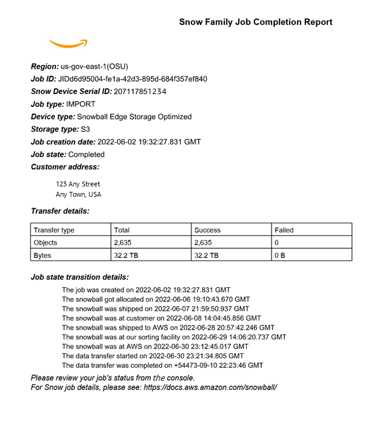

Effective November 7, 2025, AWS Snowball Edge will only be available to existing customers. If you would like to use AWS Snowball Edge,
sign up prior to that date. New customers should explore [AWS DataSync](https://aws.amazon.com/datasync/ "https://aws.amazon.com/datasync/") for online transfers, [AWS Data Transfer Terminal](https://aws.amazon.com/data-transfer-terminal/ "https://aws.amazon.com/data-transfer-terminal/") for
secure physical transfers, or AWS Partner solutions. For edge computing, explore [AWS Outposts](https://aws.amazon.com/outposts/ "https://aws.amazon.com/outposts/").

# Getting your data transfer job completion report and

logs

When you use a Snowball Edge to import data to or export data from Amazon S3, you get a
downloadable PDF job report. For import jobs, this report becomes available at the very
end of the import process. For export jobs, your job report typically becomes available
for you while the AWS Snowball Edge device for your job part is being delivered to you. Job
completion reports are not available for local compute and storage only jobs.

The job report provides you insight into the state of your Amazon S3 data transfer. The
report includes details about your job or job part for your records. The job report also
includes a table that provides a high-level overview of the total number of objects and
bytes transferred between the device and Amazon S3.

For deeper visibility into the status of your transferred objects, you can look at the
two associated logs: a success log and a failure log. The logs are saved in
comma-separated value (CSV) format, and the name of each log includes the ID of the job
or job part that the log describes.

You can download the report and the logs from the AWS Snow Family Management Console. Below is a sample
report.

###### To get your job report and logs

1. Sign in to the AWS Management Console and open the [AWS Snow Family Management Console](https://console.aws.amazon.com/snowfamily/home "https://console.aws.amazon.com/snowfamily/home").
2. Choose your job or job part from the table and expand the status pane.

Three options appear for getting your job report and logs: **Get job
report**, **Download success log**, and
**Download failure log**. 3. Choose the log you want to download.
The following list describes the possible values for the report:

- **Completed** – The transfer was completed
  successfully. You can find more detailed information in the success log.
- **Completed with errors** – Some or all of
  your data was not transferred. You can find more detailed information in the
  failure log.
