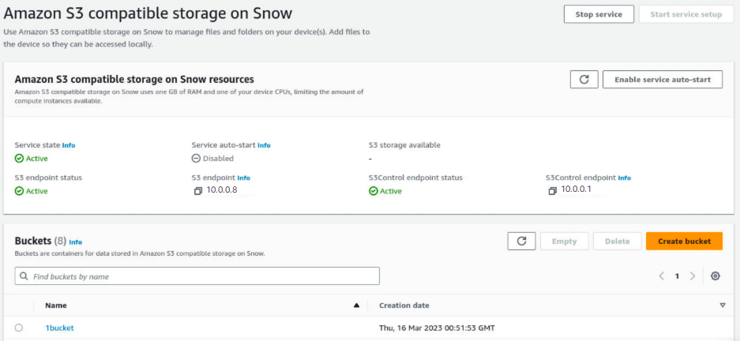
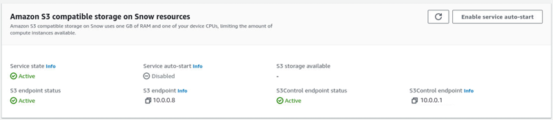
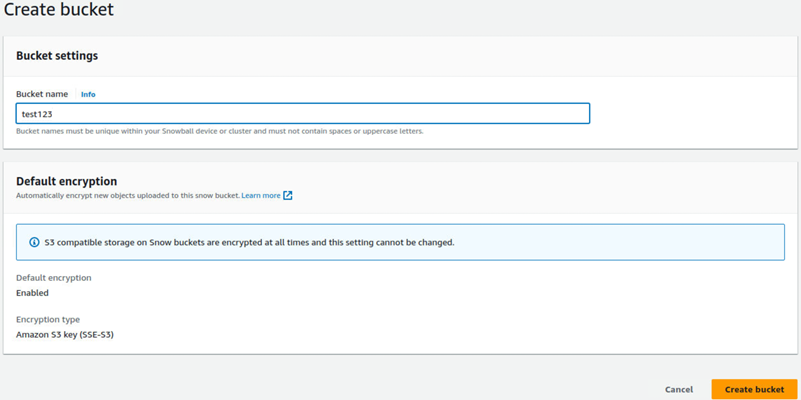
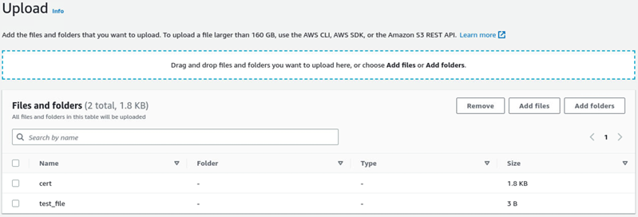
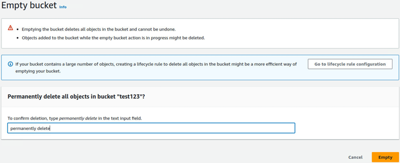
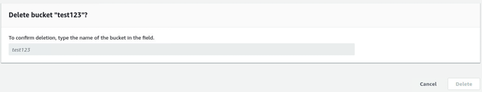

AWS Snowball Edge is no longer available to new customers. New customers should explore [AWS DataSync](https://aws.amazon.com/datasync/ "https://aws.amazon.com/datasync/") for online transfers, [AWS Data Transfer Terminal](https://aws.amazon.com/data-transfer-terminal/ "https://aws.amazon.com/data-transfer-terminal/") for
secure physical transfers, or AWS Partner solutions. For edge computing, explore [AWS Outposts](https://aws.amazon.com/outposts/ "https://aws.amazon.com/outposts/").

# Set up Amazon S3 compatible storage on Snowball Edge with AWS OpsHub

The Amazon S3 compatible storage on Snowball Edge service is not active by default. To start the service on a device or
cluster, you must create two virtual network interfaces (VNICs) on each device to attach
to the `s3control` and `s3api` endpoints.

###### Topics

- [Amazon S3 compatible storage on Snowball Edge prerequisites for AWS OpsHub](#s3-edge-snow-opshub-prereqs "#s3-edge-snow-opshub-prereqs")
- [Using the Amazon S3 compatible storage on Snowball Edge simple setup
  option in AWS OpsHub](#s3-edge-snow-opshub-simple-setup "#s3-edge-snow-opshub-simple-setup")
- [Using the Amazon S3 compatible storage on Snowball Edge advanced setup
  option using AWS OpsHub](#s3-edge-snow-opshub-advanced-setup "#s3-edge-snow-opshub-advanced-setup")
- [Configuring Amazon S3 compatible storage on Snowball Edge to autostart using AWS OpsHub](#autostart-s3compatible "#autostart-s3compatible")
- [Creating a bucket in Amazon S3 compatible storage on Snowball Edge using AWS OpsHub](#s3compatible-create-bucket "#s3compatible-create-bucket")
- [Upload files and folders to Amazon S3 compatible storage on Snowball Edge buckets using AWS OpsHub](#s3compatible-upload-files "#s3compatible-upload-files")
- [Remove files and folders from Amazon S3 compatible storage on Snowball Edge buckets with AWS OpsHub with AWS OpsHub](#s3compatible-remove-files "#s3compatible-remove-files")
- [Delete buckets from Amazon S3 compatible storage on Snowball Edge](#s3compatible-delete-bucket "#s3compatible-delete-bucket")

## Amazon S3 compatible storage on Snowball Edge prerequisites for AWS OpsHub

Before you can set up your device or cluster using AWS OpsHub, do the
following:

- Power on your Snowball Edge device and connect it to your network.
- On your local machine, download and install the latest version of [AWS OpsHub](download-opshub.md "download-opshub.md"). Connect to the device or cluster to unlock it with a
  manifest file. For more information, see [unlocking a device](connect-unlock-device.md "connect-unlock-device.md").

## Using the Amazon S3 compatible storage on Snowball Edge simple setup

option in AWS OpsHub

Use the simple setup option if your network uses DHCP. With this option, the VNICs
are created automatically on each device when you start the service.

1. Log in to AWS OpsHub, then choose **Manage
   Storage**.

This takes you to the Amazon S3 compatible storage on Snowball Edge landing page. 2. For **Start service setup type**, choose
**Simple**. 3. Choose **Start service**.

###### Note

This takes a few minutes to complete and depends on the number of
devices you're using.

After the service starts, the Service state is active, and there are
endpoints.

## Using the Amazon S3 compatible storage on Snowball Edge advanced setup

option using AWS OpsHub

Use the advanced setup option if your network uses static IP addresses or if you
want to reuse existing VNIs. With this option, you create VNICs for each device
manually.

1. Log in to AWS OpsHub, then choose **Manage
   Storage**.

This takes you to the Amazon S3 compatible storage on Snowball Edge landing page. 2. For **Start service setup type**, choose
**Advanced**. 3. Select the devices that you need to create VNICs for.

For clusters, you need a minimum quorum of devices to start the
Amazon S3 compatible storage on Snowball Edge service. The quorum is two for a three-node cluster.

###### Note

For the initial start of the service in a cluster setup, you must have
all devices in the cluster configured and available for the service to
start. For subsequent starts, you can use a subset of the devices if you
meet quorum, but the service will start in a degraded state. 4. For each device, choose an existing VNIC or select **Create
VNI**.

Each device needs a VNIC for the **S3 endpoint** for
object operations and another for the **S3Control
endpoint** for bucket operations. 5. If you're creating a VNIC, choose a physical network interface and enter
the status IP address and subnet mask, then choose **Create virtual
network interface**. 6. After you create your VNICS, choose **Start
service**.

###### Note

This takes a few minutes to complete and depends on the number of
devices you're using.

After the service starts, the Service state is active, and there are
endpoints.

## Configuring Amazon S3 compatible storage on Snowball Edge to autostart using AWS OpsHub

1. Log in to AWS OpsHub, then choose **Manage
   Storage**.

This takes you to the Amazon S3 compatible storage on Snowball Edge landing page. 2. In **Amazon S3 compatible storage on Snow resources**, choose **Enable service auto-start**. The system configures the service to automatically start in the future.

## Creating a bucket in Amazon S3 compatible storage on Snowball Edge using AWS OpsHub

Use the AWS OpsHub interface to create an Amazon S3 bucket on your Snowball Edge device.

1. Open AWS OpsHub.
2. In **Manage storage**, choose **Get started**. The **Amazon S3 compatible storage on Snow** page appears.
3. In **Buckets**, choose **Create bucket**. The **Create bucket** screen appears.

 4. In **Bucket name**, enter a name for the bucket.

###### Note

Bucket names must be unique within your Snowball device or cluster and must not contain spaces or uppercase letters. 5. Choose **Create bucket**. The system creates the bucket and it appears in **Buckets** in the **Amazon S3 compatible storage on Snow** page.

## Upload files and folders to Amazon S3 compatible storage on Snowball Edge buckets using AWS OpsHub

Use the AWS OpsHub interface to upload files and folders to Amazon S3 compatible storage on Snowball Edge buckets. Files and folders may be uploaded separately or together.

1. Open AWS OpsHub
2. In **Manage storage**, in **Buckets**, choose a bucket in which to upload files. The page for that bucket appears.
3. In the bucket page, choose **Upload files**. The **Upload** page appears.

 4. Upload files or folders by dragging them from an operating system file manager to the AWS OpsHub window or do the following:

    1. Select **Add files** or **Add folders**.
    2. Select one or more files or folders to upload. Select **Open**.The system uploads the selected files and folders to the bucket on the device. After the upload is complete, the names of the files and folders appear in the **Files and folders** list.

## Remove files and folders from Amazon S3 compatible storage on Snowball Edge buckets with AWS OpsHub with AWS OpsHub

Use the AWS OpsHub interface to remove and permanently delete files and folders from buckets on the Snowball Edge device.

1. Open AWS OpsHub.
2. In **Manage storage**, in **Buckets**, select the name of a bucket from which to delete files and folders. The page for that bucket appears.
3. In **Files and folders** select the check boxes of the files and folders to permanently delete.
4. Select **Remove**. The system removes the files or folders from the bucket on the device.

## Delete buckets from Amazon S3 compatible storage on Snowball Edge

Before you can delete a bucket from a device, the bucket must be empty. Either remove files and folders from the bucket or use the empty bucket tool. To remove files and folders, see [Remove files and folders from Amazon S3 compatible storage on Snowball Edge buckets with AWS OpsHub with AWS OpsHub](#s3compatible-remove-files "#s3compatible-remove-files").

###### To use the empty bucket tool

1. Open AWS OpsHub.
2. In **Manage storage**, in **Buckets**, select the radio button of the bucket to empty.
3. Select **Empty**. The **Empty bucket** page appears.

 4. In the text box in the **Empty bucket** page, type `permanently delete`. 5. Select **Empty**. The system empties the bucket.

###### To delete an empty bucket

1. In **Manage storage**, in **Buckets**, select the radio button of the bucket to delete.
2. Select **Delete**. The **Delete bucket** page appears.

 3. In the text box in the **Delete bucket** page, type the name of the bucket. 4. Select **Delete**. The system deletes the bucket from the device.
