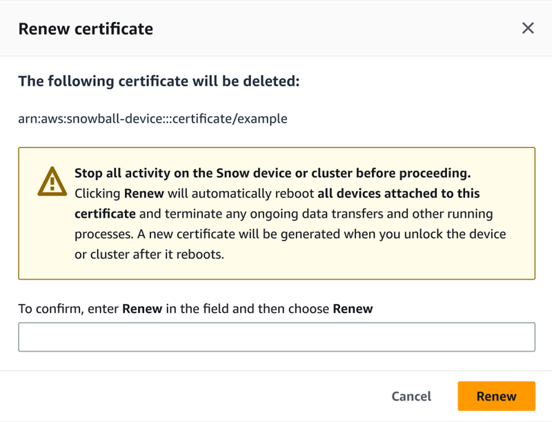

Effective November 7, 2025, AWS Snowball Edge will only be available to existing customers. If you would like to use AWS Snowball Edge,
sign up prior to that date. New customers should explore [AWS DataSync](https://aws.amazon.com/datasync/ "https://aws.amazon.com/datasync/") for online transfers, [AWS Data Transfer Terminal](https://aws.amazon.com/data-transfer-terminal/ "https://aws.amazon.com/data-transfer-terminal/") for
secure physical transfers, or AWS Partner solutions. For edge computing, explore [AWS Outposts](https://aws.amazon.com/outposts/ "https://aws.amazon.com/outposts/").

# Managing public key certificates using OpsHub

You can securely interact with AWS services running on a Snowball Edge device or a cluster of Snowball Edge devices through the HTTPS protocol by providing a public key certificate. You can use the HTTPS protocol to interact with AWS services such as IAM, Amazon EC2, S3 adapter, Amazon S3 compatible storage on Snowball Edge, Amazon EC2 Systems Manager, and AWS STS on Snowball Edge devices. In the case of a cluster of devices, a single certificate is required and can be generated by any device in the cluster. Once a Snowball Edge device generates the certificate and you unlock the device, you can use Snowball Edge client commands to list, get, and delete the certificate.

A Snowball Edge device generates a certificate when the following events occur:

- The Snowball Edge device or cluster is unlocked for the first time.
- The Snowball Edge device or cluster is unlocked after deleting the certificate (using the `delete-certificate` command or **Renew certificate** in AWS OpsHub).
- The Snowball Edge device or cluster is rebooted and unlocked after the certificate expires.
  Whenever a new certificate is generated, the old certificate is no longer valid. A certificate is valid for a period of one year from the day it was generated.

You can also use the Snowball Edge client to manage public key certificates. For more information, see [Managing public key certificates](snowball-edge-certificates-cli.md "snowball-edge-certificates-cli.md").

###### Topics

- [Download the public key certificate using OpsHub](#download-public-key-certificate-opshub "#download-public-key-certificate-opshub")
- [Renewing the public key certificate using OpsHub](#renew-public-key-certificate-opshub "#renew-public-key-certificate-opshub")

## Download the public key certificate using OpsHub

You can download the active public key certificate to your computer.

1. On the AWS OpsHub dashboard, find your device under **Devices**. Choose the device
   to open the device details page.
2. In the device details page, choose the **Manage certificate** menu. From the menu, choose **Download certificate**.
3. A window appears in which you can name the certificate file to download and choose the location on your computer where it will be downloaded. Choose **Save**.

## Renewing the public key certificate using OpsHub

Before renewing the public key certificate, stop all data transfers to or from the Snowball Edge device and stop any EC2-compatible that are running. For more information, see [Stopping an Amazon EC2-compatible instance](manage-ec2.md#stop-instance "manage-ec2.md#stop-instance") in this guide.

1. On the AWS OpsHub dashboard, find your device under **Devices**. Choose the device
   to open the device details page.
2. In the device details page, choose the **Manage certificate** menu. From the menu, choose **Renew certificate**.
3. In the **Renew certificate** window, enter `Renew` in the field and choose **Renew**. The Snowball Edge device deletes the existing public key certificate and reboots the device or cluster.

