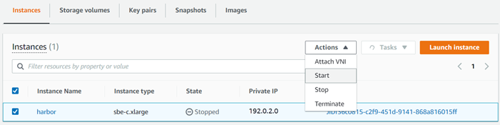

Effective November 7, 2025, AWS Snowball Edge will only be available to existing customers. If you would like to use AWS Snowball Edge,
sign up prior to that date. New customers should explore [AWS DataSync](https://aws.amazon.com/datasync/ "https://aws.amazon.com/datasync/") for online transfers, [AWS Data Transfer Terminal](https://aws.amazon.com/data-transfer-terminal/ "https://aws.amazon.com/data-transfer-terminal/") for
secure physical transfers, or AWS Partner solutions. For edge computing, explore [AWS Outposts](https://aws.amazon.com/outposts/ "https://aws.amazon.com/outposts/").

# Starting an Amazon EC2-compatible instance on an Snowball Edge with AWS OpsHub

Use these steps to start an Amazon EC2-compatible instance using AWS OpsHub.

###### To start an Amazon EC2-compatible instance

1. Open the AWS OpsHub application.
2. In the **Start computing** section of the dashboard, choose **Get
   started**. Or, choose the **Services**
   menu at the top, and then choose **Compute (EC2)** to
   open the **Compute** page.

Your compute resources appear in the **Resources**
section. 3. In the **Instance name** column, under **Instances**, find
the instance that you want to start. 4. Choose the instance, and then choose **Start**. The
**State** changes to **Pending**,
and then changes to **Running** when done.

