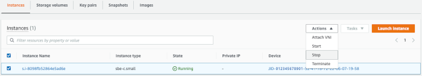

Effective November 7, 2025, AWS Snowball Edge will only be available to existing customers. If you would like to use AWS Snowball Edge,
sign up prior to that date. New customers should explore [AWS DataSync](https://aws.amazon.com/datasync/ "https://aws.amazon.com/datasync/") for online transfers, [AWS Data Transfer Terminal](https://aws.amazon.com/data-transfer-terminal/ "https://aws.amazon.com/data-transfer-terminal/") for
secure physical transfers, or AWS Partner solutions. For edge computing, explore [AWS Outposts](https://aws.amazon.com/outposts/ "https://aws.amazon.com/outposts/").

# Stopping an Amazon EC2-compatible instance on a Snowball Edge with AWS OpsHub

Use the following steps to use AWS OpsHub to stop an Amazon EC2-compatible instance.

###### To stop an Amazon EC2-compatible instance

1. Open the AWS OpsHub application.
2. In the **Start computing** section of
   the dashboard, choose **Get started**. Or, choose the
   **Services** menu at the top, and then choose
   **Compute (EC2)** to open the
   **Compute** page.

All your compute resources appear in the
**Resources** section. 3. If you have Amazon EC2-compatible instances running on your device, they appear in the **Instance
name** column under **Instances**. 4. Choose the instance that you want to stop, choose the **Actions** menu, and choose **Stop**. The
**State** changes to **Stopping**,
and then to **Stopped** when done.

