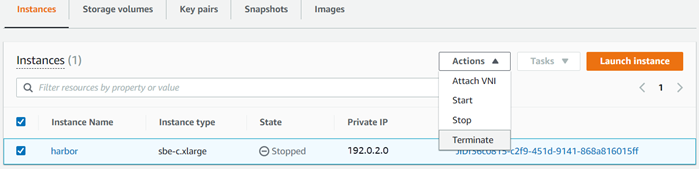
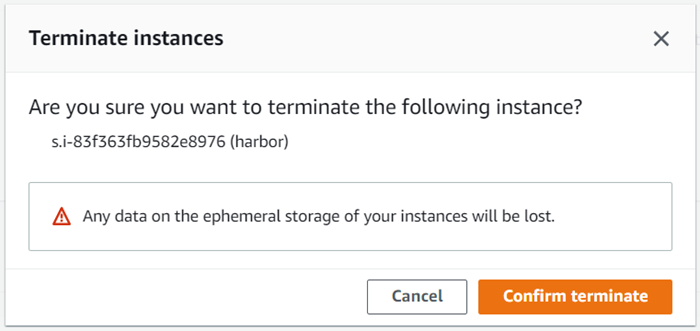

Effective November 7, 2025, AWS Snowball Edge will only be available to existing customers. If you would like to use AWS Snowball Edge,
sign up prior to that date. New customers should explore [AWS DataSync](https://aws.amazon.com/datasync/ "https://aws.amazon.com/datasync/") for online transfers, [AWS Data Transfer Terminal](https://aws.amazon.com/data-transfer-terminal/ "https://aws.amazon.com/data-transfer-terminal/") for
secure physical transfers, or AWS Partner solutions. For edge computing, explore [AWS Outposts](https://aws.amazon.com/outposts/ "https://aws.amazon.com/outposts/").

# Terminating an Amazon EC2-compatible

instance with AWS OpsHub

After you terminate an Amazon EC2-compatible instance, you can't restart the
instance.

###### To terminate an Amazon EC2-compatible instance

1. Open the AWS OpsHub application.
2. In the **Start computing** section on the dashboard, choose **Get
   started**. Or, choose the **Services**
   menu at the top, and then choose **Compute (EC2)** to
   open the **Compute** page. You can see all your compute
   resources in the **Resources** section.
3. In the **Instance name** column, under **Instances**, find
   the instance that you want to terminate.
4. Choose the instance, and choose the **Actions**menu. From the **Actions** menu, choose **Terminate**.

 5. In the **Terminate instances window, choose **Confirm terminate\*\*\*\*.

###### Note

After the instance is terminated, you can't restart it.

The **State** changes to **Terminating**, and then to
**Terminated** when done.
