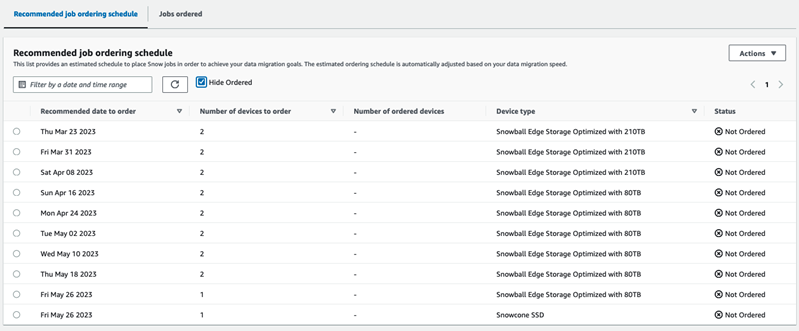
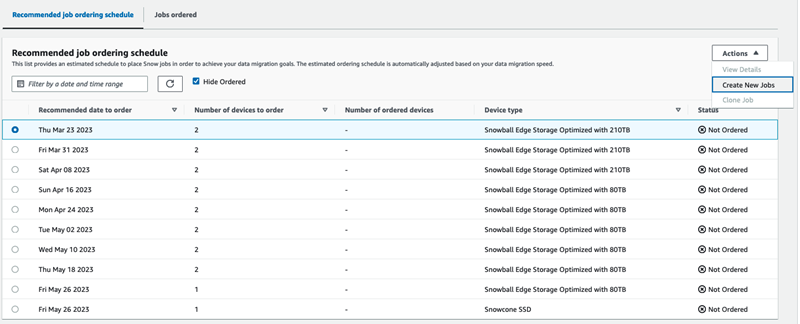
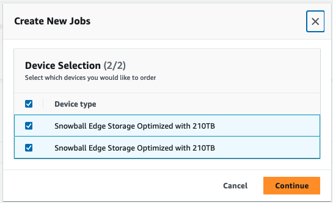

Effective November 7, 2025, AWS Snowball Edge will only be available to existing customers. If you would like to use AWS Snowball Edge,
sign up prior to that date. New customers should explore [AWS DataSync](https://aws.amazon.com/datasync/ "https://aws.amazon.com/datasync/") for online transfers, [AWS Data Transfer Terminal](https://aws.amazon.com/data-transfer-terminal/ "https://aws.amazon.com/data-transfer-terminal/") for
secure physical transfers, or AWS Partner solutions. For edge computing, explore [AWS Outposts](https://aws.amazon.com/outposts/ "https://aws.amazon.com/outposts/").

# Using the large data migration

plan with Snowball Edge

After you create your large data migration plan, you can use the resulting schedule
and dashboard to guide you through the rest of the migration process.

## Recommended job ordering schedule

After you create an Snowball Edge large migration plan, you can use the
recommended job ordering schedule to create new jobs.

###### Note

Manual updates that you make to the data size or number of concurrent devices
cause the schedule to adjust. The schedule automatically adjusts if a job has
not been ordered by the recommended order date or has been ordered before the
recommended order date. If a job is returned before the recommended order date,
the schedule automatically adjusts.

### Placing your next job order

To place you next order, instead of manually creating a job and then adding it
to your plan, you have the option to either clone a previously ordered job or
create a pre-populated one.

###### To clone a job:

1. Choose the next order (the first recommendation with a **Not
   Ordered** status) from the **Recommended job
   ordering** schedule, then choose **Clone
   Job** from the **Actions** menu. The
   **Clone Job** window appears.
2. In the **Clone Job** window, in the **Jobs
   ordered** section, choose the job to clone.
3. In the **New jobs details** section, choose the
   devices you want to order. For each device chosen, the **Job
   name** will automatically populate based on the chosen job.
   You can overwrite the job name.
4. Choose **Confirm** to place the job order for the
   chosen devices. The system clones the job for each device.

###### To create new jobs:

1. Choose the next order (the first recommendation with a **Not
   Ordered** status) from the **Recommended job
   ordering** schedule, then choose **Create New
   Jobs** from the **Actions** menu. The
   **Create new jobs** window appears.

 2. In the **Device Selection** section, choose the
devices you want to order. Choose **Continue**.

 3. The **Create new** page appears. Most parameters,
such as the job type, shipping address, and the device type are set
based on the plan. The system creates the job for each device.

You can see whether the job or jobs were successfully created or not.
Successfully created jobs are automatically added to the plan.

## Jobs ordered list

Each plan displays a job ordered list. This is empty at first. When you start to
order jobs, you can add jobs to your plan by selecting **Add job**
from the **Actions** menu. Jobs that you add here are tracked on
the monitoring dashboard.

Similarly, you may remove the job from the job ordered list by selecting
**Remove job** from the **Actions**
menu.

We recommend using the job ordering schedule provided in the plan for a smooth
data migration.

## Monitoring dashboard

After you add jobs to your plan, you can see metrics on the dashboard as the jobs
return to AWS for ingestion. These metrics can help you to track your
progress:

- **Data migrated to AWS** – The amount of data
  that's been migrated to AWS so far..
- **Average data migrated per job** – The average
  amount of data per job in terabytes.
- **Total
  Snow
  Jobs** – The number of Snowball Edge
  jobs ordered compared to the remaining jobs to be ordered.
- **Average duration for a migration job** – The
  average duration of a job in days.
- **Snow Job Status** – The number of jobs in each
  status.
