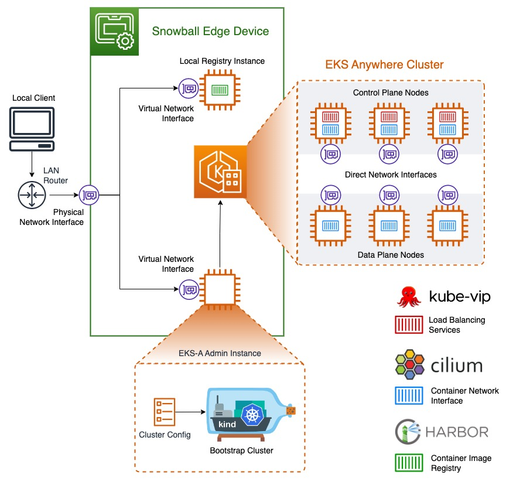

Effective November 7, 2025, AWS Snowball Edge will only be available to existing customers. If you would like to use AWS Snowball Edge,
sign up prior to that date. New customers should explore [AWS DataSync](https://aws.amazon.com/datasync/ "https://aws.amazon.com/datasync/") for online transfers, [AWS Data Transfer Terminal](https://aws.amazon.com/data-transfer-terminal/ "https://aws.amazon.com/data-transfer-terminal/") for
secure physical transfers, or AWS Partner solutions. For edge computing, explore [AWS Outposts](https://aws.amazon.com/outposts/ "https://aws.amazon.com/outposts/").

# Using Amazon EKS Anywhere on AWS Snow

Amazon EKS Anywhere on AWS Snow helps you to create and operate Kubernetes clusters on
Snowball Edge. Kubernetes is open-source software that's used for automating deployment,
scaling, and management of containerized applications. You can use Amazon EKS Anywhere on a
Snowball Edge device with or without an external network connection. To use Amazon EKS Anywhere on a
device without an external network connection, provide a container registry to run on the
Snowball Edge device. For general information about Amazon EKS Anywhere, see the [Amazon EKS Anywhere
documentation](https://anywhere.eks.amazonaws.com/docs/ "https://anywhere.eks.amazonaws.com/docs/").

Using Amazon EKS Anywhere on AWS Snow provides you with these capabilities:

- Provision a Kubernetes (K8s) cluster with Amazon EKS Anywhere CLI (eksctl anywhere) on
  Snowball Edge compute-optimized devices. You can provision Amazon EKS Anywhere on a single
  Snowball Edge device or three or more devices for high availability.
- Support for Cilium Container Network Interface (CNI).
- Support for Ubuntu 20.04 as the node operating system.
  This diagram illustrates an Amazon EKS Anywhere cluster deployed on a Snowball Edge
  device.

We recommend that you create your Kubernetes cluster with the latest available Kubernetes version supported by Amazon EKS Anywhere. For more information, see [Amazon EKS-Anywhere Versioning](https://anywhere.eks.amazonaws.com/docs/concepts/support-versions/ "https://anywhere.eks.amazonaws.com/docs/concepts/support-versions/"). If your application requires a specific version of Kubernetes, use any version of Kubernetes offered in standard or extended support by Amazon EKS. Consider the release and support dates of Kubernetes versions when planning the lifecycle of your deployment. This will help you avoid the potential loss of support for the version of Kubernetes you intend to use. For more information, see [Amazon EKS Kubernetes release calendar](../../../eks/latest/userguide/kubernetes-versions.md#kubernetes-release-calendar "../../../eks/latest/userguide/kubernetes-versions.md#kubernetes-release-calendar").

For more information about Amazon EKS Anywhere on AWS Snow, see the [Amazon EKS Anywhere documentation](https://anywhere.eks.amazonaws.com/docs/ "https://anywhere.eks.amazonaws.com/docs/").

###### Topics

- [Actions to complete before ordering a Snowball Edge
  device for Amazon EKS Anywhere on AWS Snow](eksa-gettingstarted.md "eksa-gettingstarted.md")
- [Ordering a Snowball Edge device for use with Amazon EKS Anywhere on AWS Snow](order-sbe.md "order-sbe.md")
- [Configuring and running Amazon EKS Anywhere on Snowball Edge devices](eksa-configuration.md "eksa-configuration.md")
- [Configuring Amazon EKS Anywhere on AWS Snow for disconnected operation](configure-disconnected.md "configure-disconnected.md")
- [Creating and maintaining clusters on Snowball Edge devices](maintain-eks-a-clusters-snow.md "maintain-eks-a-clusters-snow.md")
