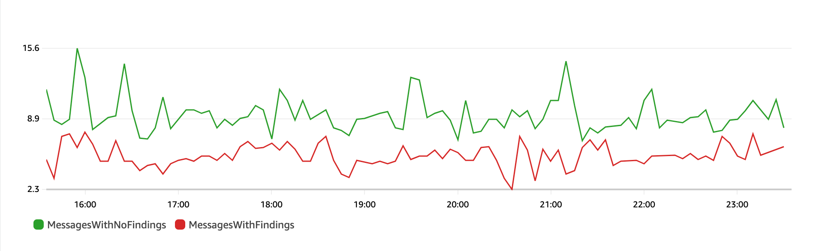

# Data protection policy operations in

Amazon SNS

The following are examples of data protection policies that you can use to audit and deny
sensitive data. For a complete tutorial that includes an example application, see the [Introducing message data protection for Amazon SNS](https://aws.amazon.com/blogs/compute/introducing-message-data-protection-for-amazon-sns/ "https://aws.amazon.com/blogs/compute/introducing-message-data-protection-for-amazon-sns/") blog post.

## Audit operation

The **Audit** operation samples topic inbound messages, and
logs the sensitive data findings in an AWS destination. The sample rate can be an integer
between 0–99. This operation requires one of the following types of logging
destinations:

1. **FindingsDestination** – The logging destination
   when the Amazon SNS topic finds sensitive data in the payload.
2. **NoFindingsDestination** – The logging
   destination when the Amazon SNS topic doesn't find sensitive data in the payload.

You can use the following AWS services in each of the following log destination
types:

- **Amazon CloudWatch Logs** (Optional) – The
  `LogGroup` must be in the topic region and the name must start with **/aws/vendedlogs/**.
- (Optional) – The
  `DeliveryStream` must be in the topic region and have **Direct PUT** as the source of delivery stream. For additional details, see
  [Source,
  Destination, and Name](../../../firehose/latest/dev/create-name.md "../../../firehose/latest/dev/create-name.md") in the _Amazon Data Firehose Developer Guide_.
- **Amazon S3** (Optional) – An Amazon S3 bucket name. [Extra actions are required for using Amazon S3 bucket with
  SSE-KMS encryption enabled](#flow-logs-s3-cmk-policy "#flow-logs-s3-cmk-policy").

```
{
  "Operation": {
    "Audit": {
      "SampleRate": "99",
      "FindingsDestination": {
            "CloudWatchLogs": {
                "LogGroup": "/aws/vendedlogs/log-group-name"
            },
            "Firehose": {
                "DeliveryStream": "delivery-stream-name"
            },
            "S3": {
                "Bucket": "bucket-name"
            }
      },
      "NoFindingsDestination": {
            "CloudWatchLogs": {
                "LogGroup": "/aws/vendedlogs/log-group-name"
            },
            "Firehose": {
                "DeliveryStream": "delivery-stream-name"
            },
            "S3": {
                "Bucket": "bucket-name"
            }
      }
    }
  }
}
```

### Required permissions when specifying

log destinations

When you specify logging destinations in the data protection policy, you must add the
following permissions to the IAM identity policy of the IAM principal that is calling
the Amazon SNS `PutDataProtectionPolicy` API, or the `CreateTopic` API with
the `--data-protection-policy` parameter.

| Audit destination        | IAM permission                                                                                                                                                                      |
| ------------------------ | ----------------------------------------------------------------------------------------------------------------------------------------------------------------------------------- | ----------------------------------------------------------------------------------------------------------------------------------------------------------------------------------------------------------------------------------------------------------------------------------------------------------------------------------------------------------------------------------------------------------------------------------------------------------------------------------------------------------------------------------------------------------------------------------------------------------------------------------------------------------------------------------------------------------------------------------------------------------------------------------------------------------------------------------------------------------------------------------------------------------------------------------------------------------------------------------------------------------------------------------------------------------------------------------------------------------------------------------------------------------------------------------------------------------------------------------------------------------------------------------------------------------------------------------------------------------------------------------------------------------------------------------------------------------------------------------------------------------------------------------------------------------------------------------------------------------------------------------------------------------------------------------------------------------------------------------------------------------------------------------------------------------------------------------------------------------------------------------------------------------------------------------------------------------------------------------------------------------------------------------------------------------------------------------------------------------------------------------------------------------------------------------------------------------------------------------------------------------------------------------------------------------------------------------------------------------------------------------------------------------------------------------------------------------------------------------------------------------------------------------------------------------------------------------------------------------------------------------------------------------------------------------------------------------------------------------------------------------------------------------------------------------------------------------------------------------------------------------------------------------------------------------------------------------------------------------------------------------------------------------------------------------------------------------------------------------------------------------------------------------------------------------------------------------------------------------------------------------------------------------------------------------------------------------------------------------------------------------------------------------------------- |
| Default                  | logs:CreateLogDelivery logs:GetLogDelivery logs:UpdateLogDelivery logs:DeleteLogDelivery logs:ListLogDeliveries                                                                     |
| CloudWatchLogs           | logs:PutResourcePolicy logs:DescribeResourcePolicies logs:DescribeLogGroups                                                                                                         |
| Firehose                 | iam:CreateServiceLinkedRole firehose:TagDeliveryStream                                                                                                                              |
| S3                       | s3:PutBucketPolicy s3:GetBucketPolicy [Extra actions are required for using Amazon S3 bucket with SSE-KMS encryption enabled](#flow-logs-s3-cmk-policy "#flow-logs-s3-cmk-policy"). | JSON `` `{ "Version":"2012-10-17", "Statement": [ { "Effect": "Allow", "Action": [ "logs:CreateLogDelivery", "logs:GetLogDelivery", "logs:UpdateLogDelivery", "logs:DeleteLogDelivery", "logs:ListLogDeliveries" ], "Resource": [ "*" ] }, { "Effect": "Allow", "Action": [ "logs:PutResourcePolicy", "logs:DescribeResourcePolicies", "logs:DescribeLogGroups" ], "Resource": [ "arn:aws:logs:us-west-1:123456789012:SampleLogGroupName:*:*" ] }, { "Effect": "Allow", "Action": [ "iam:CreateServiceLinkedRole", "firehose:TagDeliveryStream" ], "Resource": "*" }, { "Effect": "Allow", "Action": [ "s3:PutBucketPolicy", "s3:GetBucketPolicy" ], "Resource": [ "arn:aws:s3:::bucket-name" ] } ] }` `` #### Required key policy for use with SSE-KMS If you use an Amazon S3 bucket as a log destination, you can protect the data in your bucket by enabling either Server-Side Encryption with Amazon S3-Managed Keys (SSE-S3), or Server-Side Encryption with AWS KMS keys (SSE-KMS). For more information, see [Protecting data using server-side encryption](../../../AmazonS3/latest/userguide/serv-side-encryption.md "../../../AmazonS3/latest/userguide/serv-side-encryption.md") in the _Amazon S3 User Guide_. If you choose SSE-S3, no additional configuration is required. Amazon S3 handles the encryption key. If you choose SSE-KMS, you must use a customer managed key. You must update the key policy for your customer managed key so that the log delivery account can write to your S3 bucket. For more information about the required key policy for use with SSE-KMS, see [Amazon S3 bucket server-side encryption](../../../AmazonCloudWatch/latest/logs/AWS-logs-and-resource-policy.md#AWS-logs-SSE-KMS-S3 "../../../AmazonCloudWatch/latest/logs/AWS-logs-and-resource-policy.md#AWS-logs-SSE-KMS-S3") in the _Amazon CloudWatch Logs User Guide_. ### Audit destination log example In the following example, `callerPrincipal` is used to identify the source of the sensitive content, and `messageID` is used as a reference to check against the `Publish` API response. `{ "messageId": "34d9b400-c6dd-5444-820d-fbeb0f1f54cf", "auditTimestamp": "2022-05-12T2:10:44Z", "callerPrincipal": "arn:aws:iam::123412341234:role/Publisher", "resourceArn": "arn:aws:sns:us-east-1:123412341234:PII-data-topic", "dataIdentifiers": [ { "name": "Name", "count": 1, "detections": [ { "start": 1, "end": 2 } ] }, { "name": "PhoneNumber", "count": 2, "detections": [ { "start": 3, "end": 4 }, { "start": 5, "end": 6 } ] } ] }` ### Audit operation metrics When an audit operation has specified the `FindingsDestination` or the `NoFindingsDestination` property, the topic owners also receive CloudWatch `MessagesWithFindings` and `MessagesWithNoFindings` metrics.  ## De-identify operation The **De-identify** operation masks or redacts sensitive data from published or delivered messages. This operation is available for both inbound and outbound messages, and requires one of the following types of configurations: <br>• **MaskConfig** – Mask using a supported character from the following table. For example, ssn: `123-45-6789` becomes ssn: `###########`. `{ "Operation": { "Deidentify": { "MaskConfig": { "MaskWithCharacter": "#" } } }` |
| Supported mask character | Name                                                                                                                                                                                |
| ---                      | ---                                                                                                                                                                                 |
| \*                       | Asterisk                                                                                                                                                                            |
| A-Z, a-z, and 0-9        | Alphanumeric                                                                                                                                                                        |
|                          | Space                                                                                                                                                                               |
| !                        | Exclamation mark                                                                                                                                                                    |
| $                        | Dollar sign                                                                                                                                                                         |
| %                        | Percent sign                                                                                                                                                                        |
| &                        | Ampersand                                                                                                                                                                           |
| ()                       | Parenthesis                                                                                                                                                                         |
| +                        | Plus sign                                                                                                                                                                           |
| ,                        | Comma                                                                                                                                                                               |
| -                        | Hyphen                                                                                                                                                                              |
| .                        | Period                                                                                                                                                                              |
| /\                       | Slash, back slash                                                                                                                                                                   |
| #                        | Number sign                                                                                                                                                                         |
| :                        | Colon                                                                                                                                                                               |
| ;                        | Semicolon                                                                                                                                                                           |
| =, <>                    | Equals. less or greater than                                                                                                                                                        |
| @                        | At sign                                                                                                                                                                             |
| []                       | Brackets                                                                                                                                                                            |
| ^                        | Caret symbol                                                                                                                                                                        |
| \_                       | Underscore                                                                                                                                                                          |
| `                        | Backtick                                                                                                                                                                            |
|                          |                                                                                                                                                                                     | Vertical bar                                                                                                                                                                                                                                                                                                                                                                                                                                                                                                                                                                                                                                                                                                                                                                                                                                                                                                                                                                                                                                                                                                                                                                                                                                                                                                                                                                                                                                                                                                                                                                                                                                                                                                                                                                                                                                                                                                                                                                                                                                                                                                                                                                                                                                                                                                                                                                                                                                                                                                                                                                                                                                                                                                                                                                                                                                                                                                                                                                                                                                                                                                                                                                                                                                                                                                                                                                                                            |
| ~                        | Tilde symbol                                                                                                                                                                        | <br>• **RedactConfig** – Redact by removing the data entirely. For example, ssn: `123-45-6789` becomes ssn:. `{ "Operation": { "Deidentify": { "RedactConfig": {} } }` On an inbound message, the sensitive data is de-identified after the audit operation, and the `SNS:Publish` API caller receives the following invalid parameter error when the entire message is sensitive. `Error code: AuthorizationError ...` ## Deny operation The **Deny** operation interrupts either the `Publish` API request or the delivery of the message if the message contains sensitive data. The Deny operation object is empty, as it doesn't require additional configuration. `"Operation": { "Deny": {} }` On an inbound message, the `SNS:Publish` API caller receives an authorization error. `Error code: AuthorizationError ...` On an outbound message, the Amazon SNS topic does not deliver the message to the subscription. To track unauthorized deliveries, enable the topic’s [delivery status logging](sns-topic-attributes.md "sns-topic-attributes.md"). The following is an example of a delivery status log: `{ "notification": { "messageMD5Sum": "29638742ffb68b32cf56f42a79bcf16b", "messageId": "34d9b400-c6dd-5444-820d-fbeb0f1f54cf", "topicArn": "arn:aws:sns:us-east-1:123412341234:PII-data-topic", "timestamp": "2022-05-12T2:12:44Z" }, "delivery": { "deliveryId": "98236591c-56aa-51ee-a5ed-0c7d43493170", "destination": "arn:aws:sqs:us-east-1:123456789012:NoNameAccess", "providerResponse": "The topic's data protection policy prohibits this message from being delivered to <subscription-arn>", "dwellTimeMs":20, "attempts":1, "statusCode": 403 }, "status": "FAILURE" }`                                                                                                                                                                                                                                                                                                                                                                                                                                                                                                                                                                                                                                                                                                                                                                                                                                                                                                                                                                                                                                                                                                                                                                                                                                                                                                                                                                                                                                                                                                                                                                                                                                                                                                            |
