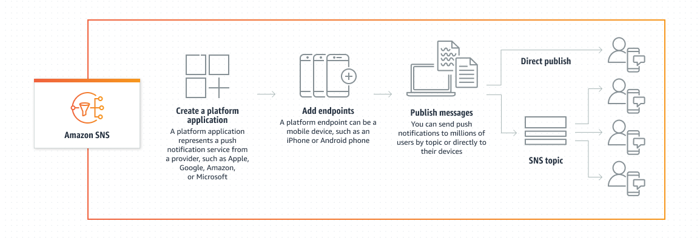

# Sending mobile push notifications

with Amazon SNS

You can use Amazon SNS to send push notification messages directly to apps on mobile devices.
Push notification messages sent to a mobile endpoint can appear in the mobile app as message
alerts, badge updates, or sound alerts.

###### Topics

- [How Amazon SNS user notifications work](#sns-how-user-notifications-work "#sns-how-user-notifications-work")
- [Setting up push notifications with
  Amazon SNS](#sns-user-notifications-process-overview "#sns-user-notifications-process-overview")
- [Setting up a mobile app in Amazon SNS](mobile-push-send.md "mobile-push-send.md")
- [Using Amazon SNS for mobile push
  notifications](mobile-push-notifications.md "mobile-push-notifications.md")
- [Amazon SNS mobile app attributes](sns-msg-status.md "sns-msg-status.md")
- [Amazon SNS application event notifications for
  mobile applications](application-event-notifications.md "application-event-notifications.md")
- [Mobile push API actions](mobile-push-api.md "mobile-push-api.md")
- [Common Amazon SNS mobile push API errors](mobile-push-api-error.md "mobile-push-api-error.md")
- [Using the Amazon SNS time to live message attribute for mobile push
  notifications](sns-ttl.md "sns-ttl.md")
- [Amazon SNS mobile application supported
  Regions](sns-mobile-push-supported-regions.md "sns-mobile-push-supported-regions.md")
- [Best practices for managing Amazon SNS
  mobile push notifications](mobile-push-notifications-best-practices.md "mobile-push-notifications-best-practices.md")

## How Amazon SNS user notifications work

You send push notification messages to both mobile devices and desktops using one of the
following supported push notification services:

- Amazon Device Messaging (ADM)
- Apple Push Notification Service (APNs) for both iOS and Mac OS X
- Baidu Cloud Push (Baidu)
- Firebase Cloud Messaging (FCM)
- Microsoft Push Notification Service for Windows Phone (MPNS)
- Windows Push Notification Services (WNS)

Push notification services, such as APNs and FCM, maintain a connection with each app
and associated mobile device registered to use their service. When an app and mobile device
register, the push notification service returns a device token. Amazon SNS uses the device token
to create a mobile endpoint, to which it can send direct push notification messages. In
order for Amazon SNS to communicate with the different push notification services, you submit
your push notification service credentials to Amazon SNS to be used on your behalf. For more
information, see [Setting up push notifications with
Amazon SNS](#sns-user-notifications-process-overview "#sns-user-notifications-process-overview").

In addition to sending direct push notification messages, you can also use Amazon SNS to send
messages to mobile endpoints subscribed to a topic. The concept is the same as subscribing
other endpoint types, such as Amazon SQS, HTTP/S, email, and SMS, to a topic, as described in
[What is Amazon SNS?](welcome.md "welcome.md"). The difference is that Amazon SNS
communicates using the push notification services in order for the subscribed mobile
endpoints to receive push notification messages sent to the topic.

## Setting up push notifications with

Amazon SNS

1. [Obtain the
   credentials and device token](sns-prerequisites-for-mobile-push-notifications.md "sns-prerequisites-for-mobile-push-notifications.md") for the mobile platforms that you want to
   support.
2. Use the credentials to create a platform application object
   (`PlatformApplicationArn`) using Amazon SNS. For more information, see
   [Creating an Amazon SNS platform application](mobile-push-send-register.md "mobile-push-send-register.md").
3. Use the returned credentials to request a device token for your mobile app and
   device from the push notification service. The token you receive represents your
   mobile app and device.
4. Use the device token and the `PlatformApplicationArn` to create a
   platform endpoint object (`EndpointArn`) using Amazon SNS. For more
   information, see [Setting up an Amazon SNS platform endpoint for mobile
   notifications](mobile-platform-endpoint.md "mobile-platform-endpoint.md").
5. Use the `EndpointArn` to [publish a
   message to an app on a mobile device](mobile-push-send.md "mobile-push-send.md"). For more information, see [Direct Amazon SNS mobile device messaging](mobile-push-notifications.md#mobile-push-send-directmobile "mobile-push-notifications.md#mobile-push-send-directmobile") and the [Publish](../api/API_Publish.md "../api/API_Publish.md") API in the
   Amazon Simple Notification Service API Reference.
