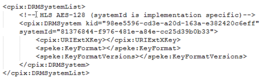
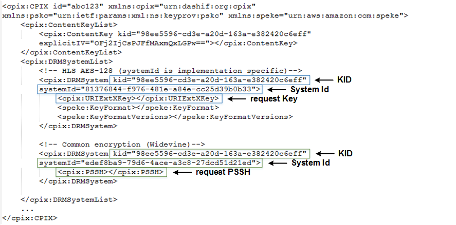
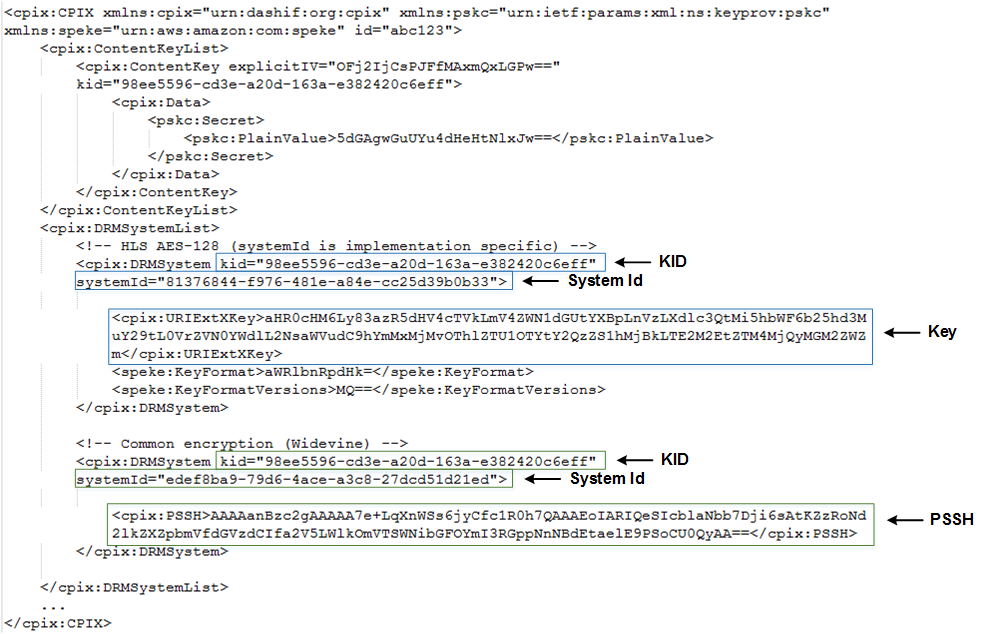

# SPEKE API v1 - Standard payload components

In any SPEKE request, the encryptor can request responses for one or more DRM systems. The encryptor specifies the DRM systems in `<cpix:DRMSystemList>` of the request payload. Each system specification includes the key and indicates the type of response to return.

The following example shows a DRM system list with a single DRM system specification:

The following table lists the main components of each `<cpix:DRMSystem>`.

| Identifier               | Description                                                                                                                                                                                                                                                                   |
| ------------------------ | ----------------------------------------------------------------------------------------------------------------------------------------------------------------------------------------------------------------------------------------------------------------------------- |
| `systemId` or `schemeId` | Unique identifier for the DRM system type, as registered with the DASH IF organization. For a list, see [DASH-IF System IDs](https://dashif.org/identifiers/content_protection/ "https://dashif.org/identifiers/content_protection/").                                        |
| `kid`                    | The key ID. This is not the actual key, but an identifier that points to the key in a hash table.                                                                                                                                                                             |
| `<cpix:UriExtXKey>`      | Requests a standard unencrypted key. The key response type must be either this or the `PSSH` response.                                                                                                                                                                        |
| `<cpix:PSSH>`            | Requests a Protection System Specific Header (PSSH). This type of header contains a reference to the `kid`, the `systemID`, plus custom data for the DRM vendor, as part of Common Encryption (CENC). The key response type must be either this or the `UriExtXKey` response. |

\_Example Requests for Standard Key and for PSSH \_

The following example shows part of a sample request from the encryptor to the DRM key provider, with the main components highlighted. The first request is for a standard key, while the second request is for a PSSH response:

\_Example Responses for Standard Key and for PSSH \_

The following example shows the corresponding response from the DRM key provider to the encryptor:

