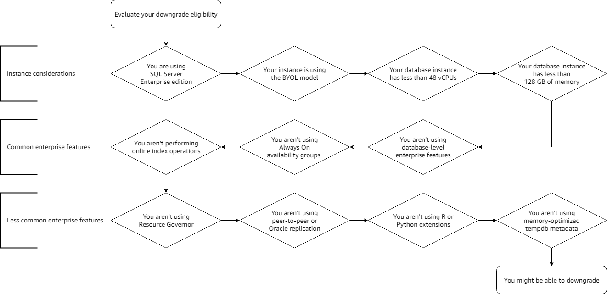

# Evaluate if you can downgrade your Microsoft SQL Server edition

If you find that you aren't using Enterprise edition features, you can consider
downgrading to Microsoft SQL Server Standard or Developer edition. By downgrading the edition, you can
save on licensing costs.

###### Note

SQL Server Developer edition is only eligible for use in non-production, development, and
test workloads.

## Downgrade requirements

Your Microsoft SQL Server on Amazon EC2 must use the Bring Your Own License model (BYOL) and SQL Server
Enterprise edition to be eligible for an in-place downgrade. If your instance meets this
criteria, you should carefully evaluate which features are being used on your SQL Server
instance before performing any changes. You can review the following SQL Server Enterprise
edition features and instance level constraints to help evaluate your downgrade
eligibility.

###### Tip

A script is available to help evaluate if you can downgrade your SQL Server edition.
For more information, see [Downgrade SQL Server Enterprise edition using AWS Systems Manager Document to reduce
cost](https://aws.amazon.com/blogs/mt/downgrade-sql-server-enterprise-edition-using-aws-systems-manager-document-to-reduce-cost/ "https://aws.amazon.com/blogs/mt/downgrade-sql-server-enterprise-edition-using-aws-systems-manager-document-to-reduce-cost/").

Confirm that your instance has **less** than the
following resources available:

- 48 vCPUs
- 128 GiB of memory

If your instance is under-utilized for your workload, you can change the instance type
or size your instance to meet these requirements. For more information, see [Change
the instance type](../../../AWSEC2/latest/UserGuide/ec2-instance-resize.md "../../../AWSEC2/latest/UserGuide/ec2-instance-resize.md") .

Confirm that you aren't using any of the following SQL Server Enterprise edition
features:

- Database-level enterprise features
- Always On availability groups
- Online index operations
- Resource Governor
- Peer-to-peer or Oracle replication
- R or Python extensions
- Memory-optimized tempdb metadata

The following diagram walks through an evaluation for some of the downgrade
requirements:

If your workload doesn't utilize any of the previously listed features, you should
continue to evaluate if you use any less common SQL Server Enterprise edition features. For
more information about SQL Server Enterprise editions and supported features, see the
Microsoft documentation for your SQL Server version:

- [SQL Server 2022](https://learn.microsoft.com/en-us/sql/sql-server/editions-and-components-of-sql-server-2022?view=sql-server-ver16 "https://learn.microsoft.com/en-us/sql/sql-server/editions-and-components-of-sql-server-2022?view=sql-server-ver16")
- [SQL Server 2019](https://learn.microsoft.com/en-us/sql/sql-server/editions-and-components-of-sql-server-2019?view=sql-server-ver16 "https://learn.microsoft.com/en-us/sql/sql-server/editions-and-components-of-sql-server-2019?view=sql-server-ver16")
- [SQL Server 2017](https://learn.microsoft.com/en-us/sql/sql-server/editions-and-components-of-sql-server-2017?view=sql-server-ver16 "https://learn.microsoft.com/en-us/sql/sql-server/editions-and-components-of-sql-server-2017?view=sql-server-ver16")
- [SQL Server 2016](https://learn.microsoft.com/en-us/sql/sql-server/editions-and-components-of-sql-server-2016?view=sql-server-ver16 "https://learn.microsoft.com/en-us/sql/sql-server/editions-and-components-of-sql-server-2016?view=sql-server-ver16")
- [SQL Server 2014](https://learn.microsoft.com/en-us/previous-versions/sql/2014/getting-started/features-supported-by-the-editions-of-sql-server-2014?view=sql-server-2014 "https://learn.microsoft.com/en-us/previous-versions/sql/2014/getting-started/features-supported-by-the-editions-of-sql-server-2014?view=sql-server-2014")
