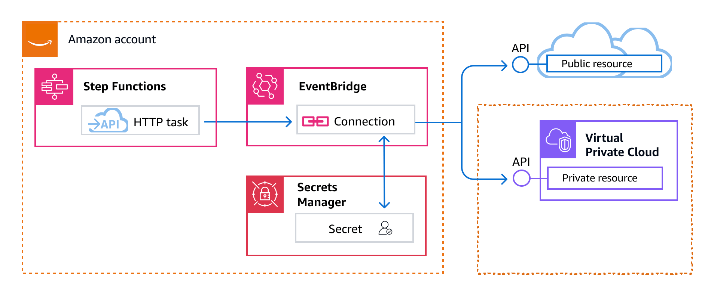

# Call HTTPS APIs in Step Functions

workflows

An HTTP Task is a type of [Task workflow state](state-task.md "state-task.md") state that you can use to call HTTPS APIs in your workflows. The API can be
public, such as third-party SaaS applications like Stripe or Salesforce. You can also call
private API, such as HTTPS-based applications in an Amazon Virtual Private Cloud.

For authorization and network connectivity, an HTTP Task requires an EventBridge connection.

To call an HTTPS API, use the [Task](state-task.md "state-task.md") state with the `arn:aws:states:::http:invoke` resource.
Then, provide the API endpoint configuration details, such as the API URL, method you want
to use, and [connection](#http-task-authentication "#http-task-authentication") details.

If you use [Workflow Studio](workflow-studio.md "workflow-studio.md") to build your state machine that
contains an HTTP Task, Workflow Studio automatically generates an execution role with
IAM policies for the HTTP Task. For more information, see [Role for testing HTTP Tasks in Workflow Studio](manage-state-machine-permissions.md#test-state-role-http "manage-state-machine-permissions.md#test-state-role-http").

###### Note

HTTP Task currently only supports public domain names with publicly trusted certificates for HTTPS endpoints when using private APIs. HTTP Task does not support mutual TLS (mTLS).

###### Topics

- [Connectivity for an HTTP Task](#http-task-authentication "#http-task-authentication")
- [HTTP Task definition](#connect-http-task-definition "#connect-http-task-definition")
- [HTTP Task fields](#connect-http-task-fields "#connect-http-task-fields")
- [Merging EventBridge connection and
  HTTP Task definition data](#http-task-data-merge "#http-task-data-merge")
- [Applying URL-encoding on request body](#url-encode-request-body "#url-encode-request-body")
- [IAM permissions to run an
  HTTP Task](#connect-http-task-permissions "#connect-http-task-permissions")
- [HTTP Task example](#connect-http-task-example "#connect-http-task-example")
- [Testing an HTTP Task](#http-task-test "#http-task-test")
- [Unsupported HTTP Task
  responses](#unsupported-http-task-responses "#unsupported-http-task-responses")
- [Connection errors](#connect-http-task-errors "#connect-http-task-errors")

## Connectivity for an HTTP Task

An HTTP Task requires an [EventBridge
connection](../../../eventbridge/latest/userguide/eb-target-connection.md "../../../eventbridge/latest/userguide/eb-target-connection.md"), which securely manages the authentication credentials of an API
provider. A _connection_ defines the authorization method and credentials to use in
connecting to a given API. If you are connecting to a private API, such as
a private API in an Amazon Virtual Private Cloud (Amazon VPC), you can also use
the connection to define secure point-to-point network
connectivity. Using a connection helps you avoid hard-coding
secrets, such as API keys, into your state machine definition. An EventBridge connection
supports the Basic, OAuth, and API Key authorization schemes.

When you create an EventBridge connection, you provide your authorization and network connectivity details. You can
also include the header, body, and query parameters that are required for authorization
with an API. You must include the connection ARN in any HTTP Task that calls an
HTTPS API.

When you create a connection, EventBridge creates a [_secret_](../../../secretsmanager/latest/userguide/managing-secrets.md "../../../secretsmanager/latest/userguide/managing-secrets.md") in AWS Secrets Manager. In this secret, EventBridge stores
the connection and authorization parameters in an encrypted form. To successfully create
or update a connection, you must use an AWS account that has permission to use
Secrets Manager. For more information about the IAM permissions your state
machine needs to access an EventBridge connection, see [IAM permissions to run an
HTTP Task](#connect-http-task-permissions "#connect-http-task-permissions").

The following image shows how Step Functions handles authorization for
HTTPS API calls using an EventBridge connection. The
EventBridge connection manages credentials of an
HTTPS API provider. EventBridge creates a [_secret_](../../../secretsmanager/latest/userguide/managing-secrets.md "../../../secretsmanager/latest/userguide/managing-secrets.md") in Secrets Manager to store the
connection and authorization parameters in an encrypted form. In the case of private
APIs, EventBridge also stores network connectivity configurations.

###### Timeouts for connections

HTTP task requests will timeout after 60 seconds.



## HTTP Task definition

The [ASL definition](concepts-amazon-states-language.md "concepts-amazon-states-language.md") represents an HTTP Task with `http:invoke`
resource. The following HTTP Task definition invokes a public Stripe API that returns
a list of all customers.

```
"Call HTTPS API": {
  "Type": "Task",
  "Resource": "arn:aws:states:::http:invoke",
  "Parameters": {
    "ApiEndpoint": "https://api.stripe.com/v1/customers",
    "Authentication": {
      "ConnectionArn": "arn:aws:events:`region`:`account-id`:connection/Stripe/81210c42-8af1-456b-9c4a-6ff02fc664ac"
    },
    "Method": "GET"
  },
  "End": true
}
```

## HTTP Task fields

An HTTP Task includes the following fields in its definition.

**`Resource` (Required)**

To specify a [task type](state-task.md#task-types "state-task.md#task-types"), provide its ARN
in the `Resource` field. For an HTTP Task, you specify the
`Resource` field as follows.

```
"Resource": "arn:aws:states:::http:invoke"
```

**`Parameters` (Required)**

Contains the `ApiEndpoint`, `Method`, and
`ConnectionArn` fields that provide information about the
HTTPS API you want to call. `Parameters`
also contains optional fields, such as `Headers` and
`QueryParameters`.

You can specify a combination of static JSON and [JsonPath](https://datatracker.ietf.org/wg/jsonpath/about/ "https://datatracker.ietf.org/wg/jsonpath/about/")
syntax as `Parameters` in the `Parameters` field. For
more information, see [Passing parameters to a service API in Step Functions](connect-parameters.md "connect-parameters.md").

To specify the EventBridge connection, use either the `Authentication` _or_ `InvocationConfig` field.

`ApiEndpoint`
**(Required)**

Specifies the URL of the HTTPS API you
want to call. To append query parameters to the URL, use the
`QueryParameters` field. The following
example shows how you can call a Stripe API to fetch the list of
all customers.

```
"ApiEndpoint":"https://api.stripe.com/v1/customers"
```

You can also specify a [reference
path](amazon-states-language-paths.md#amazon-states-language-reference-paths "amazon-states-language-paths.md#amazon-states-language-reference-paths") using the [JsonPath](https://datatracker.ietf.org/wg/jsonpath/about/ "https://datatracker.ietf.org/wg/jsonpath/about/") syntax to select
the JSON node that contains the
HTTPS API URL. For example, say you want
to call one of Stripe’s APIs using a specific customer ID.
Imagine that you've provided the following state input.

```
{
    "customer_id": "1234567890",
    "name": "John Doe"
}
```

To retrieve the details of this customer ID using a Stripe
API, specify the `ApiEndpoint` as shown in the
following example. This example uses an [intrinsic function](intrinsic-functions.md "intrinsic-functions.md") and
a reference path.

```
"ApiEndpoint.$":"States.Format('https://api.stripe.com/v1/customers/{}', $.customer_id)"
```

At runtime, Step Functions resolves the value of
`ApiEndpoint` as follows.

```
https://api.stripe.com/v1/customers/`1234567890`
```

`Method`
**(Required)**

Specifies the HTTP method you want to use for calling an
HTTPS API. You can specify one of these
methods in your HTTP Task: GET, POST, PUT, DELETE, PATCH,
OPTIONS, or HEAD.

For example, to use the GET method, specify the
`Method` field as follows.

```
"Method": "GET"
```

You can also use a [reference
path](amazon-states-language-paths.md#amazon-states-language-reference-paths "amazon-states-language-paths.md#amazon-states-language-reference-paths") to specify the method at runtime. For example,
`"Method.$": "$.myHTTPMethod"`.

`Authentication`
**(Conditional)**

_We recommend using
`InvocationConfig` over `Authentication`
for both public and private HTTPS API
calls._

Existing `Authentication` references are maintained
for backwards compatibility. Within the field, you must specify
a `ConnectionArn` field that specifies a connection
resource of Amazon EventBridge to connect to the
`ApiEndpoint`.

`InvocationConfig` **(Conditional)**

Contains the authorization and network connectivity
configuration for **both** public
and private HTTPS API calls.

Step Functions handles the connection for a specified
`ApiEndpoint` using the connection resource of
Amazon EventBridge. For more information, see [Connecting to private APIs](../../../eventbridge/latest/userguide/connection-private.md "../../../eventbridge/latest/userguide/connection-private.md") in the _Amazon EventBridge
User Guide_.

`ConnectionArn` **(Required)**

Specifies the EventBridge connection
ARN.

An HTTP Task requires an [EventBridge connection](../../../eventbridge/latest/userguide/eb-target-connection.md "../../../eventbridge/latest/userguide/eb-target-connection.md"), which securely manages
the authorization credentials of an API provider. A
_connection_ specifies the
authorization type and credentials to use for
authorizing an HTTPS API.
For private APIs, the connection also defines secure
point-to-point network connectivity. Using a
connection helps you avoid hard-coding secrets, such
as API keys, into your state machine definition. In
a connection, you can also specify `Headers`, `QueryParameters`, and
`RequestBody`
parameters.

For more information, see [Connectivity for an HTTP Task](#http-task-authentication "#http-task-authentication").

The following example shows the format of
`InvocationConfig` in an HTTP Task:

```
"InvocationConfig": {
  "ConnectionArn": "arn:aws:events:`region`:`account-id`:connection/`connection-id`"
}
```

`Headers`
(Optional)

Provides additional context and metadata to the API endpoint.
You can specify headers as a string or JSON array.

You can specify headers in the EventBridge connection
and the `Headers` field in an HTTP Task. We
recommend that you do not include authentication details to your
API providers in the `Headers` field. We recommend
that you include these details into your EventBridge
connection.

Step Functions adds the headers that you specify in the
EventBridge connection to the headers that you
specify in the HTTP Task definition. If the same header keys
are present in the definition and connection,
Step Functions uses the corresponding values specified
in the EventBridge connection for those headers. For
more information about how Step Functions performs data
merging, see [Merging EventBridge connection and
HTTP Task definition data](#http-task-data-merge "#http-task-data-merge").

The following example specifies a header that will be included
in an HTTPS API call:
`content-type`.

```
"Headers": {
  "content-type": "application/json"
}
```

You can also use a [reference
path](amazon-states-language-paths.md#amazon-states-language-reference-paths "amazon-states-language-paths.md#amazon-states-language-reference-paths") to specify the headers at runtime. For example,
`"Headers.$":
 "$.myHTTPHeaders"`.

Step Functions sets the `User-Agent`,
`Range`, and `Host` headers.
Step Functions sets the value of the `Host`
header based on the API you're calling. The following is an
example of these headers.

```
User-Agent: Amazon|StepFunctions|HttpInvoke|``region``,
Range: bytes=0-262144,
Host: api.stripe.com
```

You can't use the following headers in your HTTP Task
definition. If you use these headers, the HTTP Task fails with
the `States.Runtime` error.

- A-IM
- Accept-Charset
- Accept-Datetime
- Accept-Encoding
- Authorization
- Cache-Control
- Connection
- Content-Encoding
- Content-MD5
- Date
- Expect
- Forwarded
- From
- Host
- HTTP2-Settings
- If-Match
- If-Modified-Since
- If-None-Match
- If-Range
- If-Unmodified-Since
- Max-Forwards
- Origin
- Pragma
- Proxy-Authorization
- Referer
- Server
- TE
- Trailer
- Transfer-Encoding
- Upgrade
- Via
- Warning
- x-forwarded-\*
- x-amz-\*
- x-amzn-\*

`QueryParameters` (Optional)

Inserts key-value pairs at the end of an API URL. You can
specify query parameters as a string, JSON array, or a JSON
object. Step Functions automatically URL-encodes query
parameters when it calls an
HTTPS API.

For example, say that you want to call the Stripe API to
search for customers that do their transactions in US dollars
(USD). Imagine that you've provided the following
`QueryParameters` as state input.

```
"QueryParameters": {
  "currency": "usd"
}
```

At runtime, Step Functions appends the `QueryParameters` to
the API URL as follows.

```
https://api.stripe.com/v1/customers/search?currency=usd
```

You can also use a [reference
path](amazon-states-language-paths.md#amazon-states-language-reference-paths "amazon-states-language-paths.md#amazon-states-language-reference-paths") to specify the query parameters at runtime. For
example, `"QueryParameters.$":
 "$.myQueryParameters"`.

If you’ve specified query parameters in your
EventBridge connection, Step Functions adds
these query parameters to the query parameters that you specify
in the HTTP Task definition. If the same query parameters keys
are present in the definition and connection,
Step Functions uses the corresponding values specified
in the EventBridge connection for those headers. For
more information about how Step Functions performs data
merging, see [Merging EventBridge connection and
HTTP Task definition data](#http-task-data-merge "#http-task-data-merge").

`Transform` (Optional)

Contains the `RequestBodyEncoding` and
`RequestEncodingOptions` fields. By default,
Step Functions sends the request body as JSON data to
an API endpoint.

If your API provider accepts `form-urlencoded`
request bodies, use the `Transform` field to specify
URL-encoding for the request bodies. You must also specify the
`content-type` header as
`application/x-www-form-urlencoded`.
Step Functions then automatically URL-encodes your
request body.

`RequestBodyEncoding`

Specifies URL-encoding of your request body. You
can specify one these values: `NONE` or
`URL_ENCODED`.

- `NONE` – The HTTP request
  body will be the serialized JSON of the
  `RequestBody` field. This is the
  default value.
- `URL_ENCODED` – The HTTP
  request body will be the URL-encoded form data of
  the `RequestBody` field.

`RequestEncodingOptions`

Determines the encoding option to use for arrays
in your request body if you set
`RequestBodyEncoding` to
`URL_ENCODED`.

Step Functions supports the following array
encoding options. For more information about these
options and their examples, see [Applying URL-encoding on request body](#url-encode-request-body "#url-encode-request-body").

- `INDICES` – Encodes arrays
  using the index value of array elements. By
  default, Step Functions uses this encoding
  option.
- `REPEAT` – Repeats a key
  for each item in an array.
- `COMMAS` – Encodes all the
  values in a key as a comma-delimited list of
  values.
- `BRACKETS` – Repeats a key
  for each item in an array and appends a bracket,
  [], to the key to indicate that it is an
  array.

The following example sets URL-encoding for the request body
data. It also specifies to use the `COMMAS` encoding
option for arrays in the request body.

```
"Transform": {
  "RequestBodyEncoding": "URL_ENCODED",
  "RequestEncodingOptions": {
    "ArrayFormat": "COMMAS"
  }
}
```

`RequestBody` (Optional)

Accepts JSON data that you provide in the state input. In
`RequestBody`, you can specify a combination of
static JSON and [JsonPath](https://datatracker.ietf.org/wg/jsonpath/about/ "https://datatracker.ietf.org/wg/jsonpath/about/") syntax. For example, say
that you provide the following state input:

```
{
    "CardNumber": "1234567890",
    "ExpiryDate": "09/25"
}
```

To use these values of `CardNumber` and
`ExpiryDate` in your request body at runtime, you
can specify the following JSON data in your request body.

```
"RequestBody": {
  "Card": {
    "Number.$": "$.CardNumber",
    "Expiry.$": "$.ExpiryDate",
    "Name": "John Doe",
    "Address": "123 Any Street, Any Town, USA"
  }
}
```

If the HTTPS API you want to call
requires `form-urlencoded` request bodies, you must
specify URL-encoding for your request body data. For more
information, see [Applying URL-encoding on request body](#url-encode-request-body "#url-encode-request-body").

## Merging EventBridge connection and

HTTP Task definition data

When you invoke an HTTP Task, you can specify data in your EventBridge
connection and your HTTP Task definition. This data includes `Headers`, `QueryParameters`, and `RequestBody` parameters. Before
calling an HTTPS API, Step Functions merges the request body with the
connection body parameters in all cases except if your request body is a string and the
connection body parameters is non-empty. In this case, the HTTP Task fails with the
`States.Runtime`
error.

If there are any duplicate keys specified in the HTTP Task definition and the
EventBridge connection, Step Functions overwrites the values in the
HTTP Task with the values in the connection.

The following list describes how Step Functions merges data before calling an
HTTPS API:

- **Headers** – Step Functions adds
  any headers you specified in the connection to the headers in the
  `Headers` field of the HTTP Task. If there is a conflict
  between the header keys, Step Functions uses the values specified in the
  connection for those headers. For example, if you specified the
  `content-type` header in both the HTTP Task definition and
  EventBridge connection, Step Functions uses the
  `content-type` header value specified in the connection.
- **Query parameters** –
  Step Functions adds any query parameters you specified in the
  connection to the query parameters in the `QueryParameters` field of
  the HTTP Task. If there is a conflict between the query parameter keys,
  Step Functions uses the values specified in the connection for those
  query parameters. For example, if you specified the `maxItems` query
  parameter in both the HTTP Task definition and EventBridge connection,
  Step Functions uses the `maxItems` query parameter value
  specified in the connection.
- **Body parameters**

      + Step Functions adds any request body values specified in the
       connection to the request body in the `RequestBody` field of
       the HTTP Task. If there is a conflict between the request body keys,
       Step Functions uses the values specified in the connection for
       the request body. For example, say that you specified a
       `Mode` field in the `RequestBody` of both the
       HTTP Task definition and EventBridge connection.
       Step Functions uses the `Mode` field value you
       specified in the connection.
      + If you specify the request body as a string instead of a JSON object,
       and the EventBridge connection also contains request body,
       Step Functions can't merge the request body specified in both
       these places. It fails the HTTP Task with the `States.Runtime` error.

  Step Functions applies all transformations and serializes the request
  body after it completes the merging of the request body.

The following example sets the `Headers`, `QueryParameters`, and
`RequestBody` fields in both the HTTP Task and EventBridge
connection.

**HTTP Task definition**

```
{
  "Comment": "Data merging example for HTTP Task and EventBridge connection",
  "StartAt": "ListCustomers",
  "States": {
    "ListCustomers": {
      "Type": "Task",
      "Resource": "arn:aws:states:::http:invoke",
      "Parameters": {
        "Authentication": {
          "ConnectionArn": "arn:aws:events:`region`:`account-id`:connection/`Example/81210c42-8af1-456b-9c4a-6ff02fc664ac`"
        },
        "ApiEndpoint": "`https:/example.com/path`",
        "Method": "GET",
        "Headers": {
          `"Request-Id": "my_request_id",
 "Header-Param": "state_machine_header_param"`
        },
        "RequestBody": {
          `"Job": "Software Engineer",
 "Company": "AnyCompany",
 "BodyParam": "state_machine_body_param"`
        },
        "QueryParameters": {
          `"QueryParam": "state_machine_query_param"`
        }
      }
    }
  }
}
```

**EventBridge connection**

```
{
  "AuthorizationType": "`API_KEY`",
  "AuthParameters": {
    "ApiKeyAuthParameters": {
      "ApiKeyName": "`ApiKey`",
      "ApiKeyValue": "`key_value`"
    },
    "InvocationHttpParameters": {
      "BodyParameters": [
        {
          `"Key": "BodyParam",
 "Value": "connection_body_param"`
        }
      ],
      "HeaderParameters": [
        {
          `"Key": "Header-Param",
 "Value": "connection_header_param"`
        }
      ],
      "QueryStringParameters": [
        {
          `"Key": "QueryParam",
 "Value": "connection_query_param"`
        }
      ]
    }
  }
}
```

In this example, duplicate keys are specified in the HTTP Task and
EventBridge connection. Therefore, Step Functions overwrites the
values in the HTTP Task with the values in the connection. The following code snippet
shows the HTTP request that Step Functions sends to the
HTTPS API.

```
POST /path?QueryParam=connection_query_param HTTP/1.1
Apikey: key_value
Content-Length: 79
Content-Type: application/json; charset=UTF-8
Header-Param: connection_header_param
Host: example.com
Range: bytes=0-262144
Request-Id: my_request_id
User-Agent: Amazon|StepFunctions|HttpInvoke|``region``

{"Job":"Software Engineer","Company":"AnyCompany","BodyParam":"connection_body_param"}
```

## Applying URL-encoding on request body

By default, Step Functions sends the request body as JSON data to an API
endpoint. If your HTTPS API provider requires
`form-urlencoded` request bodies, you must specify URL-encoding for the
request bodies. Step Functions then automatically URL-encodes the request body
based on the URL-encoding option you select.

You specify URL-encoding using the `Transform` field. This field contains the `RequestBodyEncoding` field that
specifies whether or not you want to apply URL-encoding for your request bodies. When
you specify the `RequestBodyEncoding` field, Step Functions converts
your JSON request body to `form-urlencoded` request body before calling the
HTTPS API. You must also specify the `content-type`
header as `application/x-www-form-urlencoded` because APIs that accept
URL-encoded data expect the `content-type` header.

To encode arrays in your request body, Step Functions provides the following
array encoding options.

- `INDICES` – Repeats a key for each item in an array and
  appends a bracket, [], to the key to indicate that it is an array. This bracket
  contains the index of the array element. Adding the index helps you specify the
  order of the array elements. By default, Step Functions uses this encoding
  option.

For example, if your request body contains the following array.

```
{"array": ["a","b","c","d"]}
```

Step Functions encodes this array to the following string.

```
array[0]=a&array[1]=b&array[2]=c&array[3]=d
```

- `REPEAT` – Repeats a key for each item in an array.

For example, if your request body contains the following array.

```
{"array": ["a","b","c","d"]}
```

Step Functions encodes this array to the following string.

```
array=a&array=b&array=c&array=d
```

- `COMMAS` – Encodes all the values in a key as a
  comma-delimited list of values.

For example, if your request body contains the following array.

```
{"array": ["a","b","c","d"]}
```

Step Functions encodes this array to the following string.

```
array=a,b,c,d
```

- `BRACKETS` – Repeats a key for each item in an array and
  appends a bracket, [], to the key to indicate that it is an array.

For example, if your request body contains the following array.

```
{"array": ["a","b","c","d"]}
```

Step Functions encodes this array to the following string.

```
array[]=a&array[]=b&array[]=c&array[]=d
```

## IAM permissions to run an

HTTP Task

Your state machine execution role must have the following permissions for an HTTP Task to call an
HTTPS API:

- `states:InvokeHTTPEndpoint`
- `events:RetrieveConnectionCredentials`
- `secretsmanager:GetSecretValue`
- `secretsmanager:DescribeSecret`

The following IAM policy example grants the least
privileges required to your state machine role for calling Stripe APIs. This IAM
policy also grants permission to the state machine role to access a specific EventBridge
connection, including the secret for this connection that is stored in Secrets Manager.

```
`{
 "Version":"2012-10-17",
 "Statement": [
 {
 "Sid": "Statement1",
 "Effect": "Allow",
 "Action": "states:InvokeHTTPEndpoint",
 "Resource": "arn:aws:states:us-east-2:``123456789012``:stateMachine:`myStateMachine`",
 "Condition": {
 "StringEquals": {
 "states:HTTPMethod": "GET"
 },
 "StringLike": {
 "states:HTTPEndpoint": "https://api.stripe.com/*"
 }
 }
 },
 {
 "Sid": "Statement2",
 "Effect": "Allow",
 "Action": [
 "events:RetrieveConnectionCredentials"
 ],
 "Resource": "arn:aws:events:us-east-2:``123456789012``:connection/`oauth_connection/aeabd89e-d39c-4181-9486-9fe03e6f286a`"
 },
 {
 "Sid": "Statement3",
 "Effect": "Allow",
 "Action": [
 "secretsmanager:GetSecretValue",
 "secretsmanager:DescribeSecret"
 ],
 "Resource": "arn:aws:secretsmanager:*:*:secret:events!connection/*"
 }
 ]
}`

```

## HTTP Task example

The following state machine definition shows an HTTP Task that includes the
`Headers`, `QueryParameters`, `Transform`, and `RequestBody` parameters. The
HTTP Task calls a Stripe API, https://api.stripe.com/v1/invoices, to generate an
invoice. The HTTP Task also specifies URL-encoding for the request body using the
`INDICES` encoding option.

Make sure that you've created an EventBridge connection. The following example
shows a connection created using BASIC auth type.

```
{
    "Type": "BASIC",
    "AuthParameters": {
        "BasicAuthParameters": {
            "Password": "myPassword",
            "Username": "myUsername"
         },
    }
}
```

Remember to replace the `italicized` text with your resource-specific information.

```
{
  "Comment": "A state machine that uses HTTP Task",
  "StartAt": "CreateInvoiceAPI",
  "States": {
    "CreateInvoiceAPI": {
      "Type": "Task",
      "Resource": "arn:aws:states:::http:invoke",
      "Parameters": {
        "ApiEndpoint": "https://api.stripe.com/v1/invoices",
        "Method": "POST",
        "Authentication": {
          "ConnectionArn": ""arn:aws:events:`region`:`account-id`:connection/Stripe/81210c42-8af1-456b-9c4a-6ff02fc664ac"
        },
        "Headers": {
          "Content-Type": "application/x-www-form-urlencoded"
        },
        "RequestBody": {
          "customer.$": "$.customer_id",
          "description": "Monthly subscription",
          "metadata": {
            "order_details": "monthly report data"
          }
        },
        "Transform": {
          "RequestBodyEncoding": "URL_ENCODED",
          "RequestEncodingOptions": {
            "ArrayFormat": "INDICES"
          }
        }
      },
      "Retry": [
        {
          "ErrorEquals": [
            "States.Http.StatusCode.429",
            "States.Http.StatusCode.503",
            "States.Http.StatusCode.504",
            "States.Http.StatusCode.502"
          ],
          "BackoffRate": 2,
          "IntervalSeconds": 1,
          "MaxAttempts": 3,
          "JitterStrategy": "FULL"
        }
      ],
      "Catch": [
        {
          "ErrorEquals": [
            "States.Http.StatusCode.404",
            "States.Http.StatusCode.400",
            "States.Http.StatusCode.401",
            "States.Http.StatusCode.409",
            "States.Http.StatusCode.500"
          ],
          "Comment": "Handle all non 200 ",
          "Next": "HandleInvoiceFailure"
        }
      ],
      "End": true
    }
  }
}
```

To run this state machine, provide the customer ID as the input as shown in the
following example:

```
{
    "customer_id": "1234567890"
}
```

The following example shows the HTTP request that Step Functions sends to the
Stripe API.

```
POST /v1/invoices HTTP/1.1
Authorization: Basic <base64 of username and password>
Content-Type: application/x-www-form-urlencoded
Host: api.stripe.com
Range: bytes=0-262144
Transfer-Encoding: chunked
User-Agent: Amazon|StepFunctions|HttpInvoke|``region``

description=Monthly%20subscription&metadata%5Border_details%5D=monthly%20report%20data&customer=1234567890
```

## Testing an HTTP Task

You can use the [TestState](../apireference/API_TestState.md "../apireference/API_TestState.md") API
through the console, SDK, or the AWS CLI to [test](test-state-isolation.md "test-state-isolation.md") an HTTP Task. The following procedure describes how to use the
TestState API in the Step Functions console. You can iteratively test the API
request, response, and authentication details until your HTTP Task is working as
expected.

###### Test an HTTP Task state in Step Functions console

1. Open the [Step Functions
   console](https://console.aws.amazon.com/states/home?region=us-east-1#/ "https://console.aws.amazon.com/states/home?region=us-east-1#/").
2. Choose **Create state machine** to start creating a state
   machine or choose an existing state machine that contains an HTTP Task.

Refer Step 4 if you're testing the task in an existing state machine. 3. In the [Design mode](workflow-studio.md#wfs-interface-design-mode "workflow-studio.md#wfs-interface-design-mode") of Workflow Studio, configure an
HTTP Task visually. Or choose the Code mode to copy-paste the state machine
definition from your local development environment. 4. In Design mode, choose **Test state** in the [Inspector
panel](workflow-studio.md#workflow-studio-components-formdefinition "workflow-studio.md#workflow-studio-components-formdefinition") panel of
Workflow Studio. 5. In the **Test state** dialog box, do the following:

    1. For **Execution role**, choose an execution role to
     test the state. If you don't have a role with [sufficient
     permissions](#connect-http-task-permissions "#connect-http-task-permissions") for an HTTP Task, see [Role for testing HTTP Tasks in Workflow Studio](manage-state-machine-permissions.md#test-state-role-http "manage-state-machine-permissions.md#test-state-role-http") to create a role.
    2. (Optional) Provide any JSON input that your selected state needs for
     the test.
    3. For **Inspection level**, keep the default selection
     of **INFO**. This level shows you the status of the API
     call and the state output. This is useful for quickly checking the API
     response.
    4. Choose **Start test**.
    5. If the test succeeds, the state output appears on the right side of
     the **Test state** dialog box. If the test fails, an
     error appears.


    In the **State details** tab of the dialog box, you
     can see the state definition and a link to your [EventBridge
     connection](#http-task-authentication "#http-task-authentication").
    6. Change the **Inspection level** to
     **TRACE**. This level shows you the raw HTTP
     request and response, and is useful for verifying headers, query
     parameters, and other API-specific details.
    7. Choose the **Reveal secrets** checkbox. In
     combination with **TRACE**, this setting lets you see
     the sensitive data that the EventBridge connection inserts, such
     as API keys. The IAM user identity that you use to
     access the console must have permission to perform the
     `states:RevealSecrets` action. Without this permission,
     Step Functions throws an access denied error when you start
     the test. For an example of an IAM policy that sets the
     `states:RevealSecrets` permission, see [IAM permissions for using TestState API](test-state-isolation.md#test-state-permissions "test-state-isolation.md#test-state-permissions").


    The following image shows a test for an HTTP Task that succeeds. The
     **Inspection level** for this state is set to
     **TRACE**. The **HTTP request &
     response** tab in the following image shows the result of
     the HTTPS API call.


    
    8. Choose **Start test**.
    9. If the test succeeds, you can see your HTTP details under the
     **HTTP request & response** tab.

## Unsupported HTTP Task

responses

An HTTP Task fails with the `States.Runtime` error if one of the following conditions is
true for the response returned:

- The response contains a content-type header of
  `application/octet-stream`, `image/*`,
  `video/*`, or `audio/*`.
- The response can't be read as a valid string. For example, binary or image
  data.

## Connection errors

If EventBridge encounters an issue when connecting to the specified API during workflow
execution, Step Functions raises the error in your workflow. Connection errors are prefixed with
`Events.ConnectionResource.`.

These errors include:

- `Events.ConnectionResource.InvalidConnectionState`
- `Events.ConnectionResource.InvalidPrivateConnectionState`
- `Events.ConnectionResource.AccessDenied`
- `Events.ConnectionResource.ResourceNotFound`
- `Events.ConnectionResource.AuthInProgress`
- `Events.ConnectionResource.ConcurrentModification`
- `Events.ConnectionResource.InternalError`
