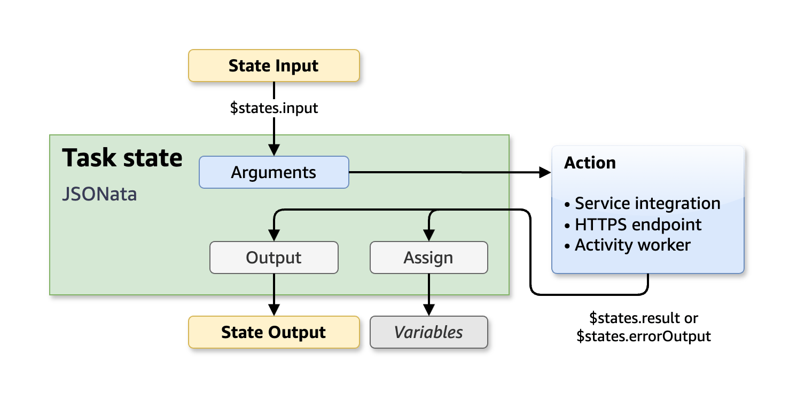
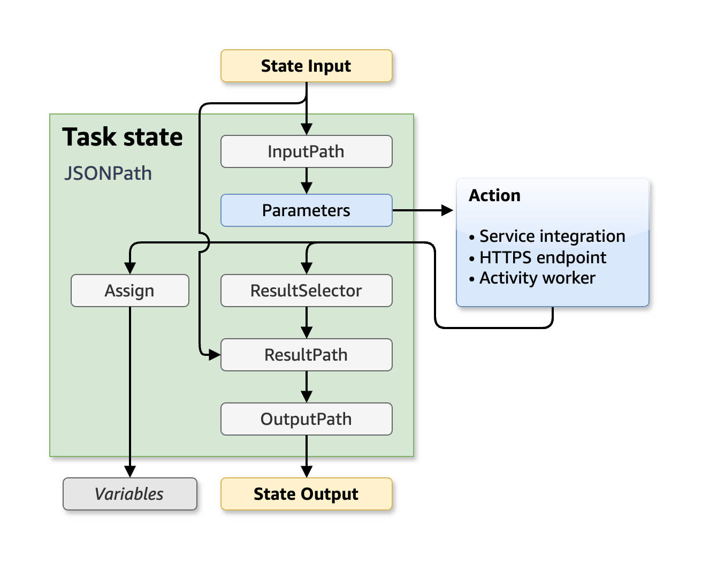

# Processing input and output in Step Functions

###### Managing state with variables and JSONata

Step Functions recently added variables and JSONata to manage state and transform data.

Learn more in the blog post [Simplifying developer experience with variables and JSONata in AWS Step Functions](https://aws.amazon.com/blogs/compute/simplifying-developer-experience-with-variables-and-jsonata-in-aws-step-functions/ "https://aws.amazon.com/blogs/compute/simplifying-developer-experience-with-variables-and-jsonata-in-aws-step-functions/")

When a Step Functions execution receives JSON input, it passes that data to the first state in the workflow as input.

With JSONata, you can retrieve state input from `$states.input`. Your state machine executions also provide that initial input data in the [Context object](input-output-contextobject.md "input-output-contextobject.md"). You can retrieve the original state machine input at any point in your workflow from `$states.context.Execution.Input`.

When states exit, their output is available to the _very_ next state in your state machine. Your state inputs will pass through as state output by default, unless you **modify** the state output. For data that you might need in later steps, consider storing it in variables. For more info, see [Passing data between states with variables](workflow-variables.md "workflow-variables.md").

###### QueryLanguage recommendation

For new state machines, we recommend the JSONata query language. In state machines that do not specify a query language, the state machine defaults to JSONPath for backward compatibility. You must opt-in to use JSONata for your state machines or individual states.

**Processing input and output with JSONata**

With JSONata expressions, you can select and transform data. In the `Arguments`
field, you can customize the data sent to the action. The result can be transformed into
custom state output in the `Output` field. You can also store data in variables
in the `Assign` field. For more info, see [Transforming data with JSONata](transforming-data.md "transforming-data.md").

The following diagram shows how JSON information moves through a JSONata task state.

**Processing input and output with JSONPath**

###### Managing state and transforming data

Learn about [Passing data between states with variables](workflow-variables.md "workflow-variables.md") and [Transforming data with JSONata](transforming-data.md "transforming-data.md").

For state machines that use JSONPath, the following fields control the flow of data from
state to state: `InputPath`, `Parameters`,
`ResultSelector`, `ResultPath`, and `OutputPath`. Each
JSONPath field can manipulate JSON as it moves through each state in your workflow.

JSONPath fields can use [paths](amazon-states-language-paths.md "amazon-states-language-paths.md") to select portions
of the JSON from the input or the result. A path is a string, beginning with `$`,
that identifies nodes within JSON text. Step Functions paths use [JsonPath](https://datatracker.ietf.org/wg/jsonpath/about/ "https://datatracker.ietf.org/wg/jsonpath/about/") syntax.

The following diagram shows how JSON information moves through a JSONPath task state. The
`InputPath` selects the parts of the JSON input to pass to the task of the
`Task` state (for example, an AWS Lambda function). You can adjust the data that
is sent to your action in the `Parameters` field. Then, with
`ResultSelector`, you can select portions of the action result to carry forward.
`ResultPath` then selects the combination of state input and task results to pass
to the output. `OutputPath` can filter the JSON output to further limit the
information that's passed to the output.

###### Topics

- [Passing data between states with variables](workflow-variables.md "workflow-variables.md")
- [Transforming data with JSONata in Step Functions](transforming-data.md "transforming-data.md")
- [Accessing execution data from the Context object
  in Step Functions](input-output-contextobject.md "input-output-contextobject.md")
- [Using JSONPath paths](amazon-states-language-paths.md "amazon-states-language-paths.md")
- [Manipulate parameters in Step Functions workflows](input-output-inputpath-params.md "input-output-inputpath-params.md")
- [Example: Manipulating state data with paths in Step Functions workflows](input-output-example.md "input-output-example.md")
- [Specifying state output using ResultPath in Step Functions](input-output-resultpath.md "input-output-resultpath.md")
- [Map state input and output fields in Step Functions](input-output-fields-dist-map.md "input-output-fields-dist-map.md")
