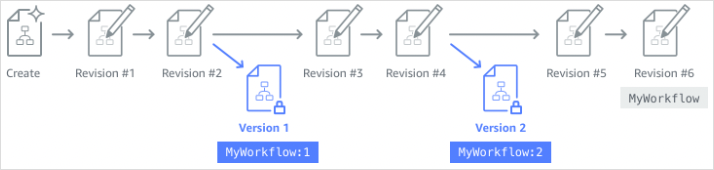

# State machine versions in Step Functions workflows

A _version_ is a
numbered, **immutable** snapshot of a state machine. You publish versions from the most recent revision
made to that state machine. Each version has a unique Amazon Resource Name (ARN) which is a
combination of state machine ARN and the version number separated by a colon
(:).
The following example shows the format of a state machine version ARN.

```
arn:`partition`:states:`region`:`account-id`:stateMachine:`myStateMachine`:1
```

To start using state machine versions, you must publish the first version.
After
you publish a version, you can invoke the [StartExecution](../apireference/API_StartExecution.md "../apireference/API_StartExecution.md")
API action with the version ARN. You can't edit a version, but you can update a state
machine and publish a new version. You can also publish multiple versions of your state
machine.


When you publish a new version of your state machine, Step Functions assigns it a version number. Version numbers start at 1 and increase monotonically for each new version. Version numbers aren't reused for a given state machine. If you delete version 10 of your state machine and then publish a new version, Step Functions publishes it as version 11.

The following properties are the same for all versions of a state machine:

- All versions of a state machine share the same type [(Standard or Express)](choosing-workflow-type.md "choosing-workflow-type.md").
- You can't change the name or creation date of a state machine between
  versions.
- Tags apply globally to state machines. You can manage tags for state machines
  using the [TagResource](../apireference/API_TagResource.md "../apireference/API_TagResource.md") and [UntagResource](../apireference/API_UntagResource.md "../apireference/API_UntagResource.md") API actions.
  State machines also contain properties that are a part of each version and [revision](concepts-cd-aliasing-versioning.md#statemachinerev "concepts-cd-aliasing-versioning.md#statemachinerev"), but these properties
  can
  differ between two given versions or revisions. These properties include [State machine definition](../apireference/API_UpdateStateMachine.md#StepFunctions-UpdateStateMachine-request-definition "../apireference/API_UpdateStateMachine.md#StepFunctions-UpdateStateMachine-request-definition"), [IAM role](../apireference/API_UpdateStateMachine.md#StepFunctions-UpdateStateMachine-request-roleArn "../apireference/API_UpdateStateMachine.md#StepFunctions-UpdateStateMachine-request-roleArn"), [tracing configuration](../apireference/API_UpdateStateMachine.md#StepFunctions-UpdateStateMachine-request-tracingConfiguration "../apireference/API_UpdateStateMachine.md#StepFunctions-UpdateStateMachine-request-tracingConfiguration"), and [logging configuration](../apireference/API_UpdateStateMachine.md#StepFunctions-UpdateStateMachine-request-loggingConfiguration "../apireference/API_UpdateStateMachine.md#StepFunctions-UpdateStateMachine-request-loggingConfiguration").

## Publishing a state machine version

(Console)

You can publish up to 1000 versions of a state machine. To request an increase
to this soft limit, use the **Support Center** page in the [AWS Management Console](../../../servicequotas/latest/userguide/request-quota-increase.md "../../../servicequotas/latest/userguide/request-quota-increase.md"). You can manually delete unused versions from the console or by invoking
the [DeleteStateMachineVersion](../apireference/API_DeleteStateMachineVersion.md "../apireference/API_DeleteStateMachineVersion.md") API action.

###### To publish a state machine version

1. Open the [Step Functions
   console](https://console.aws.amazon.com/states/home?region=us-east-1#/ "https://console.aws.amazon.com/states/home?region=us-east-1#/"), and then choose an existing state machine.
2. On the **State machine detail** page, choose
   **Edit**.
3. Edit the state machine
   definition
   as required, and then choose **Save**.
4. Choose **Publish version**.
5. (Optional)
   In
   the **Description** field of the dialog box that
   appears, enter a brief description
   about the state machine version.
6. Choose **Publish**.

###### Note

When you publish a new version of your state machine, Step Functions assigns it a version number. Version numbers start at 1 and increase monotonically for each new version. Version numbers aren't reused for a given state machine. If you delete version 10 of your state machine and then publish a new version, Step Functions publishes it as version 11.

## Managing versions with Step Functions API

operations

Step Functions provides the following API operations to publish and manage state machine
versions:

- [PublishStateMachineVersion](../apireference/API_PublishStateMachineVersion.md "../apireference/API_PublishStateMachineVersion.md") – Publishes a
  version from the current [revision](concepts-cd-aliasing-versioning.md#statemachinerev "concepts-cd-aliasing-versioning.md#statemachinerev") of a state machine.
- [UpdateStateMachine](../apireference/API_UpdateStateMachine.md "../apireference/API_UpdateStateMachine.md") – Publishes a new state
  machine version if you update a state machine and set the `publish`
  parameter to `true` in the same request.
- [CreateStateMachine](../apireference/API_CreateStateMachine.md "../apireference/API_CreateStateMachine.md") – Publishes the first
  revision of the state machine if you set the `publish` parameter to
  `true`.
- [ListStateMachineVersions](../apireference/API_ListStateMachineVersions.md "../apireference/API_ListStateMachineVersions.md") – Lists versions
  for the specified state machine ARN.
- [DescribeStateMachine](../apireference/API_DescribeStateMachine.md "../apireference/API_DescribeStateMachine.md") – Returns the state machine version details for a version ARN specified in `stateMachineArn`.
- [DeleteStateMachineVersion](../apireference/API_DeleteStateMachineVersion.md "../apireference/API_DeleteStateMachineVersion.md") – Deletes a state
  machine version.

To publish a new version from the current revision of a state machine called
`myStateMachine` using the AWS Command Line Interface, use
the `publish-state-machine-version` command:

```
aws stepfunctions publish-state-machine-version --state-machine-arn arn:aws:states:`region`:`account-id`:stateMachine:`myStateMachine`
```

The response returns the `stateMachineVersionArn`. For example,
the previous command returns a response
of`arn:aws:states:`region`:`account-id`:stateMachine:`myStateMachine`:1`.

###### Note

When you publish a new version of your state machine, Step Functions assigns it a version number. Version numbers start at 1 and increase monotonically for each new version. Version numbers aren't reused for a given state machine. If you delete version 10 of your state machine and then publish a new version, Step Functions publishes it as version 11.

## Running a state machine version from the

console

To start using state machine versions, you must first publish a version from the current
state machine [revision](concepts-cd-aliasing-versioning.md#statemachinerev "concepts-cd-aliasing-versioning.md#statemachinerev"). To publish a version, use the Step Functions console or invoke the [PublishStateMachineVersion](../apireference/API_PublishStateMachineVersion.md "../apireference/API_PublishStateMachineVersion.md") API action. You can also invoke
the [UpdateStateMachineAlias](../apireference/API_UpdateStateMachineAlias.md "../apireference/API_UpdateStateMachineAlias.md") API action with an optional parameter
named `publish` to update a state machine and publish its version.

You can start executions of a version by using the console or by invoking
the [StartExecution](../apireference/API_StartExecution.md "../apireference/API_StartExecution.md") API action and providing the version ARN.
You can also use an [alias](concepts-state-machine-alias.md "concepts-state-machine-alias.md") to start executions of a version. Based on its [routing configuration](concepts-state-machine-alias.md#alias-routing-config "concepts-state-machine-alias.md#alias-routing-config"), an alias routes traffic to a specific version.

If you start a state
machine execution without using a version, Step Functions uses the most recent revision of the
state machine for the execution. For information about how Step Functions associates an execution with a version, see [Associating executions with a version or alias](execution-alias-version-associate.md "execution-alias-version-associate.md").

###### To start an execution using a state machine version

1. Open the [Step Functions
   console](https://console.aws.amazon.com/states/home?region=us-east-1#/ "https://console.aws.amazon.com/states/home?region=us-east-1#/"), and then choose an existing state machine
   that
   you've published one or more versions for. To learn how to
   publish a version, see [Publishing a state machine version
   (Console)](#procedure-create-versions "#procedure-create-versions").
2. On the **State machine detail** page, choose the
   **Versions** tab.
3. In the **Versions** section, do the following:
   1. Select
      the version that you want to start the execution with.
   2. Choose **Start execution**.

4. (Optional) In the **Start execution** dialog box, enter a
   name for the execution.
5. (Optional)
   , enter the execution input, and
   then choose **Start execution**.
