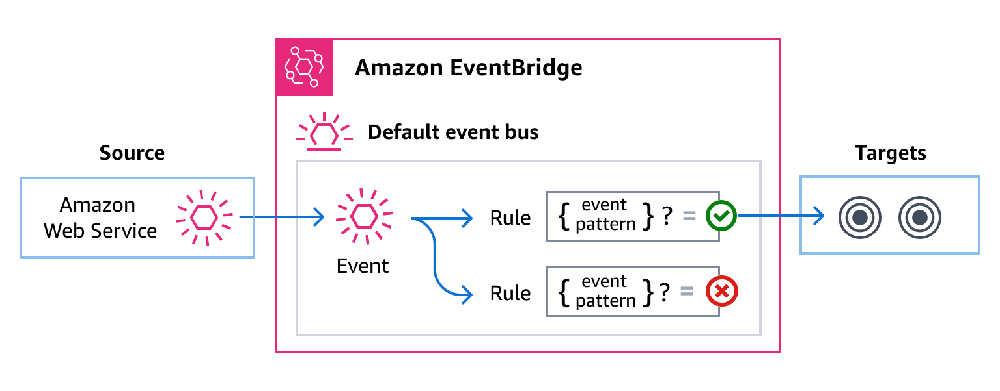

# Automating Step Functions event delivery with EventBridge

With EventBridge, you can select events from Step Functions standard workflows,
to send to other services for additional processing. This
technique provides a flexible way to loosely connect components and monitor your resources.

Amazon EventBridge is a serverless service that connects application
components together to build scalable event-driven applications.
Event-driven architecture is a style of building loosely-coupled software systems that work
together by emitting and responding to _events_. Events represent a change in state, or an update.

By using EventBridge to deliver Step Functions events to other services, you can monitor
your standard workflows without continuously calling the [DescribeExecution](../apireference/API_DescribeExecution.md "../apireference/API_DescribeExecution.md") API to get the status. Status changes in state machine executions
are sent to EventBridge automatically. You can use those events to target services.
For example, events might invoke a AWS Lambda function, publish a message to Amazon Simple Notification Service
(Amazon SNS) topic, or even run another SFN workflow.

###### How event delivery works

Step Functions generates and sends events to the default EventBridge _event bus_ which is automatically provisioned in every AWS account. An event bus is a router that receives events and delivers them to zero
or more destinations, or _targets_. Targets are other AWS services. You can specify rules for the event bus that compare events against the rule's _event pattern_. When the event matches a pattern, the event bus sends the event to the specified target(s). The following diagram shows this process:



###### Standard versus Express workflows

Only standard workflows emit events to EventBridge. To monitor the execution of express workflows, you can use CloudWatch Logs. See [Logging in CloudWatch Logs](cw-logs.md "cw-logs.md").

## Step Functions events

Step Functions sends the following events to the default EventBridge event bus automatically. Events that match a rule's event pattern are delivered to the specified targets
on a [best-effort basis](../../../eventbridge/latest/userguide/eb-service-event.md#eb-service-event-delivery-level "../../../eventbridge/latest/userguide/eb-service-event.md#eb-service-event-delivery-level"). Events might be
delivered out of order.

For more information, see [EventBridge events](../../../eventbridge/latest/userguide/eb-events.md "../../../eventbridge/latest/userguide/eb-events.md") in the _Amazon EventBridge User Guide._

| Event detail type                                                                                        | Description                                                     |
| -------------------------------------------------------------------------------------------------------- | --------------------------------------------------------------- | ----------------------------------------------------------------------------------------------------------------------------------------------------------------------------------------------------------------------------------------------------------------------------------------------------------------------------------------------------------------------------------------------------------------------------------------------------------------------------------------------------------------------------------------------------------------------------------------------------------------------------------------------------------------------------------------------------------------------------------------------------------------------------------------------------------------------------------------------------------------------------------------------------------------------------------------------------------------------------------------------------------------------------------------------------------------------------------------------------------------------------------------------------------------------------------------------------------------------------------------------------------------------------------------------------------------------------------------------------------------------------------------------------------------------------------------------------------------------------------------------------------------------------------------------------------------------------------------------------------------------------------------------------------------------------------------------------------------------------------------------------------------------------------------------------------------------------------------------------------------------------------------------------------------------------------------------------------------------------------------------------------------------------------------------------------------------------------------------------------------------------------------------------------------------------------------------------------------------------------------------------------------------------------------------------------------------------------------------------------------------------------------------------------------------------------------------------------------------------------------------------------------------------------------------------------------------------------------------------------------------------------------------------------------------------------------------------------------------------------------------------------------------------------------------------------------------------------------------------------------------------------------------------------------------------------------------------------------------------------------------------------------------------------------------------------------------------------------------------------------------------------------------------------------------------------------------------------------------------------------------------------------------------------------------------------------------------------------------------------------------------------------------------------------------------------------------------------------------------------------------------------------------------------------------------------------------------------------------------------------------------------------------------------------------------------------------------------------------------------------------------------------------------------------------------------------------------------------------------------------------------------------------------------------------------------------------------------------------------------------------------------------------------------------------------------------------------------------------------------------------------------------------------------------------------------------------------------------------------------------------------------------------------------------------------------------------------------------------------------------------------------------------------------------------------------------------------------------------------------------------------------------------------------------------------------------------------------------------------------------------------------------------------------------------------------------------------------------------------------------------------------------------------------------------------------------------------------------------------------------------------------------------------------------------------------------------------------------------------------------------------------------------------------------------------------------------------------------------------------------------------------------------------------------------------------------------------------------------------------------------------------------------------------------------------------------------------------------------------------------------------------------------------------------------------------------------------------------------------------------------------------------------------------------------------------------------------------------------------------------------------------------------------------------- | --------- | ------ | --------- | ------- | ---------------------------------------------------------------------------------------------------------------------------------------------------------------------------------------------------------------------------------------------------------------------------------------------------------------------------------------------------------------------------------------------------------------------------------------------------------------------------------------------------------------------------------------------------------------------------------------------------------------------------------------------------------------------------------------------------------------------------------------------------------------------------------------------------------------------------------------------------------------------------------------------------------------------------------------------------------------------------------------------------------------------------------------------------------------------------------------------------------------------------------------------------------------------------------------------------------------------------------------------------------------------------------------------------------------------------------------------------------------------------------------------------------------------------------------------------------------------------------------------------------------------------------------------------------------------------------------------------------------------------------------------------------------------------------------------------------------------------------------------------------------------------------------------------------------------------------------------------------------------------------------------------------------------------------------------------------------------------------------------------------------------------------------------------------------------------------------------------------------------------------------------------------------------------------------------------------------------------------------------------------------------------------------------------------------------------------------------------------------------------------------------------------------------------------------------------------------------------------------------------------------------------------------------------------------------------------------------------------------------------------------------------------------------------------------------------------------------------------------------------------------------------------------------------------------------------------------------------------------------------------------------------------------------------------------------------------------------------------------------------------------------------------------------------------------------------------------------------------------------------------------------------------------------------------------------------------------------------------------------------------------------------------------------------------------------------------------------------------------------------------------------------------------------------------------------------------------------------------------------------------------------------------------------------------------------------------------------------------------------------------------------------------------------------------------------------------------------------------------------------------------------------------------------------------------------------------------------------------------------------------------------------------------------------------------------------------------------------------------------------------------------------------------------------------------------------------------------------------------------------------------------------------------------------------------------------------------------------------------------------------------------------------------------------------------------------------------------------------------------------------------------------------------------------------------------------------------------------------------------------------------------------------------------------------------------------------------------------------------------------------------------------------------------------------------------------------------------------------------------------------------------------------------------------------------------------------------------------------------------------------------------------------------------------------------------------------------------------------------------------------------------------------------------------------------------------------------------------------------------------------------------------------------------------------------------------------------------------------------------------------------------------------------------------------------------------------------------------------------------------------------------------------------------------------------------------------------------------------------------------------------------- |
| [Execution Status Change](#event-detail-execution-status-change "#event-detail-execution-status-change") | Represents a change in the status of a state machine execution. | ## Delivering Step Functions events using EventBridge To have the EventBridge default event bus send Step Functions events to a target, you must create a rule. Each rule contains an event pattern, which EventBridge matches against each event received on the event bus. If the event data matches the specified event pattern, EventBridge delivers that event to the rule's target(s). For comprehensive instructions on creating event bus rules, see [Creating rules that react to events](../../../eventbridge/latest/userguide/eb-create-rule.md "../../../eventbridge/latest/userguide/eb-create-rule.md") in the _EventBridge User Guide_. You can also create an event bus rule for a specific state machine from the Step Functions console: <br>• On the **Details** page of a state machine, choose **Actions**, and then choose **Create _EventBridge_ rule**. The EventBridge console opens to the **Create rule** page, with the state machine selected as the event source for the rule. <br>• Follow the procedure detailed in [Creating rules that react to events](../../../eventbridge/latest/userguide/eb-create-rule.md "../../../eventbridge/latest/userguide/eb-create-rule.md") in the _EventBridge User Guide_. ### Creating event patterns that match Step Functions events Each event pattern is a JSON object that contains: <br>• A `source` attribute that identifies the service sending the event. For Step Functions events, the source is `aws.states`. <br>• (Optional): A `detail-type` attribute that contains an array of the event types to match. <br>• (Optional): A `detail` attribute containing any other event data on which to match. For example, the following event pattern matches against all Execution Status Change events from Step Functions: `{ "source": ["aws.states"], "detail-type": ["Step Functions Execution Status Change"] }` While the following example matches against a specific execution associated with a specific state machine, when that execution fails or times out: ``{ "source": ["aws.states"], "detail-type": ["Step Functions Execution Status Change"], "detail": { "status": ["FAILED", "TIMED_OUT"], "stateMachineArn": ["arn:aws:states:`region`:`account-id`:stateMachine:state-machine"], "executionArn": ["arn:aws:states:`region`:`account-id`:execution:state-machine-name:execution-name"] } }`` For more information on writing event patterns, see [Event patterns](../../../eventbridge/latest/userguide/eb-event-patterns.md "../../../eventbridge/latest/userguide/eb-event-patterns.md") in the _EventBridge User Guide_. ## Triggering Step Functions state machines using events You can also specify a Step Functions state machine as a target for EventBridge event bus rule. This enables you to trigger an execution of a Step Functions workflow in response to an event from another AWS service. For more information, see [Amazon EventBridge targets](../../../eventbridge/latest/userguide/eb-targets.md "../../../eventbridge/latest/userguide/eb-targets.md") in the _Amazon EventBridge User Guide_. ## Step Functions events detail reference All events from AWS services have a common set of fields containing metadata about the event, such as the AWS service that is the source of the event, the time the event was generated, the account and region in which the event took place, and others. For definitions of these general fields, see [Event structure reference](../../../eventbridge/latest/ref/overiew-event-structure.md "../../../eventbridge/latest/ref/overiew-event-structure.md") in the _Amazon EventBridge User Guide_. In addition, each event has a `detail` field that contains data specific to that particular event. When using EventBridge to select and manage Step Functions events, it's useful to keep the following in mind: <br>• The `source` field for all events from Step Functions is set to `aws.states`. <br>• The `detail-type` field specifies the event type. For example, `Step Functions Execution Status Change`. <br>• The `detail` field contains the data that is specific to that particular event. For information on constructing event patterns that enable rules to match Step Functions events, see [Event patterns](../../../eventbridge/latest/userguide/eb-event-patterns.md "../../../eventbridge/latest/userguide/eb-event-patterns.md") in the _Amazon EventBridge User Guide_. For more information on events and how EventBridge processes them, see [Amazon EventBridge events](../../../eventbridge/latest/userguide/eb-events.md "../../../eventbridge/latest/userguide/eb-events.md") in the _Amazon EventBridge User Guide_. ### Execution Status Change Represents a change in the status of a state machine execution. The `source` and `detail-type` fields are included below because they contain specific values for Step Functions events. For definitions of the other metadata fields that are included in all events, see [Event structure reference](../../../eventbridge/latest/ref/overiew-event-structure.md "../../../eventbridge/latest/ref/overiew-event-structure.md") in the _Amazon EventBridge User Guide_. #### Event structure ``` { . . ., "detail-type": "Step Functions Execution Status Change", "source"": "aws.states", . . ., "detail"": { "executionArn"" : "string", "input" : "string", "inputDetails" : { "included" : "boolean" }, "name" : "string", "output" : "string", "outputDetails" : { "included" : "boolean" }, "startDate" : "integer", "stateMachineArn" : "string", "stopDate" : "integer", "status" : "RUNNING | SUCCEEDED | FAILED | TIMED_OUT | ABORTED | PENDING_REDRIVE" } } ``#### Remarks An Execution Status Change event can contain an input property in its definition. For some events, an Execution Status Change event can also contain an output property in its definition. <br>• If the combined escaped input and escaped output sent to EventBridge exceeds 248 KiB, then the input will be excluded. Similarly, if the escaped output exceeds 248 KiB, then the output will be excluded. This is a result of events quotas. <br>• You can determine whether a payload has been truncated with the `inputDetails` and `outputDetails` properties. For more information, see the [`CloudWatchEventsExecutionDataDetails` Data Type](../apireference/API_CloudWatchEventsExecutionDataDetails.md "../apireference/API_CloudWatchEventsExecutionDataDetails.md"). <br>• For Standard Workflows, use [DescribeExecution](../apireference/API_DescribeExecution.md "../apireference/API_DescribeExecution.md") to see the full input and output. `DescribeExecution` is not available for Express Workflows. If you want to see the full input/output, you can: + Wrap your Express Workflow with a Standard Workflow. + Use Amazon S3 ARNs. For information about using ARNs, see [Using Amazon S3 ARNs instead of passing large payloads in Step Functions](sfn-best-practices.md#avoid-exec-failures "sfn-best-practices.md#avoid-exec-failures"). #### Examples ###### Example Execution Status Change: execution started`` { "version": "0", "id": "315c1398-40ff-a850-213b-158f73e60175", "detail-type": "Step Functions Execution Status Change", "source": "aws.states", "account": "`account-id`", "time": "2019-02-26T19:42:21Z", "region": "us-east-2", "resources": [ "arn:aws:states:us-east-2:`account-id`:execution:state-machine-name:execution-name" ], "detail": { "executionArn": "arn:aws:states:us-east-2:`account-id`:execution:state-machine-name:execution-name", "stateMachineArn": "arn:aws::states:us-east-2:`account-id`:stateMachine:state-machine", "name": "execution-name", "status": "RUNNING", "startDate": 1551225271984, "stopDate": null, "input": "{}", "inputDetails": { "included": true }, "output": null, "outputDetails": null } } `###### Example Execution Status Change: execution succeeded` { "version": "0", "id": "315c1398-40ff-a850-213b-158f73e60175", "detail-type": "Step Functions Execution Status Change", "source": "aws.states", "account": "`account-id`", "time": "2019-02-26T19:42:21Z", "region": "us-east-2", "resources": [ "arn:aws:states:us-east-2:`account-id`:execution:state-machine-name:execution-name" ], "detail": { "executionArn": "arn:aws:states:us-east-2:`account-id`:execution:state-machine-name:execution-name", "stateMachineArn": "arn:aws:states:us-east-2:`account-id`:stateMachine:state-machine", "name": "execution-name", "status": "SUCCEEDED", "startDate": 1547148840101, "stopDate": 1547148840122, "input": "{}", "inputDetails": { "included": true }, "output": "\"Hello World!\"", "outputDetails": { "included": true } } } `###### Example Execution Status Change: execution failed` { "version": "0", "id": "315c1398-40ff-a850-213b-158f73e60175", "detail-type": "Step Functions Execution Status Change", "source": "aws.states", "account": "`account-id`", "time": "2019-02-26T19:42:21Z", "region": "us-east-2", "resources": [ "arn:aws:states:us-east-2:`account-id`:execution:state-machine-name:execution-name" ], "detail": { "executionArn": "arn:aws:states:us-east-2:`account-id`:execution:state-machine-name:execution-name", "stateMachineArn": "arn:aws:states:us-east-2:`account-id`:stateMachine:state-machine", "name": "execution-name", "status": "FAILED", "startDate": 1551225146847, "stopDate": 1551225151881, "input": "{}", "inputDetails": { "included": true }, "output": null, "outputDetails": null } } `###### Example Execution Status Change: timed-out` { "version": "0", "id": "315c1398-40ff-a850-213b-158f73e60175", "detail-type": "Step Functions Execution Status Change", "source": "aws.states", "account": "`account-id`", "time": "2019-02-26T19:42:21Z", "region": "us-east-2", "resources": [ "arn:aws:states:us-east-2:`account-id`:execution:state-machine-name:execution-name" ], "detail": { "executionArn": "arn:aws:states:us-east-2:`account-id`:execution:state-machine-name:execution-name", "stateMachineArn": "arn:aws:states:us-east-2:`account-id`:stateMachine:state-machine", "name": "execution-name", "status": "TIMED_OUT", "startDate": 1551224926156, "stopDate": 1551224927157, "input": "{}", "inputDetails": { "included": true }, "output": null, "outputDetails": null `###### Example Execution Status Change: aborted` { "version": "0", "id": "315c1398-40ff-a850-213b-158f73e60175", "detail-type": "Step Functions Execution Status Change", "source": "aws.states", "account": "`account-id`", "time": "2019-02-26T19:42:21Z", "region": "us-east-2", "resources": [ "arn:aws:states:us-east-2:`account-id`:execution:state-machine-name:execution-name" ], "detail": { "executionArn": "arn:aws:states:us-east-2:`account-id`:execution:state-machine-name:execution-name", "stateMachineArn": "arn:aws:states:us-east-2:`account-id`:stateMachine:state-machine", "name": "execution-name", "status": "ABORTED", "startDate": 1551225014968, "stopDate": 1551225017576, "input": "{}", "inputDetails": { "included": true }, "output": null, "outputDetails": null } } ``` |
