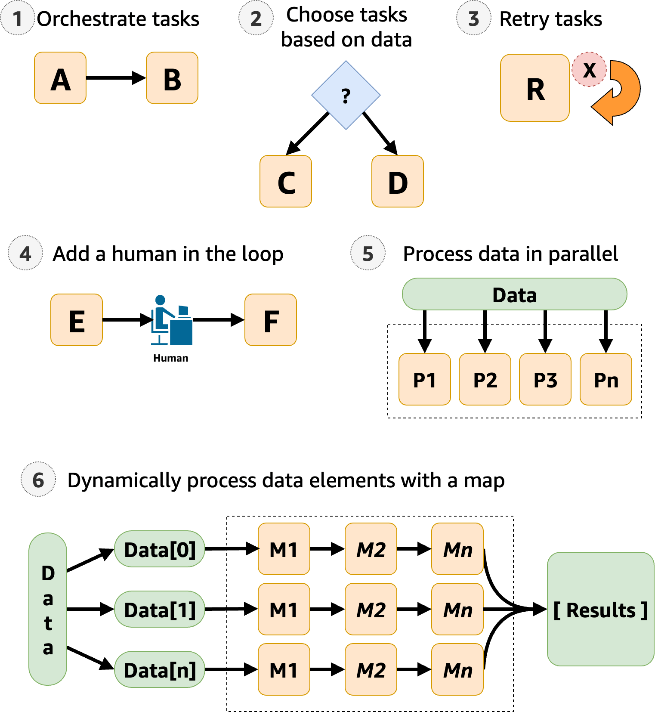

# Tutorials and workshops for learning Step Functions

Learn from this guide, workshops, and practical tutorials how to integrate and orchestrate services with Step Functions.

## Tutorials for learning Step Functions

For a quick introduction, see: [Getting started tutorial](getting-started.md "getting-started.md").

For specific scenarios, see the following tutorials:

- [Handling error conditions in a Step Functions
  state machine](tutorial-handling-error-conditions.md "tutorial-handling-error-conditions.md")
- [Create a Step Functions state machine using
  AWS SAM](tutorial-state-machine-using-sam.md "tutorial-state-machine-using-sam.md")
- [Using CloudFormation to create a workflow in Step Functions](tutorial-lambda-state-machine-cloudformation.md "tutorial-lambda-state-machine-cloudformation.md")
- [Using AWS CDK to create an Express workflow in Step Functions](tutorial-step-functions-rest-api-integration-cdk.md "tutorial-step-functions-rest-api-integration-cdk.md")
- [Using AWS CDK to create a Standard workflow in Step Functions](tutorial-lambda-state-machine-cdk.md "tutorial-lambda-state-machine-cdk.md")
- [Examining state machine executions in Step Functions](debug-sm-exec-using-ui.md "debug-sm-exec-using-ui.md")
- [Creating a Step Functions state machine that uses Lambda](tutorial-creating-lambda-state-machine.md "tutorial-creating-lambda-state-machine.md")
- [Deploying a workflow that waits for human approval in Step Functions](tutorial-human-approval.md "tutorial-human-approval.md")
- [Using Inline Map state to repeat an action in Step Functions](tutorial-map-inline.md "tutorial-map-inline.md")
- [Copying large-scale CSV data using Distributed Map in Step Functions](tutorial-map-distributed.md "tutorial-map-distributed.md")
- [Iterate a loop with a Lambda function in Step Functions](tutorial-create-iterate-pattern-section.md "tutorial-create-iterate-pattern-section.md")
- [Processing batch data with a Lambda function in Step Functions](tutorial-itembatcher-param-task.md "tutorial-itembatcher-param-task.md")
- [Processing individual items with a Lambda function in Step Functions](tutorial-itembatcher-single-item-process.md "tutorial-itembatcher-single-item-process.md")
- [Starting a Step Functions workflow in response to events](tutorial-cloudwatch-events-s3.md "tutorial-cloudwatch-events-s3.md")
- [Creating a Step Functions API using API Gateway](tutorial-api-gateway.md "tutorial-api-gateway.md")
- [Creating an Activity state
  machine using Step Functions](tutorial-creating-activity-state-machine.md "tutorial-creating-activity-state-machine.md")
- [View X-Ray traces in Step Functions](tutorial-xray-traces.md "tutorial-xray-traces.md")
- [Gather Amazon S3 bucket info using AWS SDK service integrations](tutorial-gather-s3-info.md "tutorial-gather-s3-info.md")
- [Continue long-running workflows using Step Functions API (recommended)](tutorial-continue-new.md "tutorial-continue-new.md")
- [Using a Lambda function to continue a new execution in Step Functions](tutorial-use-lambda-cont-exec.md "tutorial-use-lambda-cont-exec.md")
- [Accessing cross-account AWS resources in Step Functions](tutorial-access-cross-acct-resources.md "tutorial-access-cross-acct-resources.md")

###### Learn with starter templates

To deploy and learn from ready-to-run state machines for a variety of use cases, see [Starter templates](starter-templates.md "starter-templates.md").

## Workshops for learning Step Functions

###### Workshop: [The Step Functions Workshop](https://catalog.workshops.aws/stepfunctions/en-US "https://catalog.workshops.aws/stepfunctions/en-US")

In this workshop, you will learn to use the primary features of Step Functions while building workflows. A series of interactive modules start by introducing you to basic workflows, task states, and error handling. You can continue to learn choice states for branch logic, map states for processing arrays, and parallel states for running multiple branches in parallel.

###### Workshop: [Large-scale Data Processing with Step Functions](https://catalog.workshops.aws/serverless-data-processing "https://catalog.workshops.aws/serverless-data-processing")

Learn how serverless technologies such as Step Functions and Lambda can simplify management and scaling, offload undifferentiated tasks, and address the challenges of large-scale distributed data processing. Along the way, you will work with distributed map for high concurrency processing. The workshop also presents best practices for optimizing your workflows, and practical use cases for claims processing, vulnerability scanning, and Monte Carlo simulation.
