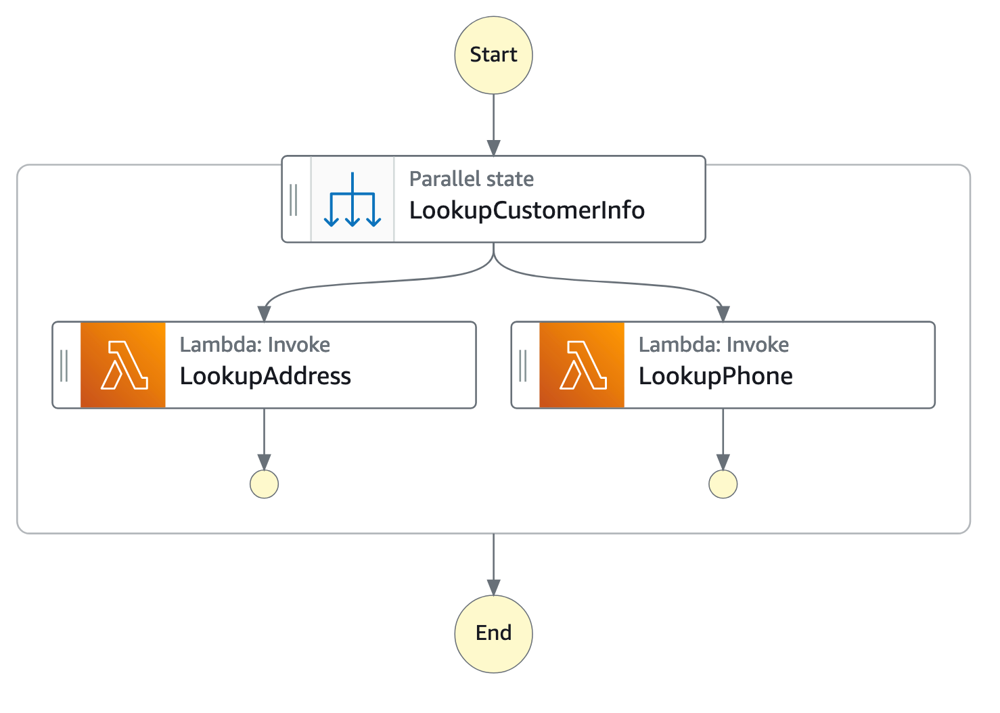

# Parallel workflow state

###### Managing state and transforming data

Learn about [Passing data between states with variables](workflow-variables.md "workflow-variables.md") and [Transforming data with JSONata](transforming-data.md "transforming-data.md").

The `Parallel` state (`"Type": "Parallel"`) can be used to add separate branches of execution in your state machine.

In addition to the [common state
fields](statemachine-structure.md#amazon-states-language-common-fields "statemachine-structure.md#amazon-states-language-common-fields"), `Parallel` states include these additional fields.

**`Branches` (Required)**

An array of objects that specify state machines to execute in parallel. Each
such state machine object must have fields named `States` and
`StartAt`, whose meanings are exactly like those in the top level of a state
machine.

**`Parameters` (Optional, JSONPath only)**

Used to pass information to the state machines defined in the `Branches` array.

**`Arguments` (Optional, JSONata only)**

Used to pass information to the API actions of connected resources. Values
can include JSONata expressions. For more information, see [Transforming data with JSONata in Step Functions](transforming-data.md "transforming-data.md").

**`Output` (Optional, JSONata only)**

Used to specify and transform output from the state. When specified, the
value overrides the state output default.

The output field accepts any JSON value (object, array, string, number,
boolean, null). Any string value, including those inside objects or arrays,
will be evaluated as JSONata if surrounded by  characters.

Output also accepts a JSONata expression directly, for example: "Output":
""

For more information, see [Transforming data with JSONata in Step Functions](transforming-data.md "transforming-data.md").

**`Assign` (Optional)**

Used to store variables. The `Assign` field accepts a JSON object with
key/value pairs that define variable names and their assigned values. Any
string value, including those inside objects or arrays, will be evaluated as
JSONata when surrounded by `` characters

For more information, see [Passing data between states with variables](workflow-variables.md "workflow-variables.md").

**`ResultPath` (Optional, JSONPath only)**

Specifies where (in the input) to place the output of the branches. The input
is then filtered as specified by the `OutputPath` field (if present) before
being used as the state's output. For more information, see [Input and Output
Processing](concepts-input-output-filtering.md "concepts-input-output-filtering.md").

**`ResultSelector` (Optional, JSONPath only)**

Pass a collection of key value pairs, where the values are static or selected from the
result. For more information, see [ResultSelector](input-output-inputpath-params.md#input-output-resultselector "input-output-inputpath-params.md#input-output-resultselector").

**`Retry` (Optional)**

An array of objects, called Retriers, that define a retry policy in case the
state encounters runtime errors. For more information, see [State machine examples using Retry and Catch](concepts-error-handling.md#error-handling-examples "concepts-error-handling.md#error-handling-examples").

**`Catch` (Optional)**

An array of objects, called Catchers, that define a fallback state that is
executed if the state encounters runtime errors and its retry policy is exhausted or isn't
defined. For more information, see [Fallback States](concepts-error-handling.md#error-handling-fallback-states "concepts-error-handling.md#error-handling-fallback-states").

A `Parallel` state causes AWS Step Functions to execute each branch, starting with the
state named in that branch's `StartAt` field, as concurrently as possible, and
wait until all branches terminate (reach a terminal state) before processing the
`Parallel` state's `Next` field.

## Parallel State Example

```
{
  "Comment": "Parallel Example.",
  "StartAt": "LookupCustomerInfo",
  "States": {
    "LookupCustomerInfo": {
      "Type": "Parallel",
      "End": true,
      "Branches": [
        {
         "StartAt": "LookupAddress",
         "States": {
           "LookupAddress": {
             "Type": "Task",
             "Resource": "arn:aws:lambda:`region`:`account-id`:function:AddressFinder",
             "End": true
           }
         }
       },
       {
         "StartAt": "LookupPhone",
         "States": {
           "LookupPhone": {
             "Type": "Task",
             "Resource": "arn:aws:lambda:`region`:`account-id`:function:PhoneFinder",
             "End": true
           }
         }
       }
      ]
    }
  }
}
```

In this example, the `LookupAddress` and `LookupPhone` branches are
executed in parallel. Here is how the visual workflow looks in the Step Functions console.



Each branch must be self-contained. A state in one branch of a `Parallel` state
must not have a `Next` field that targets a field outside of that branch, nor can
any other state outside the branch transition into that branch.

## Parallel State

Input and Output Processing

A `Parallel` state provides each branch with a copy of its own input data
(subject to modification by the `InputPath` field). It generates output that is an
array with one element for each branch, containing the output from that branch. There is no
requirement that all elements be of the same type. The output array can be inserted into the
input data (and the whole sent as the `Parallel` state's output) by using a
`ResultPath` field in the usual way (see [Input and Output
Processing](concepts-input-output-filtering.md "concepts-input-output-filtering.md")).

```
{
  "Comment": "Parallel Example.",
  "StartAt": "FunWithMath",
  "States": {
    "FunWithMath": {
      "Type": "Parallel",
      "End": true,
      "Branches": [
        {
          "StartAt": "Add",
          "States": {
            "Add": {
              "Type": "Task",
              "Resource": "arn:aws:states:`region`:123456789012:activity:Add",
              "End": true
            }
          }
        },
        {
          "StartAt": "Subtract",
          "States": {
            "Subtract": {
              "Type": "Task",
              "Resource": "arn:aws:states:`region`:123456789012:activity:Subtract",
              "End": true
            }
          }
        }
      ]
    }
  }
}
```

If the `FunWithMath` state was given the array `[3, 2]` as input, then both the `Add` and `Subtract` states receive that array as input.
The output of the `Add` and `Subtract` tasks would be the sum of and difference between the array elements 3 and 2, which is `5` and `1`,
while the output of the `Parallel` state would be an array.

```
[ 5, 1 ]
```

###### Tip

If the Parallel or Map state you use in your state machines returns an array of arrays, you can transform them into a flat array with the [ResultSelector](input-output-inputpath-params.md#input-output-resultselector "input-output-inputpath-params.md#input-output-resultselector") field. For more information, see [Flattening an array of arrays](input-output-inputpath-params.md#flatten-array-of-arrays-result-selector "input-output-inputpath-params.md#flatten-array-of-arrays-result-selector").

## Error Handling

If any branch fails, because of an unhandled error or by transitioning to a
`Fail` state, the entire `Parallel` state is considered to have
failed and all its branches are stopped. If the error is not handled by the
`Parallel` state itself, Step Functions stops the execution with an error.

###### Note

When a parallel state fails, invoked Lambda functions continue to run and
activity workers processing a task token are not stopped.

- To stop long-running activities, use heartbeats to detect if its
  branch has been stopped by Step Functions, and stop workers that are processing tasks. Calling
  [`SendTaskHeartbeat`](../apireference/API_SendTaskHeartbeat.md "../apireference/API_SendTaskHeartbeat.md"), [`SendTaskSuccess`](../apireference/API_SendTaskSuccess.md "../apireference/API_SendTaskSuccess.md"), or
  [`SendTaskFailure`](../apireference/API_SendTaskFailure.md "../apireference/API_SendTaskFailure.md") will throw an error if the state has failed.
  See [Heartbeat Errors](../apireference/API_SendTaskHeartbeat.md#API_SendTaskHeartbeat_Errors "../apireference/API_SendTaskHeartbeat.md#API_SendTaskHeartbeat_Errors").
- Running Lambda functions cannot be stopped. If you have implemented a
  fallback, use a `Wait` state so that cleanup work happens
  after the Lambda function has finished.
