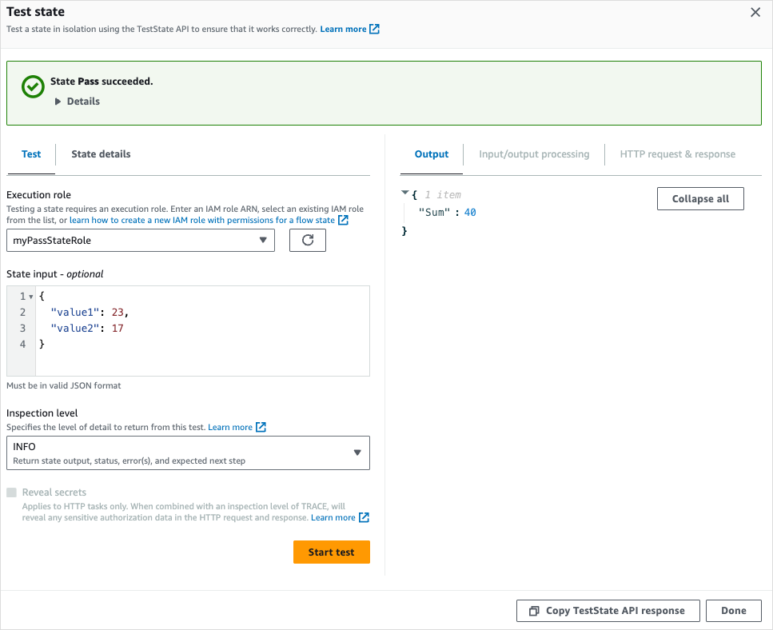
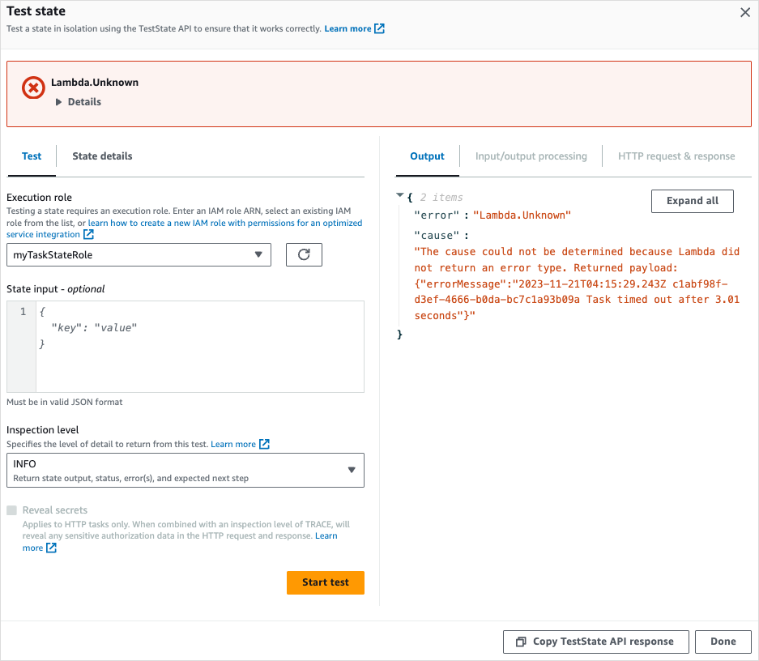
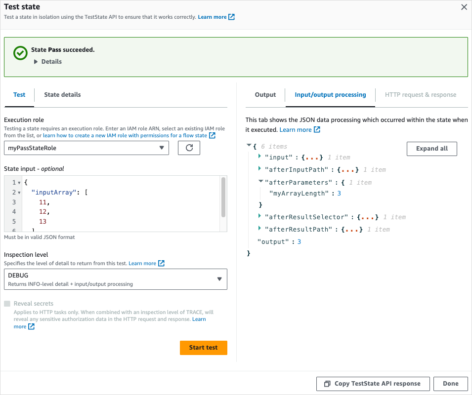
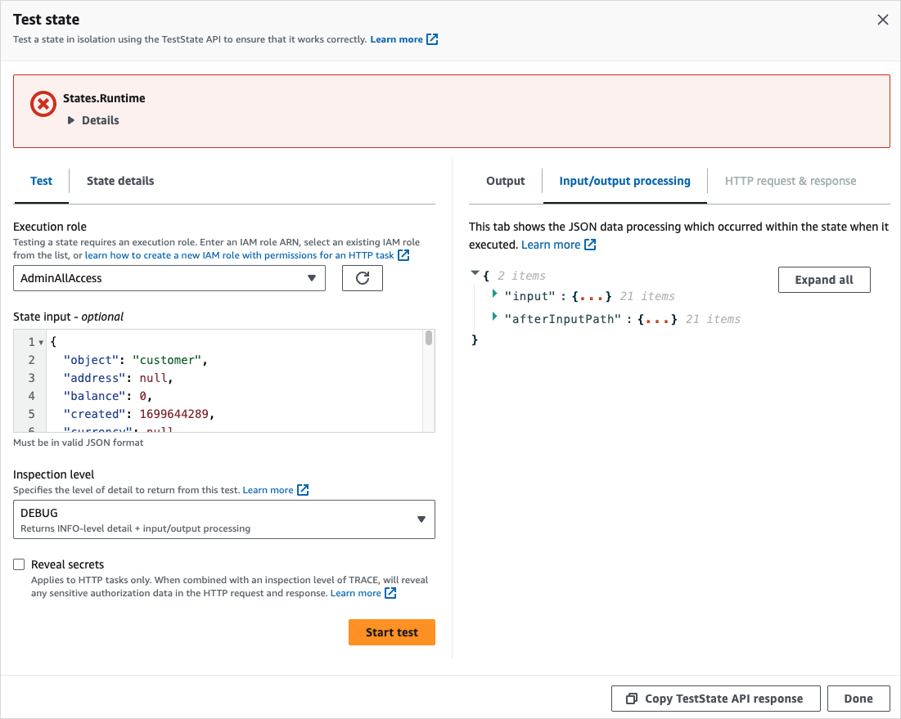
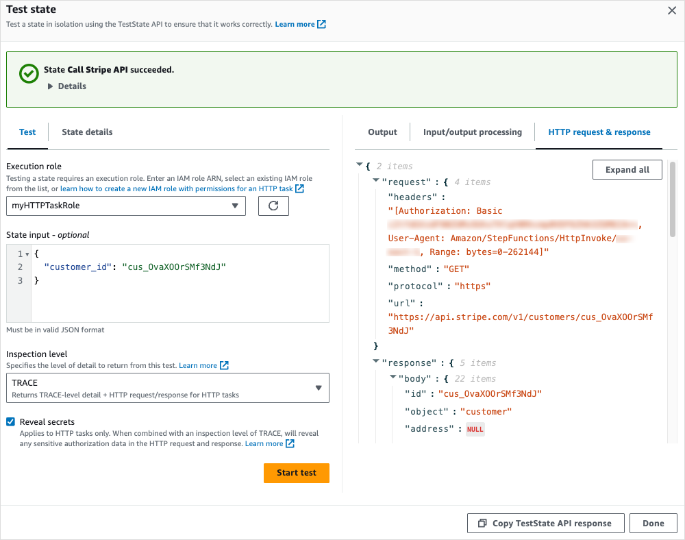
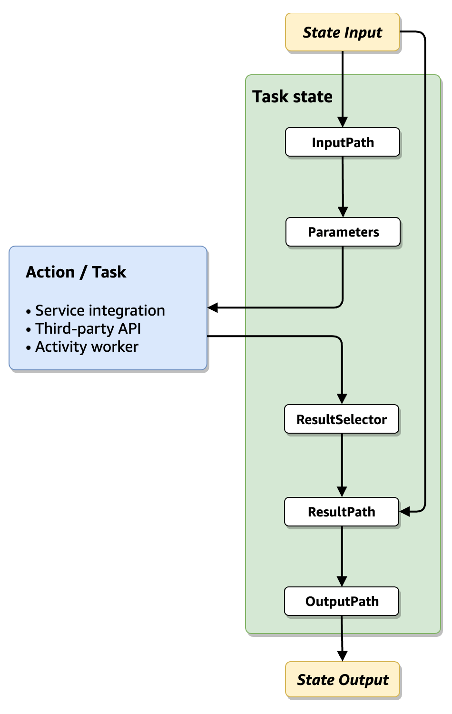
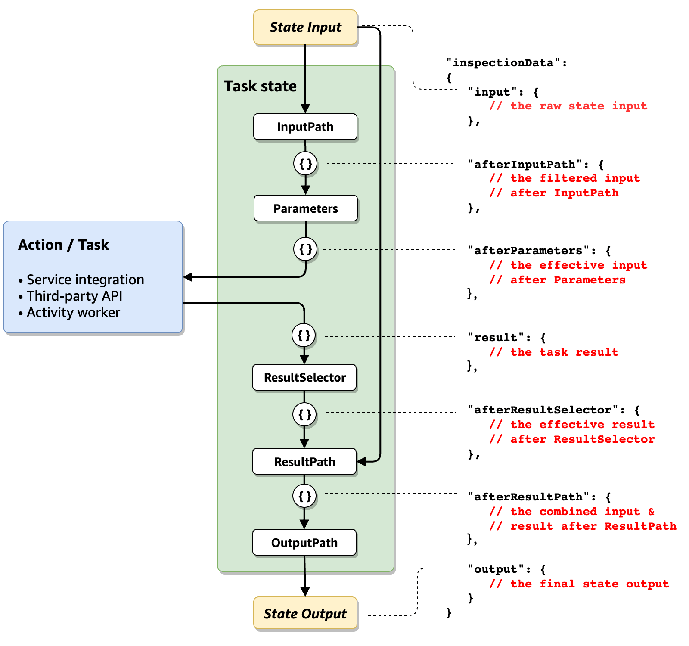

# Using TestState API to test a state in Step Functions

The [TestState](../apireference/API_TestState.md "../apireference/API_TestState.md") API accepts the definition of a single state and executes it. You can test a state without creating a state machine or updating an existing state machine.

Using the TestState API, you can test the following:

- A state's [input and output processing data flow](#test-state-input-output-dataflow "#test-state-input-output-dataflow").
- An [AWS service integration](supported-services-awssdk.md "supported-services-awssdk.md") with other AWS services request and response
- An [HTTP Task](call-https-apis.md "call-https-apis.md") request and response
  To test a state, you can also use the [Step Functions console](#test-state-console "#test-state-console"), [AWS Command Line Interface (AWS CLI)](#test-state-cli "#test-state-cli"), or the SDK.

The `TestState` API assumes an IAM role which must contain the required IAM permissions for the resources your state accesses. For information about the permissions a state might need, see [IAM permissions for using TestState API](#test-state-permissions "#test-state-permissions").

###### Topics

- [Considerations about using the TestState API](#supported-test-states "#supported-test-states")
- [Using inspection levels in TestState API](#how-test-state-works "#how-test-state-works")
- [IAM permissions for using TestState API](#test-state-permissions "#test-state-permissions")
- [Testing a state (Console)](#test-state-console "#test-state-console")
- [Testing a state using AWS CLI](#test-state-cli "#test-state-cli")
- [Testing and debugging input and output data flow](#test-state-input-output-dataflow "#test-state-input-output-dataflow")

## Considerations about using the TestState API

Using the [TestState](../apireference/API_TestState.md "../apireference/API_TestState.md") API, you can test only one state at a time. The states that you can test include the following:

- All [Task types](state-task.md#task-types "state-task.md#task-types"), except [Activities](concepts-activities.md "concepts-activities.md")
- [Pass workflow state](state-pass.md "state-pass.md")
- [Wait workflow state](state-wait.md "state-wait.md")
- [Choice workflow state](state-choice.md "state-choice.md")
- [Succeed workflow state](state-succeed.md "state-succeed.md")
- [Fail workflow state](state-fail.md "state-fail.md")

While using the `TestState` API, keep in mind the following considerations.

- The TestState API doesn't include support for the following:
  - [Task workflow state](state-task.md "state-task.md") states that use the following resource types:
    - [Activity](concepts-activities.md "concepts-activities.md")
    - [Service integration patterns](connect-to-resource.md "connect-to-resource.md") of type `.sync` or `.waitForTaskToken`

  - [Parallel workflow state](state-parallel.md "state-parallel.md") state
  - [Map workflow state](state-map.md "state-map.md") state

- A test can run for up to five minutes. If a test exceeds this duration, it fails with the `States.Timeout` error.

## Using inspection levels in TestState API

To test a state using the [TestState](../apireference/API_TestState.md "../apireference/API_TestState.md") API, you provide the definition of that state. The test then returns an output. For each state, you can specify the amount of detail you want to view in the test results. These details provide additional information about the state you're testing. For example, if you've used any input and output data processing filters, such as [InputPath](input-output-inputpath-params.md "input-output-inputpath-params.md") or [ResultPath](input-output-resultpath.md "input-output-resultpath.md") in a state, you can view the intermediate and final data processing results.

Step Functions provides the following levels to specify the details you want to view:

- [INFO](#test-state-info-level "#test-state-info-level")
- [DEBUG](#test-state-debug-level "#test-state-debug-level")
- [TRACE](#test-state-trace-level "#test-state-trace-level")

All these levels also return the `status` and `nextState` fields. `status` indicates the status of the state execution. For example, `SUCCEEDED`, `FAILED`, `RETRIABLE`, and `CAUGHT_ERROR`. `nextState` indicates the name of the next state to transition to. If you haven't defined a next state in your definition, this field returns an empty value.

For information about testing a state using these inspection levels in the Step Functions console and AWS CLI, see [Testing a state (Console)](#test-state-console "#test-state-console") and [Testing a state using AWS CLI](#test-state-cli "#test-state-cli").

### INFO inspectionLevel

If the test succeeds, this level shows the state output. If the test fails, this level shows the error output. By default, Step Functions sets **Inspection level** to **INFO** if you don't specify a level.

The following image shows a test for a Pass state that succeeds. The **Inspection level** for this state is set to **INFO** and the output for the state appears in the **Output** tab.



The following image shows a test that failed for a Task state when the **Inspection level** is set to **INFO**. The **Output** tab shows the error output that includes the error name and a detailed explanation of the cause for that error.



### DEBUG inspectionLevel

If the test succeeds, this level shows the state output and the result of input and output data processing.

If the test fails, this level shows the error output. This level shows the intermediate data processing results up to the point of failure. For example, say that you tested a Task state that invokes a Lambda function. Imagine that you had applied the [InputPath](input-output-inputpath-params.md#input-output-inputpath "input-output-inputpath-params.md#input-output-inputpath"), [Parameters](input-output-inputpath-params.md#input-output-parameters "input-output-inputpath-params.md#input-output-parameters"), [Specifying state output using ResultPath in Step Functions](input-output-resultpath.md "input-output-resultpath.md"), and [Filtering state output using OutputPath](input-output-example.md#input-output-outputpath "input-output-example.md#input-output-outputpath") filters to the Task state. Say that the invocation failed. In this case, the `DEBUG` level shows data processing results based on the application of the filters in the following order:

- `input` – Raw state input
- `afterInputPath` – Input after Step Functions applies the `InputPath` filter.
- `afterParameters` – The effective input after Step Functions applies the `Parameters` filter.

The diagnostic information available in this level can help you troubleshoot issues related to a [service integration](integrate-services.md "integrate-services.md") or [input and output data processing](#test-state-input-output-dataflow "#test-state-input-output-dataflow") flow that you might have defined.

The following image shows a test for a Pass state that succeeds. The **Inspection level** for this state is set to **DEBUG**. The **Input/output processing** tab in the following image shows the result of the application of [Parameters](input-output-inputpath-params.md#input-output-parameters "input-output-inputpath-params.md#input-output-parameters") on the input provided for this state.



The following image shows a test that failed for a Task state when the **Inspection level** is set to **DEBUG**. The **Input/output processing** tab in the following image shows the input and output data processing result for the state up to the point of its failure.



### TRACE inspectionLevel

Step Functions provides the **TRACE** level to test an [HTTP Task](call-https-apis.md "call-https-apis.md"). This level returns information about the HTTP request that Step Functions makes and response that a HTTPS API returns. The response might contain information, such as headers and request body. In addition, you can view the state output and result of input and output data processing in this level.

If the test fails, this level shows the error output.

This level is only applicable for HTTP Task. Step Functions throws an error if you use this level for other state types.

When you set the **Inspection level** to **TRACE**, you can also view secrets included in the [EventBridge connection](call-https-apis.md#http-task-authentication "call-https-apis.md#http-task-authentication"). To do this, you must set the `revealSecrets` parameter to `true` in the [TestState](../apireference/API_TestState.md "../apireference/API_TestState.md") API. In addition, you must make sure that the IAM user that calls the TestState API has permission for the `states:RevealSecrets` action. For an example of IAM policy that sets the `states:RevealSecrets` permission, see [IAM permissions for using TestState API](#test-state-permissions "#test-state-permissions"). Without this permission, Step Functions throws an access denied error.

If you set the `revealSecrets` parameter to `false`, Step Functions omits all secrets in the HTTP request and response data.

The following image shows a test for an HTTP Task that succeeds. The **Inspection level** for this state is set to **TRACE**. The **HTTP request & response** tab in the following image shows the result of the HTTPS API call.



## IAM permissions for using TestState API

The IAM user that calls the `TestState` API must have permission to perform `states:TestState` and `iam:PassRole` actions.

In addition, if you set the [revealSecrets](../apireference/API_TestState.md#StepFunctions-TestState-request-revealSecrets "../apireference/API_TestState.md#StepFunctions-TestState-request-revealSecrets") parameter to `true`, you must make sure that the IAM user has permissions to perform the `states:RevealSecrets` action. Without this permission, Step Functions throws an access denied error.

You must also make sure the execution role contains the required permissions for the resources your state is accessing. For information about the permissions your state might need, see [Managing execution roles](manage-state-machine-permissions.md "manage-state-machine-permissions.md").

## Testing a state (Console)

You can test a [state](#supported-test-states "#supported-test-states") in the console and check the state output or input and output data processing flow. For an [HTTP Task](call-https-apis.md#http-task-test "call-https-apis.md#http-task-test"), you can test the raw HTTP request and response.

###### To test a state

1. Open the [Step Functions console](https://console.aws.amazon.com/states/home?region=us-east-1#/ "https://console.aws.amazon.com/states/home?region=us-east-1#/").
2. Choose **Create state machine** to start creating a state machine or choose an existing state machine.
3. In the [Design mode](workflow-studio.md#wfs-interface-design-mode "workflow-studio.md#wfs-interface-design-mode") of Workflow Studio, choose a state that you want to test.
4. Choose **Test state** in the [Inspector
   panel](workflow-studio.md#workflow-studio-components-formdefinition "workflow-studio.md#workflow-studio-components-formdefinition") panel of Workflow Studio.
5. In the **Test state** dialog box, do the following:
   1. For **Execution role**, choose an execution role to test the state. Make sure that you have the required [IAM permissions](#test-state-permissions "#test-state-permissions") for the state that you want to test.
   2. (Optional) Provide any JSON input that your selected state needs for the test.
   3. For **Inspection level**, select one of the following options based on the values you want to view:
      - [INFO](#test-state-info-level "#test-state-info-level") – Shows the state output in the **Output** tab if the test succeeds. If the test fails, **INFO** shows the error output, which includes the error name and a detailed explanation of the cause for that error. By default, Step Functions sets **Inspection level** to **INFO** if you don't select a level.
      - [DEBUG](#test-state-debug-level "#test-state-debug-level") – Shows the state output and the result of input and output data processing if the test succeeds. If the test fails, **DEBUG** shows the error output, which includes the error name and a detailed explanation of the cause for that error.
      - [TRACE](#test-state-trace-level "#test-state-trace-level") – Shows the raw HTTP request and response, and is useful for verifying headers, query parameters, and other API-specific details. This option is only available for the [HTTP Task](call-https-apis.md "call-https-apis.md").

      Optionally, you can choose to select **Reveal secrets**. In combination with **TRACE**, this setting lets you see the sensitive data that the EventBridge connection inserts, such as API keys. The IAM user identity that you use to access the console must have permission to perform the `states:RevealSecrets` action. Without this permission, Step Functions throws an access denied error when you start the test. For an example of an IAM policy that sets the `states:RevealSecrets` permission, see [IAM permissions for using TestState API](#test-state-permissions "#test-state-permissions").

   4. Choose **Start test**.

## Testing a state using AWS CLI

You can test a [supported](#supported-test-states "#supported-test-states") state using the [TestState](../apireference/API_TestState.md "../apireference/API_TestState.md") API in the AWS CLI. This API accepts the definition of a state and executes it.

For each state, you can specify the amount of detail you want to view in the test results. These details provide additional information about the state's execution, including its input and output data processing result and HTTP request and response information. The following examples showcase the different inspection levels you can specify for the TestState API. Remember to replace the `italicized` text with your resource-specific information.

This section contains the following examples that describe how you can use the different inspection levels that Step Functions provides in the AWS CLI:

- [Using INFO inspectionLevel](#test-info-level-cli "#test-info-level-cli")
- [Using DEBUG inspectionLevel](#test-debug-level-cli "#test-debug-level-cli")
- [Using TRACE inspectionLevel](#test-trace-level-cli "#test-trace-level-cli")
- [Using jq utility in AWS CLI to filter and print the HTTP response that TestState API returns](#cli-readable-output "#cli-readable-output")

### Example 1: Using INFO inspectionLevel to test a Choice state

To test a state using the `INFO` [inspectionLevel](../apireference/API_TestState.md#StepFunctions-TestState-request-inspectionLevel "../apireference/API_TestState.md#StepFunctions-TestState-request-inspectionLevel") in the AWS CLI, run the `test-state` command as shown in the following example.

```
aws stepfunctions test-state \
    --definition '{"Type": "Choice", "Choices": [{"Variable": "$.number", "NumericEquals": 1, "Next": "Equals 1"}, {"Variable": "$.number", "NumericEquals": 2, "Next": "Equals 2"}], "Default": "No Match"}' \
    --role-arn arn:aws:iam::`account-id`:role/`myRole` \
    --input '{"number": 2}'
```

This example uses a [Choice](state-choice.md "state-choice.md") state to determine the execution path for the state based on the numeric input you provide. By default, Step Functions sets the `inspectionLevel` to `INFO` if you don't set a level.

Step Functions returns the following output.

```
{
    "output": "{\"number\": 2}",
    "nextState": "Equals 2",
    "status": "SUCCEEDED"
}
```

### Example 2: Using DEBUG inspectionLevel to debug input and output data processing in a Pass state

To test a state using the `DEBUG` [inspectionLevel](../apireference/API_TestState.md#StepFunctions-TestState-request-inspectionLevel "../apireference/API_TestState.md#StepFunctions-TestState-request-inspectionLevel") in the AWS CLI, run the `test-state` command as shown in the following example.

```
aws stepfunctions test-state \
    --definition '{"Type": "Pass", "InputPath": "$.payload", "Parameters": {"data": 1}, "ResultPath": "$.result", "OutputPath": "$.result.data", "Next": "Another State"}' \
    --role-arn arn:aws:iam::`account-id`:role/`myRole` \
    --input '{"payload": {"foo": "bar"}}' \
    --inspection-level DEBUG
```

This example uses a [Pass workflow state](state-pass.md "state-pass.md") state to showcase how Step Functions filters and manipulates input JSON data using the input and output data processing filters. This example uses these filters: `InputPath`, `Parameters`, `Specifying state output using ResultPath in Step Functions`, and `Filtering state output using OutputPath`.

Step Functions returns the following output.

```
{
    "output": "1",
    "inspectionData": {
        "input": "{\"payload\": {\"foo\": \"bar\"}}",
        "afterInputPath": "{\"foo\":\"bar\"}",
        "afterParameters": "{\"data\":1}",
        "afterResultSelector": "{\"data\":1}",
        "afterResultPath": "{\"payload\":{\"foo\":\"bar\"},\"result\":{\"data\":1}}"
    },
    "nextState": "Another State",
    "status": "SUCCEEDED"
}
```

### Example 3: Using TRACE inspectionLevel and revealSecrets to inspect the HTTP request sent to a HTTPS API

To test an [HTTP Task](call-https-apis.md "call-https-apis.md") using the `TRACE` [inspectionLevel](../apireference/API_TestState.md#StepFunctions-TestState-request-inspectionLevel "../apireference/API_TestState.md#StepFunctions-TestState-request-inspectionLevel") along with the [revealSecrets](../apireference/API_TestState.md#StepFunctions-TestState-request-revealSecrets "../apireference/API_TestState.md#StepFunctions-TestState-request-revealSecrets") parameter in the AWS CLI, run the `test-state` command as shown in the following example.

```
aws stepfunctions test-state \
    --definition '{"Type": "Task", "Resource": "arn:aws:states:::http:invoke", "Parameters": {"Method": "GET", "Authentication": {"ConnectionArn": "arn:aws:events:`region`:`account-id`:connection/`MyConnection/0000000-0000-0000-0000-000000000000"`}, "ApiEndpoint": "https://httpbin.org/get", "Headers": {"definitionHeader": "h1"}, "RequestBody": {"message": "Hello from Step Functions!"}, "QueryParameters": {"queryParam": "q1"}}, "End": true}' \
    --role-arn arn:aws:iam::`account-id`:role/`myRole` \
    --inspection-level TRACE \
    --reveal-secrets
```

This example tests if the HTTP Task calls the specified HTTPS API, `https://httpbin.org/`. It also shows the HTTP request and response data for the API call.

```
{
    "output": "{\"Headers\":{\"date\":[\"Tue, 21 Nov 2023 00:06:17 GMT\"],\"access-control-allow-origin\":[\"*\"],\"content-length\":[\"620\"],\"server\":[\"gunicorn/19.9.0\"],\"access-control-allow-credentials\":[\"true\"],\"content-type\":[\"application/json\"]},\"ResponseBody\":{\"args\":{\"QueryParam1\":\"QueryParamValue1\",\"queryParam\":\"q1\"},\"headers\":{\"Authorization\":\"Basic XXXXXXXX\",\"Content-Type\":\"application/json; charset=UTF-8\",\"Customheader1\":\"CustomHeaderValue1\",\"Definitionheader\":\"h1\",\"Host\":\"httpbin.org\",\"Range\":\"bytes=0-262144\",\"Transfer-Encoding\":\"chunked\",\"User-Agent\":\"Amazon|StepFunctions|HttpInvoke|`region`\",\"X-Amzn-Trace-Id\":\"Root=1-0000000-0000-0000-0000-000000000000\"},\"origin\":\"12.34.567.891\",\"url\":\"https://httpbin.org/get?queryParam=q1&QueryParam1=QueryParamValue1\"},\"StatusCode\":200,\"StatusText\":\"OK\"}",
    "inspectionData": {
        "input": "{}",
        "afterInputPath": "{}",
        "afterParameters": "{\"Method\":\"GET\",\"Authentication\":{\"ConnectionArn\":\"arn:aws:events:`region`:`account-id`:connection/foo/a59c10f0-a315-4c1f-be6a-559b9a0c6250\"},\"ApiEndpoint\":\"https://httpbin.org/get\",\"Headers\":{\"definitionHeader\":\"h1\"},\"RequestBody\":{\"message\":\"Hello from Step Functions!\"},\"QueryParameters\":{\"queryParam\":\"q1\"}}",
        "result": "{\"Headers\":{\"date\":[\"Tue, 21 Nov 2023 00:06:17 GMT\"],\"access-control-allow-origin\":[\"*\"],\"content-length\":[\"620\"],\"server\":[\"gunicorn/19.9.0\"],\"access-control-allow-credentials\":[\"true\"],\"content-type\":[\"application/json\"]},\"ResponseBody\":{\"args\":{\"QueryParam1\":\"QueryParamValue1\",\"queryParam\":\"q1\"},\"headers\":{\"Authorization\":\"Basic XXXXXXXX\",\"Content-Type\":\"application/json; charset=UTF-8\",\"Customheader1\":\"CustomHeaderValue1\",\"Definitionheader\":\"h1\",\"Host\":\"httpbin.org\",\"Range\":\"bytes=0-262144\",\"Transfer-Encoding\":\"chunked\",\"User-Agent\":\"Amazon|StepFunctions|HttpInvoke|`region`\",\"X-Amzn-Trace-Id\":\"Root=1-0000000-0000-0000-0000-000000000000\"},\"origin\":\"12.34.567.891\",\"url\":\"https://httpbin.org/get?queryParam=q1&QueryParam1=QueryParamValue1\"},\"StatusCode\":200,\"StatusText\":\"OK\"}",
        "afterResultSelector": "{\"Headers\":{\"date\":[\"Tue, 21 Nov 2023 00:06:17 GMT\"],\"access-control-allow-origin\":[\"*\"],\"content-length\":[\"620\"],\"server\":[\"gunicorn/19.9.0\"],\"access-control-allow-credentials\":[\"true\"],\"content-type\":[\"application/json\"]},\"ResponseBody\":{\"args\":{\"QueryParam1\":\"QueryParamValue1\",\"queryParam\":\"q1\"},\"headers\":{\"Authorization\":\"Basic XXXXXXXX\",\"Content-Type\":\"application/json; charset=UTF-8\",\"Customheader1\":\"CustomHeaderValue1\",\"Definitionheader\":\"h1\",\"Host\":\"httpbin.org\",\"Range\":\"bytes=0-262144\",\"Transfer-Encoding\":\"chunked\",\"User-Agent\":\"Amazon|StepFunctions|HttpInvoke|`region`\",\"X-Amzn-Trace-Id\":\"Root=1-0000000-0000-0000-0000-000000000000\"},\"origin\":\"12.34.567.891\",\"url\":\"https://httpbin.org/get?queryParam=q1&QueryParam1=QueryParamValue1\"},\"StatusCode\":200,\"StatusText\":\"OK\"}",
        "afterResultPath": "{\"Headers\":{\"date\":[\"Tue, 21 Nov 2023 00:06:17 GMT\"],\"access-control-allow-origin\":[\"*\"],\"content-length\":[\"620\"],\"server\":[\"gunicorn/19.9.0\"],\"access-control-allow-credentials\":[\"true\"],\"content-type\":[\"application/json\"]},\"ResponseBody\":{\"args\":{\"QueryParam1\":\"QueryParamValue1\",\"queryParam\":\"q1\"},\"headers\":{\"Authorization\":\"Basic XXXXXXXX\",\"Content-Type\":\"application/json; charset=UTF-8\",\"Customheader1\":\"CustomHeaderValue1\",\"Definitionheader\":\"h1\",\"Host\":\"httpbin.org\",\"Range\":\"bytes=0-262144\",\"Transfer-Encoding\":\"chunked\",\"User-Agent\":\"Amazon|StepFunctions|HttpInvoke|`region`\",\"X-Amzn-Trace-Id\":\"Root=1-0000000-0000-0000-0000-000000000000\"},\"origin\":\"12.34.567.891\",\"url\":\"https://httpbin.org/get?queryParam=q1&QueryParam1=QueryParamValue1\"},\"StatusCode\":200,\"StatusText\":\"OK\"}",
        "request": {
            "protocol": "https",
            "method": "GET",
            "url": "https://httpbin.org/get?queryParam=q1&QueryParam1=QueryParamValue1",
            "headers": "[definitionHeader: h1, Authorization: Basic XXXXXXXX, CustomHeader1: CustomHeaderValue1, User-Agent: Amazon|StepFunctions|HttpInvoke|`region`, Range: bytes=0-262144]",
            "body": "{\"message\":\"Hello from Step Functions!\",\"BodyKey1\":\"BodyValue1\"}"
        },
        "response": {
            "protocol": "https",
            "statusCode": "200",
            "statusMessage": "OK",
            "headers": "[date: Tue, 21 Nov 2023 00:06:17 GMT, content-type: application/json, content-length: 620, server: gunicorn/19.9.0, access-control-allow-origin: *, access-control-allow-credentials: true]",
            "body": "{\n  \"args\": {\n    \"QueryParam1\": \"QueryParamValue1\", \n    \"queryParam\": \"q1\"\n  }, \n  \"headers\": {\n    \"Authorization\": \"Basic XXXXXXXX\", \n    \"Content-Type\": \"application/json; charset=UTF-8\", \n    \"Customheader1\": \"CustomHeaderValue1\", \n    \"Definitionheader\": \"h1\", \n    \"Host\": \"httpbin.org\", \n    \"Range\": \"bytes=0-262144\", \n    \"Transfer-Encoding\": \"chunked\", \n    \"User-Agent\": \"Amazon|StepFunctions|HttpInvoke|`region`\", \n    \"X-Amzn-Trace-Id\": \"Root=1-0000000-0000-0000-0000-000000000000\"\n  }, \n  \"origin\": \"12.34.567.891\", \n  \"url\": \"https://httpbin.org/get?queryParam=q1&QueryParam1=QueryParamValue1\"\n}\n"
        }
    },
    "status": "SUCCEEDED"
}
```

[Show moreShow less](# "#")

### Example 4: Using jq utility to filter and print the response that TestState API returns

The TestState API returns JSON data as escaped strings in its response. The following AWS CLI example extends [Example 3](#test-trace-level-cli "#test-trace-level-cli") and uses the `jq` utility to filter and print the HTTP response that the TestState API returns in a human-readable format. For information about `jq` and its installation instructions, see [jq](https://stedolan.github.io/jq/ "https://stedolan.github.io/jq/") on _GitHub_.

```
aws stepfunctions test-state \
    --definition '{"Type": "Task", "Resource": "arn:aws:states:::http:invoke", "Parameters": {"Method": "GET", "Authentication": {"ConnectionArn": "arn:aws:events:`region`:`account-id`:connection/`MyConnection/0000000-0000-0000-0000-000000000000"`}, "ApiEndpoint": "https://httpbin.org/get", "Headers": {"definitionHeader": "h1"}, "RequestBody": {"message": "Hello from Step Functions!"}, "QueryParameters": {"queryParam": "q1"}}, "End": true}' \
    --role-arn arn:aws:iam::`account-id`:role/`myRole` \
    --inspection-level TRACE \
    --reveal-secrets \
    | `jq '.inspectionData.response.body | fromjson'`
```

The following example shows the output returned in a human-readable format.

```
{
  "args": {
    `"QueryParam1": "QueryParamValue1",
 "queryParam": "q1"`
  },
  "headers": {
    "Authorization": "Basic XXXXXXXX",
    "Content-Type": "application/json; charset=UTF-8",
    "Customheader1": "CustomHeaderValue1",
    "Definitionheader": "h1",
    "Host": "httpbin.org",
    "Range": "bytes=0-262144",
    "Transfer-Encoding": "chunked",
    "User-Agent": "Amazon|StepFunctions|HttpInvoke|`region`",
    "X-Amzn-Trace-Id": "Root=1-0000000-0000-0000-0000-000000000000"
  },
  "origin": "`12.34.567.891`",
  "url": "`https://httpbin.org/get?queryParam=q1&QueryParam1=QueryParamValue1`"
}
```

## Testing and debugging input and output data flow

The `TestState` API is helpful for testing and debugging the data that flows through your workflow. This section provides some key concepts and explains how to use the TestState for this purpose.

### Key concepts

In Step Functions, the process of filtering and manipulating JSON data as it passes through the states in your state machine is called _input and output processing_. For information about how this works, see [Processing input and output in Step Functions](concepts-input-output-filtering.md "concepts-input-output-filtering.md").

All the [state](workflow-states.md "workflow-states.md") types in the [Amazon States Language](concepts-amazon-states-language.md "concepts-amazon-states-language.md") (ASL) (Task, Parallel, Map, Pass, Wait, Choice, Succeed, and Fail) share a set of common fields for filtering and manipulating the JSON data that passes through them. These fields are: [InputPath](input-output-inputpath-params.md#input-output-inputpath "input-output-inputpath-params.md#input-output-inputpath"), [Parameters](input-output-inputpath-params.md#input-output-parameters "input-output-inputpath-params.md#input-output-parameters"), [ResultSelector](input-output-inputpath-params.md#input-output-resultselector "input-output-inputpath-params.md#input-output-resultselector"), [Specifying state output using ResultPath in Step Functions](input-output-resultpath.md "input-output-resultpath.md"), and [Filtering state output using OutputPath](input-output-example.md#input-output-outputpath "input-output-example.md#input-output-outputpath"). Support for each field [varies across states](https://states-language.net/spec.html#state-type-table "https://states-language.net/spec.html#state-type-table"). At runtime, Step Functions applies each field in a specific order. The following diagram shows the order in which these fields are applied to the data inside a Task state:



The following list describes the order of application of the input and output processing fields shown in the diagram.

1. _State input_ is the JSON data passed to the current state from a previous state.
2. [InputPath](input-output-inputpath-params.md#input-output-inputpath "input-output-inputpath-params.md#input-output-inputpath") filters a portion of the raw state input.
3. [Parameters](input-output-inputpath-params.md#input-output-parameters "input-output-inputpath-params.md#input-output-parameters") configures the set of values to pass to the [Task](state-task.md "state-task.md").
4. The task performs work and returns a result.
5. [ResultSelector](input-output-inputpath-params.md#input-output-resultselector "input-output-inputpath-params.md#input-output-resultselector") selects a set of values to keep from the task result.
6. [Specifying state output using ResultPath in Step Functions](input-output-resultpath.md "input-output-resultpath.md") combines the result with the raw state input, or replaces the result with it.
7. [Filtering state output using OutputPath](input-output-example.md#input-output-outputpath "input-output-example.md#input-output-outputpath") filters a portion of the output to pass along to the next state.
8. _State output_ is the JSON data passed from the current state to the next state.

These input and output processing fields are optional. If you don’t use any of these fields in your state definition, the task will consume the raw state input, and return the task result as the state output.

### Using TestState to inspect input and output processing

When you call the `TestState` API and set the `inspectionLevel` parameter to `DEBUG`, the API response includes an object called `inspectionData`. This object contains fields to help you inspect how data was filtered or manipulated within the state when it was executed. The following example shows the `inspectionData` object for a Task state.

```
"inspectionData":   {
  "input": string,
  "afterInputPath": string,
  "afterParameters": string,
  "result": string,
  "afterResultSelector": string,
  "afterResultPath": string,
  "output": string
}
```

In this example, each field that contains the `after` prefix, shows the data after a particular field was applied. For example, `afterInputPath` shows the effect of applying the `InputPath` field to filter the raw state input. The following diagram maps each [ASL definition](concepts-amazon-states-language.md "concepts-amazon-states-language.md") field to its corresponding field in the `inspectionData` object:



For examples of using the TestState API to debug input and output processing, see the following:

- [Testing a state using the DEBUG inspection level in the Step Functions console](#test-state-debug-level "#test-state-debug-level")
- [Testing a state using the DEBUG inspection level in the AWS CLI](#test-debug-level-cli "#test-debug-level-cli")
