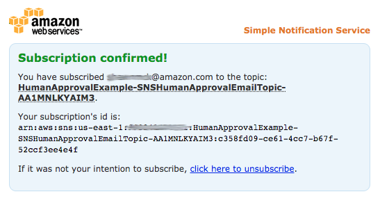
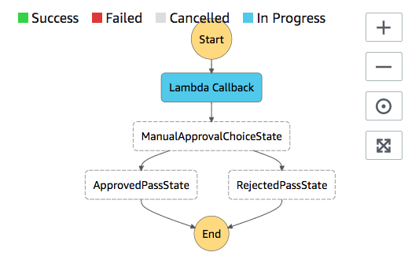
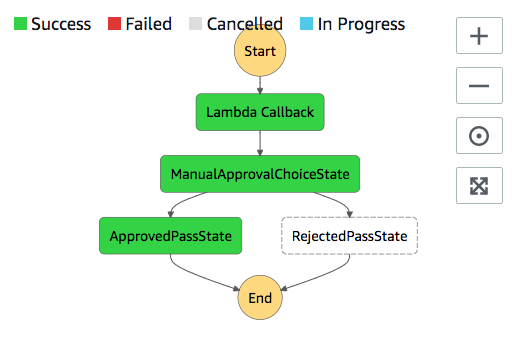

# Deploying a workflow that waits for human approval in Step Functions

This tutorial shows you how to deploy a human approval project that allows an AWS Step Functions
execution to pause during a task, and wait for a user to respond to an email. The workflow
progresses to the next state once the user has approved the task to proceed.

Deploying the AWS CloudFormation stack included in this tutorial will create all necessary resources,
including:

- Amazon API Gateway resources
- An AWS Lambda functions
- An AWS Step Functions state machine
- An Amazon Simple Notification Service email topic
- Related AWS Identity and Access Management roles and permissions

###### Note

You will need to provide a valid email address that you have access to when you create the AWS CloudFormation stack.

For more information, see [Working with
CloudFormation Templates](../../../AWSCloudFormation/latest/UserGuide/template-guide.md "../../../AWSCloudFormation/latest/UserGuide/template-guide.md") and the `AWS::StepFunctions::StateMachine` resource in the
_AWS CloudFormation User Guide_.

## Step 1: Create an AWS CloudFormation template

1. Copy the example code from the [AWS CloudFormation Template Source Code](#human-approval-yaml "#human-approval-yaml") section.
2. Paste the source of the AWS CloudFormation template into a file on your local machine.

For this example the file is called `human-approval.yaml`.

## Step 2: Create a stack

1. Log into the [AWS CloudFormation console](https://console.aws.amazon.com/cloudformation/home "https://console.aws.amazon.com/cloudformation/home").
2. Choose **Create Stack**, and then choose **With new resources (standard)**.
3. On the **Create stack** page, do the following:
   1. In the **Prerequisite - Prepare template** section, make sure **Template is ready** is selected.
   2. In the **Specify template** section, choose **Upload a template file** and then choose **Choose file** to
      upload the `human-approval.yaml` file you created earlier that includes the [template source
      code](#human-approval-yaml "#human-approval-yaml").

4. Choose **Next**.
5. On the **Specify stack details** page, do the following:
   1. For **Stack name**, enter a name for your stack.
   2. Under **Parameters**, enter a valid email address. You'll use this email address to subscribe to the Amazon SNS topic.

6. Choose **Next**, and then choose **Next** again.
7. On the **Review** page, choose **I acknowledge that AWS CloudFormation might create IAM resources** and then choose
   **Create**.

AWS CloudFormation begins to create your stack and displays the **CREATE_IN_PROGRESS** status. When the process is complete, AWS CloudFormation displays the
**CREATE_COMPLETE** status. 8. (Optional) To display the resources in your stack, select the stack and choose the **Resources** tab.

## Step 3: Approve the Amazon SNS subscription

Once the Amazon SNS topic is created, you will receive an email requesting that you confirm
subscription.

1. Open the email account you provided when you created the AWS CloudFormation stack.
2. Open the message **AWS Notification - Subscription Confirmation**
   from **no-reply@sns.amazonaws.com**

The email will list the Amazon Resource Name for the Amazon SNS topic, and a confirmation link. 3. Choose the **confirm subscription** link.



## Step 4: Run the state machine

1. On the **HumanApprovalLambdaStateMachine** page, choose **Start execution**.

The **Start execution** dialog box is displayed. 2. In the **Start execution** dialog box, do the following:

    1. (Optional) Enter a custom execution name to override the generated default.

     ###### Non-ASCII names and logging

    Step Functions accepts names for state machines, executions, activities, and labels that contain non-ASCII characters. Because such characters will prevent Amazon CloudWatch from logging data, we recommend using only ASCII characters so you can track Step Functions metrics.
    2. In the **Input** box, enter the following JSON input to run your workflow.


    ```
    {
        "Comment": "Testing the human approval tutorial."
    }
    ```
    3. Choose **Start execution**.


    The **ApprovalTest** state machine execution starts, and pauses at the **Lambda Callback** task.
    4. The Step Functions console directs you to a page that's titled with your execution ID. This page is known as the *Execution Details* page. On this page, you can review the execution results as the execution progresses or after it's complete.


    To review the execution results, choose individual states on the **Graph view**, and then choose the individual tabs on the [Step details](concepts-view-execution-details.md#exec-details-intf-step-details "concepts-view-execution-details.md#exec-details-intf-step-details") pane to view each state's details including input, output, and definition respectively. For details about the execution information you can view on the *Execution Details* page, see [Execution details overview](concepts-view-execution-details.md#exec-details-interface-overview "concepts-view-execution-details.md#exec-details-interface-overview").


    

3. In the email account you used for the Amazon SNS topic earlier, open the message with the subject **Required approval from AWS Step Functions**.

The message includes separate URLs for **Approve** and **Reject**. 4. Choose the **Approve** URL.

The workflow continues based on your choice.



## AWS CloudFormation Template Source Code

Use this AWS CloudFormation template to deploy an example of a human approval process
workflow.

```
AWSTemplateFormatVersion: "2010-09-09"
Description: "AWS Step Functions Human based task example. It sends an email with an HTTP URL for approval."
Parameters:
  Email:
    Type: String
    AllowedPattern: "^[a-zA-Z0-9_.+-]+@[a-zA-Z0-9-]+\\.[a-zA-Z0-9-.]+$"
    ConstraintDescription: Must be a valid email address.
Resources:
  # Begin API Gateway Resources
  ExecutionApi:
    Type: "AWS::ApiGateway::RestApi"
    Properties:
      Name: "Human approval endpoint"
      Description: "HTTP Endpoint backed by API Gateway and Lambda"
      FailOnWarnings: true

  ExecutionResource:
    Type: 'AWS::ApiGateway::Resource'
    Properties:
      RestApiId: !Ref ExecutionApi
      ParentId: !GetAtt "ExecutionApi.RootResourceId"
      PathPart: execution

  ExecutionMethod:
    Type: "AWS::ApiGateway::Method"
    Properties:
      AuthorizationType: NONE
      HttpMethod: GET
      Integration:
        Type: AWS
        IntegrationHttpMethod: POST
        Uri: !Sub "arn:aws:apigateway:${AWS::Region}:lambda:path/2015-03-31/functions/${LambdaApprovalFunction.Arn}/invocations"
        IntegrationResponses:
          - StatusCode: 302
            ResponseParameters:
              method.response.header.Location: "integration.response.body.headers.Location"
        RequestTemplates:
          application/json: |
            {
              "body" : $input.json('$'),
              "headers": {
                #foreach($header in $input.params().header.keySet())
                "$header": "$util.escapeJavaScript($input.params().header.get($header))" #if($foreach.hasNext),#end

                #end
              },
              "method": "$context.httpMethod",
              "params": {
                #foreach($param in $input.params().path.keySet())
                "$param": "$util.escapeJavaScript($input.params().path.get($param))" #if($foreach.hasNext),#end

                #end
              },
              "query": {
                #foreach($queryParam in $input.params().querystring.keySet())
                "$queryParam": "$util.escapeJavaScript($input.params().querystring.get($queryParam))" #if($foreach.hasNext),#end

                #end
              }
            }
      ResourceId: !Ref ExecutionResource
      RestApiId: !Ref ExecutionApi
      MethodResponses:
        - StatusCode: 302
          ResponseParameters:
            method.response.header.Location: true

  ApiGatewayAccount:
    Type: 'AWS::ApiGateway::Account'
    Properties:
      CloudWatchRoleArn: !GetAtt "ApiGatewayCloudWatchLogsRole.Arn"

  ApiGatewayCloudWatchLogsRole:
    Type: 'AWS::IAM::Role'
    Properties:
      AssumeRolePolicyDocument:
        Version: "2012-10-17"
        Statement:
          - Effect: Allow
            Principal:
              Service:
                - apigateway.amazonaws.com
            Action:
              - 'sts:AssumeRole'
      Policies:
        - PolicyName: ApiGatewayLogsPolicy
          PolicyDocument:
            Version: 2012-10-17
            Statement:
              - Effect: Allow
                Action:
                  - "logs:*"
                Resource: !Sub "arn:${AWS::Partition}:logs:*:*:*"

  ExecutionApiStage:
    DependsOn:
      - ApiGatewayAccount
    Type: 'AWS::ApiGateway::Stage'
    Properties:
      DeploymentId: !Ref ApiDeployment
      MethodSettings:
        - DataTraceEnabled: true
          HttpMethod: '*'
          LoggingLevel: INFO
          ResourcePath: /*
      RestApiId: !Ref ExecutionApi
      StageName: states

  ApiDeployment:
    Type: "AWS::ApiGateway::Deployment"
    DependsOn:
      - ExecutionMethod
    Properties:
      RestApiId: !Ref ExecutionApi
      StageName: DummyStage
  # End API Gateway Resources

  # Begin
  # Lambda that will be invoked by API Gateway
  LambdaApprovalFunction:
    Type: 'AWS::Lambda::Function'
    Properties:
      Code:
        ZipFile:
          Fn::Sub: |
            const { SFN: StepFunctions } = require("@aws-sdk/client-sfn");
            var redirectToStepFunctions = function(lambdaArn, statemachineName, executionName, callback) {
              const lambdaArnTokens = lambdaArn.split(":");
              const partition = lambdaArnTokens[1];
              const region = lambdaArnTokens[3];
              const accountId = lambdaArnTokens[4];

              console.log("partition=" + partition);
              console.log("region=" + region);
              console.log("accountId=" + accountId);

              const executionArn = "arn:" + partition + ":states:" + region + ":" + accountId + ":execution:" + statemachineName + ":" + executionName;
              console.log("executionArn=" + executionArn);

              const url = "https://console.aws.amazon.com/states/home?region=" + region + "#/executions/details/" + executionArn;
              callback(null, {
                  statusCode: 302,
                  headers: {
                    Location: url
                  }
              });
            };

            exports.handler = (event, context, callback) => {
              console.log('Event= ' + JSON.stringify(event));
              const action = event.query.action;
              const taskToken = event.query.taskToken;
              const statemachineName = event.query.sm;
              const executionName = event.query.ex;

              const stepfunctions = new StepFunctions();

              var message = "";

              if (action === "approve") {
                message = { "Status": "Approved! Task approved by ${Email}" };
              } else if (action === "reject") {
                message = { "Status": "Rejected! Task rejected by ${Email}" };
              } else {
                console.error("Unrecognized action. Expected: approve, reject.");
                callback({"Status": "Failed to process the request. Unrecognized Action."});
              }

              stepfunctions.sendTaskSuccess({
                output: JSON.stringify(message),
                taskToken: event.query.taskToken
              })
              .then(function(data) {
                redirectToStepFunctions(context.invokedFunctionArn, statemachineName, executionName, callback);
              }).catch(function(err) {
                console.error(err, err.stack);
                callback(err);
              });
            }
      Description: Lambda function that callback to AWS Step Functions
      FunctionName: LambdaApprovalFunction
      Handler: index.handler
      Role: !GetAtt "LambdaApiGatewayIAMRole.Arn"
      Runtime: nodejs18.x

  LambdaApiGatewayInvoke:
    Type: "AWS::Lambda::Permission"
    Properties:
      Action: "lambda:InvokeFunction"
      FunctionName: !GetAtt "LambdaApprovalFunction.Arn"
      Principal: "apigateway.amazonaws.com"
      SourceArn: !Sub "arn:aws:execute-api:${AWS::Region}:${AWS::AccountId}:${ExecutionApi}/*"

  LambdaApiGatewayIAMRole:
    Type: "AWS::IAM::Role"
    Properties:
      AssumeRolePolicyDocument:
        Version: "2012-10-17"
        Statement:
          - Action:
              - "sts:AssumeRole"
            Effect: "Allow"
            Principal:
              Service:
                - "lambda.amazonaws.com"
      Policies:
        - PolicyName: CloudWatchLogsPolicy
          PolicyDocument:
            Statement:
              - Effect: Allow
                Action:
                  - "logs:*"
                Resource: !Sub "arn:${AWS::Partition}:logs:*:*:*"
        - PolicyName: StepFunctionsPolicy
          PolicyDocument:
            Statement:
              - Effect: Allow
                Action:
                  - "states:SendTaskFailure"
                  - "states:SendTaskSuccess"
                Resource: "*"
  # End Lambda that will be invoked by API Gateway

  # Begin state machine that publishes to Lambda and sends an email with the link for approval
  HumanApprovalLambdaStateMachine:
    Type: AWS::StepFunctions::StateMachine
    Properties:
      RoleArn: !GetAtt LambdaStateMachineExecutionRole.Arn
      DefinitionString:
        Fn::Sub: |
          {
              "StartAt": "Lambda Callback",
              "TimeoutSeconds": 3600,
              "States": {
                  "Lambda Callback": {
                      "Type": "Task",
                      "Resource": "arn:${AWS::Partition}:states:::lambda:invoke.waitForTaskToken",
                      "Parameters": {
                        "FunctionName": "${LambdaHumanApprovalSendEmailFunction.Arn}",
                        "Payload": {
                          "ExecutionContext.$": "$$",
                          "APIGatewayEndpoint": "https://${ExecutionApi}.execute-api.${AWS::Region}.amazonaws.com/states"
                        }
                      },
                      "Next": "ManualApprovalChoiceState"
                  },
                  "ManualApprovalChoiceState": {
                    "Type": "Choice",
                    "Choices": [
                      {
                        "Variable": "$.Status",
                        "StringEquals": "Approved! Task approved by ${Email}",
                        "Next": "ApprovedPassState"
                      },
                      {
                        "Variable": "$.Status",
                        "StringEquals": "Rejected! Task rejected by ${Email}",
                        "Next": "RejectedPassState"
                      }
                    ]
                  },
                  "ApprovedPassState": {
                    "Type": "Pass",
                    "End": true
                  },
                  "RejectedPassState": {
                    "Type": "Pass",
                    "End": true
                  }
              }
          }

  SNSHumanApprovalEmailTopic:
    Type: AWS::SNS::Topic
    Properties:
      Subscription:
        -
           Endpoint: !Sub ${Email}
           Protocol: email

  LambdaHumanApprovalSendEmailFunction:
    Type: "AWS::Lambda::Function"
    Properties:
      Handler: "index.lambda_handler"
      Role: !GetAtt LambdaSendEmailExecutionRole.Arn
      Runtime: "nodejs18.x"
      Timeout: "25"
      Code:
        ZipFile:
          Fn::Sub: |
            console.log('Loading function');
            const { SNS } = require("@aws-sdk/client-sns");
            exports.lambda_handler = (event, context, callback) => {
                console.log('event= ' + JSON.stringify(event));
                console.log('context= ' + JSON.stringify(context));

                const executionContext = event.ExecutionContext;
                console.log('executionContext= ' + executionContext);

                const executionName = executionContext.Execution.Name;
                console.log('executionName= ' + executionName);

                const statemachineName = executionContext.StateMachine.Name;
                console.log('statemachineName= ' + statemachineName);

                const taskToken = executionContext.Task.Token;
                console.log('taskToken= ' + taskToken);

                const apigwEndpint = event.APIGatewayEndpoint;
                console.log('apigwEndpint = ' + apigwEndpint)

                const approveEndpoint = apigwEndpint + "/execution?action=approve&ex=" + executionName + "&sm=" + statemachineName + "&taskToken=" + encodeURIComponent(taskToken);
                console.log('approveEndpoint= ' + approveEndpoint);

                const rejectEndpoint = apigwEndpint + "/execution?action=reject&ex=" + executionName + "&sm=" + statemachineName + "&taskToken=" + encodeURIComponent(taskToken);
                console.log('rejectEndpoint= ' + rejectEndpoint);

                const emailSnsTopic = "${SNSHumanApprovalEmailTopic}";
                console.log('emailSnsTopic= ' + emailSnsTopic);

                var emailMessage = 'Welcome! \n\n';
                emailMessage += 'This is an email requiring an approval for a step functions execution. \n\n'
                emailMessage += 'Check the following information and click "Approve" link if you want to approve. \n\n'
                emailMessage += 'Execution Name -> ' + executionName + '\n\n'
                emailMessage += 'Approve ' + approveEndpoint + '\n\n'
                emailMessage += 'Reject ' + rejectEndpoint + '\n\n'
                emailMessage += 'Thanks for using Step functions!'

                const sns = new SNS();
                var params = {
                  Message: emailMessage,
                  Subject: "Required approval from AWS Step Functions",
                  TopicArn: emailSnsTopic
                };

                sns.publish(params)
                  .then(function(data) {
                    console.log("MessageID is " + data.MessageId);
                    callback(null);
                  }).catch(
                    function(err) {
                    console.error(err, err.stack);
                    callback(err);
                  });
            }

  LambdaStateMachineExecutionRole:
    Type: "AWS::IAM::Role"
    Properties:
      AssumeRolePolicyDocument:
        Version: "2012-10-17"
        Statement:
          - Effect: Allow
            Principal:
              Service: states.amazonaws.com
            Action: "sts:AssumeRole"
      Policies:
        - PolicyName: InvokeCallbackLambda
          PolicyDocument:
            Statement:
              - Effect: Allow
                Action:
                  - "lambda:InvokeFunction"
                Resource:
                  - !Sub "${LambdaHumanApprovalSendEmailFunction.Arn}"

  LambdaSendEmailExecutionRole:
    Type: "AWS::IAM::Role"
    Properties:
      AssumeRolePolicyDocument:
        Version: "2012-10-17"
        Statement:
          - Effect: Allow
            Principal:
              Service: lambda.amazonaws.com
            Action: "sts:AssumeRole"
      Policies:
        - PolicyName: CloudWatchLogsPolicy
          PolicyDocument:
            Statement:
              - Effect: Allow
                Action:
                  - "logs:CreateLogGroup"
                  - "logs:CreateLogStream"
                  - "logs:PutLogEvents"
                Resource: !Sub "arn:${AWS::Partition}:logs:*:*:*"
        - PolicyName: SNSSendEmailPolicy
          PolicyDocument:
            Statement:
              - Effect: Allow
                Action:
                  - "SNS:Publish"
                Resource:
                  - !Sub "${SNSHumanApprovalEmailTopic}"

# End state machine that publishes to Lambda and sends an email with the link for approval
Outputs:
  ApiGatewayInvokeURL:
    Value: !Sub "https://${ExecutionApi}.execute-api.${AWS::Region}.amazonaws.com/states"
  StateMachineHumanApprovalArn:
    Value: !Ref HumanApprovalLambdaStateMachine
```

[Show moreShow less](# "#")
