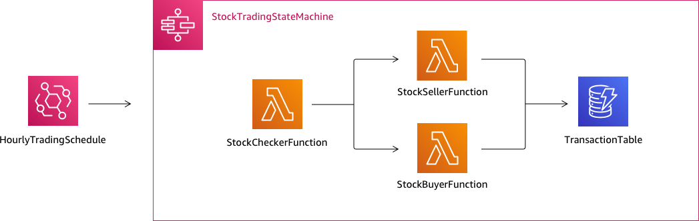

# Create a Step Functions state machine using

AWS SAM

In this guide, you download, build, and deploy a sample AWS SAM application that contains an
AWS Step Functions state machine. This application creates a mock stock trading workflow which runs
on a pre-defined schedule (note that the schedule is disabled by default to avoid incurring
charges).

The following diagram shows the components of this application:


The following is a preview of commands that you run to create your sample application. For
more details about each of these commands, see the sections later in this page

```
# Step 1 - Download a sample application. For this tutorial you
#   will follow the prompts to select an AWS Quick Start Template
#   called 'Multi-step workflow'
`sam init`

# Step 2 - Build your application
`cd `project-directory``
`sam build`

# Step 3 - Deploy your application
`sam deploy --guided`
```

## Prerequisites

This guide assumes that you've completed the steps in the [Installing the AWS SAM CLI](../../../serverless-application-model/latest/developerguide/serverless-sam-cli-install.md "../../../serverless-application-model/latest/developerguide/serverless-sam-cli-install.md")
for your OS. It assumes that you've done the following:

1. Created an AWS account.
2. Configured IAM permissions.
3. Installed Homebrew. Note: Homebrew is only a prerequisite for Linux and
   macOS.
4. Installed the AWS SAM CLI. Note: Make sure you have version 0.52.0 or later. You
   can check which version you have by executing the command `sam
--version`.

## Step 1: Download a Sample

AWS SAM Application

**Command to run:**

```
`sam init`
```

Follow the on-screen prompts to select the following:

1. **Template:** AWS Quick Start Templates
2. **Language:** Python, Ruby, NodeJS, Go, Java, or
   .NET
3. **Project name:** (name of your choice - default is `sam-app`)
4. **Quick start application:** Multi-step workflow

**What AWS SAM is doing:**

This command creates a directory with the name you provided for the 'Project name'
prompt (default is `sam-app`). The specific contents of the directory will
depend on the language you choose.

Following are the directory contents when you choose one of the Python
runtimes:

```
├── README.md
├── functions
│   ├── __init__.py
│   ├── stock_buyer
│   │   ├── __init__.py
│   │   ├── app.py
│   │   └── requirements.txt
│   ├── stock_checker
│   │   ├── __init__.py
│   │   ├── app.py
│   │   └── requirements.txt
│   └── stock_seller
│       ├── __init__.py
│       ├── app.py
│       └── requirements.txt
├── statemachine
│   └── stock_trader.asl.json
├── template.yaml
└── tests
    └── unit
        ├── __init__.py
        ├── test_buyer.py
        ├── test_checker.py
        └── test_seller.py
```

There are two especially interesting files that you can take a look at:

- `template.yaml`: Contains the AWS SAM template that defines your
  application's AWS resources.
- `statemachine/stockTrader.asl.json`: Contains the application's
  state machine definition, which is written in [Using Amazon States Language to define Step Functions workflows](concepts-amazon-states-language.md "concepts-amazon-states-language.md").

You can see the following entry in the `template.yaml` file, which points
to the state machine definition file:

```
    Properties:
      DefinitionUri: statemachine/stock_trader.asl.json
```

It can be helpful to keep the state machine definition as a separate file instead of embedding it in the AWS SAM template. For example, tracking changes to the state machine
definition is easier if you don't include the definition in the template. You can use the Workflow Studio to create and maintain the state machine definition, and export the definition
from the console directly to the Amazon States Language specification file without merging it into the template.

For more information about the sample application, see the `README.md` file
in the project directory.

## Step 2: Build Your

Application

**Command to run:**

First change into the project directory (that is, the directory where the
`template.yaml` file for the sample application is located; by default is
`sam-app`), then run this command:

```
`sam build`
```

**Example output:**

```

 Build Succeeded

 Built Artifacts  : .aws-sam/build
 Built Template   : .aws-sam/build/template.yaml

 Commands you can use next
 =========================
 [*] Invoke Function: sam local invoke
 [*] Deploy: sam deploy --guided

```

**What AWS SAM is doing:**

The AWS SAM CLI comes with abstractions for a number of Lambda runtimes to build your
dependencies, and copies all build artifacts into staging folders so that everything is
ready to be packaged and deployed. The `sam build` command builds any
dependencies that your application has, and copies the build artifacts to folders under
`.aws-sam/build`.

## Step 3: Deploy Your

Application to the AWS Cloud

**Command to run:**

```
`sam deploy --guided`
```

Follow the on-screen prompts. You can just respond with `Enter` to accept
the default options provided in the interactive experience.

**What AWS SAM is doing:**

This command deploys your application to the AWS cloud. It take the deployment
artifacts you build with the `sam build` command, packages and uploads them
to an Amazon S3 bucket created by AWS SAM CLI, and deploys the application using CloudFormation. In the
output of the deploy command you can see the changes being made to your CloudFormation
stack.

You can verify the example Step Functions state machine was successfully deployed by following
these steps:

1. Sign in to the AWS Management Console and open the Step Functions console at
   [https://console.aws.amazon.com/states/](https://console.aws.amazon.com/states/ "https://console.aws.amazon.com/states/").
2. In the left navigation, choose **State machines**.
3. Find and choose your new state machine in the list. It will be named
   StockTradingStateMachine-`<unique-hash>`.
4. Choose the **Definition** tab.

You should now see a visual representation of your state machine. You can verify that
the visual representation matches the state machine definition found in the
`statemachine/stockTrader.asl.json` file of your project
directory.

## Troubleshooting

### SAM CLI

error: "no such option: --guided"

When executing `sam deploy`, you see the following error:

```

Error: no such option: --guided

```

This means that you are using an older version of the AWS SAM CLI that does not
support the `--guided` parameter. To fix this, you can either update your
version of AWS SAM CLI to 0.33.0 or later, or omit the `--guided` parameter
from the `sam deploy` command.

### SAM

CLI error: "Failed to create managed resources: Unable to locate
credentials"

When executing `sam deploy`, you see the following error:

```

Error: Failed to create managed resources: Unable to locate credentials

```

This means that you have not set up AWS credentials to enable the AWS SAM CLI to
make AWS service calls. To fix this, you must set up AWS credentials. For more
information, see [Setting
Up AWS Credentials](../../../serverless-application-model/latest/developerguide/serverless-getting-started-set-up-credentials.md "../../../serverless-application-model/latest/developerguide/serverless-getting-started-set-up-credentials.md") in the _AWS Serverless Application Model Developer Guide_.

## Clean Up

If you no longer need the AWS resources you created by running this tutorial, you can
remove them by deleting the CloudFormation stack that you deployed.

To delete the CloudFormation stack created with this tutorial using the AWS Management Console, follow these
steps:

1. Sign in to the AWS Management Console and open the CloudFormation console at
   [https://console.aws.amazon.com/cloudformation](https://console.aws.amazon.com/cloudformation/ "https://console.aws.amazon.com/cloudformation/").
2. In the left navigation pane, choose **Stacks**.
3. In the list of stacks, choose **sam-app** (or the name of
   stack you created).
4. Choose **Delete**.

When done, the status of the of the stack will change to
**DELETE_COMPLETE**.

Alternatively, you can delete the CloudFormation stack by executing the following AWS CLI
command:

```
`aws cloudformation delete-stack --stack-name `sam-app` --region `region``
```

### Verify Deleted

Stack

For both methods of deleting the CloudFormation stack, you can verify it was deleted by
going to the [https://console.aws.amazon.com/cloudformation](https://console.aws.amazon.com/cloudformation/ "https://console.aws.amazon.com/cloudformation/"), choosing **Stacks** in the left
navigation pane, and choosing **Deleted** in the dropdown to the
right of the search text box. You should see your stack name
**sam-app** (or the name of the stack you created) in the list
of deleted stacks.
