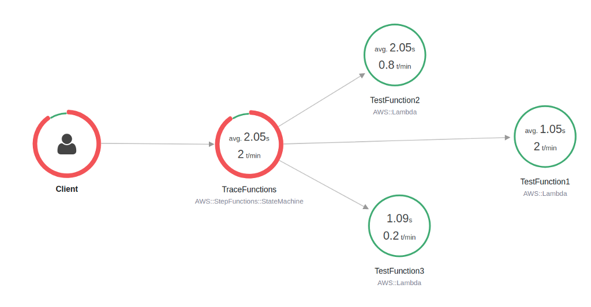
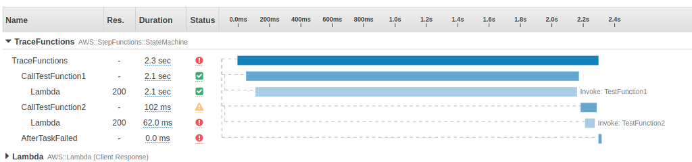

# View X-Ray traces in Step Functions

In this tutorial, you will learn how to use X-Ray to trace errors that occur when running
a state machine. You can use [AWS X-Ray](../../../xray/latest/devguide/aws-xray.md "../../../xray/latest/devguide/aws-xray.md")
to visualize the components of your state machine, identify performance bottlenecks, and
troubleshoot requests that resulted in an error. In this tutorial, you will create several
Lambda functions that randomly produce errors, which you can then trace and analyze using
X-Ray.

The [Creating a Step Functions state machine that uses Lambda](tutorial-creating-lambda-state-machine.md "tutorial-creating-lambda-state-machine.md") tutorial walks you though
creating a state machine that calls a Lambda function. If you have completed that tutorial,
skip to [Step 2](#create-xray-lambda-state-machine-step-4 "#create-xray-lambda-state-machine-step-4") and use the
AWS Identity and Access Management (IAM) role that you previously created.

## Step 1: Create an IAM role for Lambda

Both AWS Lambda and AWS Step Functions can run code and access AWS resources (for example, data stored
in Amazon S3 buckets). To maintain security, you must grant Lambda and Step Functions access to these
resources.

Lambda requires
you to assign an AWS Identity and Access Management (IAM) role when you create a Lambda function, in the same way Step Functions requires you
to assign an IAM role when you create a state machine.

You use the IAM console to create a service-linked role.

###### To create a role (console)

1. Sign in to the AWS Management Console and open the IAM console at [https://console.aws.amazon.com/iam/](https://console.aws.amazon.com/iam/ "https://console.aws.amazon.com/iam/").
2. In the navigation pane of the IAM console, choose
   **Roles**. Then choose **Create
   role**.
3. Choose the **AWS Service** role type, and then choose
   **Lambda**.
4. Choose the **Lambda** use case. Use cases are
   defined by the service to include the trust policy required by the service.
   Then choose **Next: Permissions**.
5. Choose one or more permissions policies to attach to the role (for
   example, `AWSLambdaBasicExecutionRole`). See [AWS Lambda Permissions
   Model](../../../lambda/latest/dg/intro-permission-model.md "../../../lambda/latest/dg/intro-permission-model.md").

Select the box next to the policy that assigns the permissions that you
want the role to have, and then choose **Next:
Review**. 6. Enter a **Role name**. 7. (Optional) For **Role description**, edit the description
for the new service-linked role. 8. Review the role, and then choose **Create role**.

## Step 2: Create a Lambda function

Your Lambda function will randomly throw errors or time out, producing example data to
view in X-Ray.

###### Important

Ensure that your Lambda function is under the same AWS account and AWS Region as your state machine.

1. Open the [Lambda
   console](https://console.aws.amazon.com/lambda/home "https://console.aws.amazon.com/lambda/home") and choose **Create function**.
2. In the **Create function** section, choose
   **Author from scratch**.
3. In the **Basic information** section, configure your
   Lambda function:
   1. For **Function name**, enter
      `TestFunction1`.
   2. For **Runtime**, choose **Node.js
      18.x**.
   3. For **Role**, select **Choose an existing
      role**.
   4. For **Existing role**, select [the Lambda role that you created earlier](#create-xray-lambda-state-machine-to-create-a-role-for-use-with-lambda "#create-xray-lambda-state-machine-to-create-a-role-for-use-with-lambda").

   ###### Note

   If the IAM role that you created doesn't appear in the list,
   the role might still need a few minutes to propagate to
   Lambda. 5. Choose **Create function**.

   When your Lambda function is created, note its Amazon Resource Name (ARN) in
   the upper-right corner of the page. For example:

   ```
   arn:aws:lambda:`region`:123456789012:function:TestFunction1
   ```

4. Copy the following code for the Lambda function into the **Function
   code** section of the
   **`TestFunction1`**
   page.

```
function getRandomSeconds(max) {
    return Math.floor(Math.random() * Math.floor(max)) * 1000;
}
function sleep(ms) {
    return new Promise(resolve => setTimeout(resolve, ms));
}
export const handler = async (event) => {
    if(getRandomSeconds(4) === 0) {
        throw new Error("Something went wrong!");
    }
    let wait_time = getRandomSeconds(5);
    await sleep(wait_time);
    return { 'response': true }
};
```

This code creates randomly timed failures, which will be used to generate
example errors in your state machine that can be viewed and analyzed using
X-Ray traces. 5. Choose **Save**.

## Step 3: Create two more Lambda functions

Create two more Lambda functions.

1. Repeat Step 2 to create two more Lambda functions. For the next function,
   in **Function name**, enter `TestFunction2`. For
   the last function, in **Function name**, enter
   `TestFunction3`.
2. In the Lambda console, check that you now have three Lambda functions,
   `TestFunction1`, `TestFunction2`, and
   `TestFunction3`.

## Step 4: Create a state machine

In this step, you'll use the [Step Functions console](https://console.aws.amazon.com/states/home?region=us-east-1#/ "https://console.aws.amazon.com/states/home?region=us-east-1#/") to create a state machine with three `Task` states. Each `Task` state will a reference one of your three Lambda functions.

1. Open the [Step Functions console](https://console.aws.amazon.com/states/home "https://console.aws.amazon.com/states/home"), choose **State machines** from the menu, then choose **Create state machine**.

###### Important

Make sure that your state machine is under the same AWS account and Region as the Lambda functions you created earlier in [Step 2](#create-xray-lambda-state-machine-step-2 "#create-xray-lambda-state-machine-step-2") and [Step 3](#create-xray-lambda-state-machine-step-3 "#create-xray-lambda-state-machine-step-3"). 2. Choose **Create from blank**. 3. Name your state machine, then choose **Continue** to edit your state machine in Workflow Studio. 4. For this tutorial, you'll write the [Amazon States Language](concepts-amazon-states-language.md "concepts-amazon-states-language.md") (ASL) definition of your state machine in the [Code editor](workflow-studio.md#wfs-interface-code-editor "workflow-studio.md#wfs-interface-code-editor"). To do this, choose **Code**. 5. Remove the existing boilerplate code and paste the following code. In the Task state definition, remember to replace the example ARNs with the ARNs of the Lambda functions you created.

```
{
  "StartAt": "CallTestFunction1",
  "States": {
    "CallTestFunction1": {
      "Type": "Task",
      "Resource": "`arn:aws:lambda:`region`:123456789012:function:test-function1`",
      "Catch": [
        {
          "ErrorEquals": [
            "States.TaskFailed"
          ],
          "Next": "AfterTaskFailed"
        }
      ],
      "Next": "CallTestFunction2"
    },
    "CallTestFunction2": {
      "Type": "Task",
      "Resource": "`arn:aws:lambda:`region`:123456789012:function:test-function2`",
      "Catch": [
        {
          "ErrorEquals": [
            "States.TaskFailed"
          ],
          "Next": "AfterTaskFailed"
        }
      ],
      "Next": "CallTestFunction3"
    },
    "CallTestFunction3": {
      "Type": "Task",
      "Resource": "`arn:aws:lambda:`region`:123456789012:function:test-function3`",
      "TimeoutSeconds": 5,
      "Catch": [
        {
          "ErrorEquals": [
            "States.Timeout"
          ],
          "Next": "AfterTimeout"
        },
        {
          "ErrorEquals": [
            "States.TaskFailed"
          ],
          "Next": "AfterTaskFailed"
        }
      ],
      "Next": "Succeed"
    },
    "Succeed": {
      "Type": "Succeed"
    },
    "AfterTimeout": {
      "Type": "Fail"
    },
    "AfterTaskFailed": {
      "Type": "Fail"
    }
  }
}

```

This is a description of your state machine using the Amazon States Language. It defines three `Task` states named `CallTestFunction1`, `CallTestFunction2` and `CallTestFunction3`. Each calls one of your three Lambda functions. For more information, see [State Machine Structure](statemachine-structure.md "statemachine-structure.md"). 6. Specify a name for your state machine. To do this, choose the edit icon next to the default state machine name of **MyStateMachine**. Then, in **State machine configuration**, specify a name in the **State machine name** box.

For this tutorial, enter the name `TraceFunctions`. 7. (Optional) In **State machine configuration**, specify other workflow settings, such as state machine type and its execution role.

For this tutorial, under **Additional configuration**, choose **Enable X-Ray tracing**. Keep all the other default selections in **State machine settings**.

If you've [previously created an IAM role](procedure-create-iam-role.md "procedure-create-iam-role.md") with the correct permissions for your state machine and want to use it, in **Permissions**, select **Choose an existing role**, and then select a role from the list. Or select **Enter a role ARN** and then provide an ARN for that IAM role. 8. In the **Confirm role creation** dialog box, choose **Confirm** to continue.

You can also choose **View role settings** to go back to **State machine configuration**.

###### Note

If you delete the IAM role that Step Functions creates, Step Functions can't
recreate it later. Similarly, if you modify the role (for example, by
removing Step Functions from the principals in the IAM policy), Step Functions can't
restore its original settings later.

## Step 5: Run the state machine

State machine executions are instances where you run your workflow to perform tasks.

1. On the **`TraceFunctions`**
   page, choose **Start execution**.

The **New execution** page is displayed. 2. In the **Start execution** dialog box, do the following:

    1. (Optional) Enter a custom execution name to override the generated default.

     ###### Non-ASCII names and logging

    Step Functions accepts names for state machines, executions, activities, and labels that contain non-ASCII characters. Because such characters will prevent Amazon CloudWatch from logging data, we recommend using only ASCII characters so you can track Step Functions metrics.
    2. Choose **Start execution**.
    3. The Step Functions console directs you to a page that's titled with your execution ID. This page is known as the *Execution Details* page. On this page, you can review the execution results as the execution progresses or after it's complete.


    To review the execution results, choose individual states on the **Graph view**, and then choose the individual tabs on the [Step details](concepts-view-execution-details.md#exec-details-intf-step-details "concepts-view-execution-details.md#exec-details-intf-step-details") pane to view each state's details including input, output, and definition respectively. For details about the execution information you can view on the *Execution Details* page, see [Execution details overview](concepts-view-execution-details.md#exec-details-interface-overview "concepts-view-execution-details.md#exec-details-interface-overview").


    Run several (at least three) executions.

3. After the executions have finished, follow the **X-Ray trace map** link. You can view the trace while an execution is still running, but you may want to see the execution results before viewing the X-Ray trace map.
4. View the service map to identify where errors are occurring, connections with high latency, or traces for requests that were unsuccessful. In this example, you can see how much traffic each function is receiving. `TestFunction2` was called more often than `TestFunction3`, and `TestFunction1` was called more than twice as often as `TestFunction2`.

The service map indicates the health of each node by coloring it based on the ratio of successful calls to errors and faults:

    * **Green** for successful calls
    * **Red** for server faults (500 series errors)
    * **Yellow** for client errors (400 series errors)
    * **Purple** for throttling errors (429 Too Many
     Requests)



You can also choose a service node to view requests for that node, or an edge between two nodes to view requests that traveled that connection. 5. View the X-Ray trace map to see what has happened for each execution. The Timeline view shows a hierarchy of segments and subsegments. The first entry in the list is the segment, which represents all data recorded by the service for a single request. Below the segment are subsegments. This example shows subsegments recorded by the Lambda functions.



For more information on understanding X-Ray traces and using X-Ray with Step Functions, see the [Trace Step Functions request data in AWS X-Ray](concepts-xray-tracing.md "concepts-xray-tracing.md")
