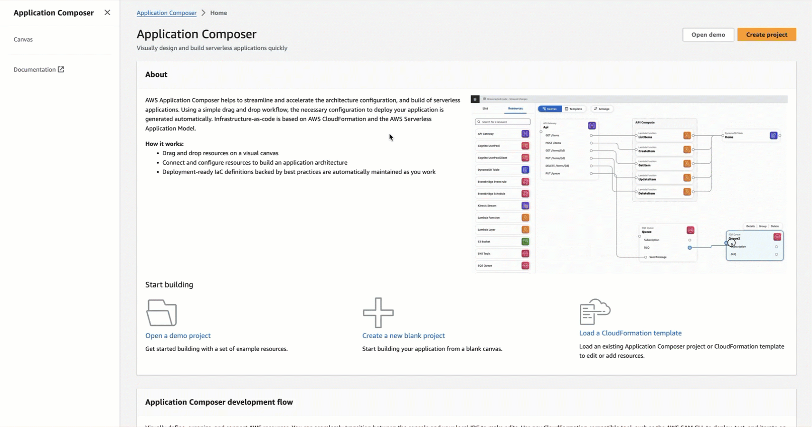
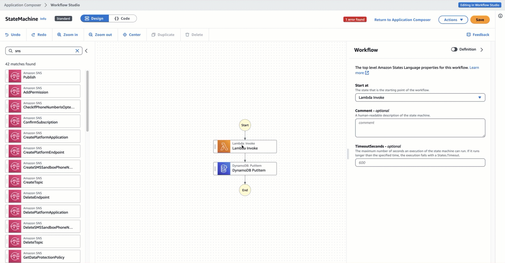
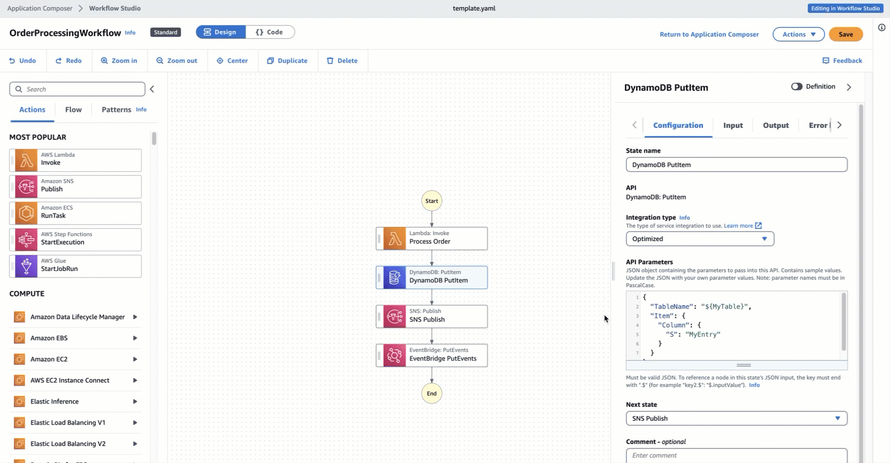

# Using Workflow Studio in Infrastructure Composer to build Step Functions workflows

Workflow Studio is available in Infrastructure Composer to help you design and build your workflows. Workflow Studio in Infrastructure Composer provides a visual infrastructure as code
(IaC) environment that makes it easy for you to incorporate workflows in your serverless applications built using IaC tools, such as
CloudFormation templates.

AWS Infrastructure Composer is a visual builder that helps you develop AWS SAM and AWS CloudFormation templates using a simple graphical
interface. With Infrastructure Composer, you design an application architecture by dragging, grouping, and connecting AWS services in a visual canvas.
Infrastructure Composer then creates an IaC template from your design that you can use to deploy your application with the AWS SAM Command Line
Interface (AWS SAM CLI) or CloudFormation. To learn more about Infrastructure Composer, see [What is Infrastructure Composer](../../../application-composer/latest/dg/what-is-composer.md "../../../application-composer/latest/dg/what-is-composer.md").

When you use Workflow Studio in Infrastructure Composer, Infrastructure Composer connects the individual workflow steps to AWS resources and generates the resource configurations in an
AWS SAM template. Infrastructure Composer also adds the IAM permissions required for your workflow to run. Using
Workflow Studio in Infrastructure Composer, you can create prototypes of your applications and turn them into production-ready applications.

When you use Workflow Studio in Infrastructure Composer, you can switch back and forth between the Infrastructure Composer canvas and Workflow Studio.

###### Topics

- [Using Workflow Studio in Infrastructure Composer](#procedure-use-wfs-in-app-composer "#procedure-use-wfs-in-app-composer")
- [Dynamically reference resources using CloudFormation definition
  substitutions](#use-cfn-sub-edit-state-machine-resource "#use-cfn-sub-edit-state-machine-resource")
- [Connect service integration tasks to enhanced component cards](#connect-service-integrations-enhanced-cards "#connect-service-integrations-enhanced-cards")
- [Import existing projects and sync them locally](#import-projects-local-sync "#import-projects-local-sync")
- [Export Step Functions workflows directly into AWS Infrastructure Composer](#export-wsf-projects-into-app-composer "#export-wsf-projects-into-app-composer")
- [Unavailable Workflow Studio features in AWS Infrastructure Composer](#wfs-features-unavailable-app-composer "#wfs-features-unavailable-app-composer")

## Using Workflow Studio in Infrastructure Composer to build a serverless workflow

1. Open the [Infrastructure Composer console](https://console.aws.amazon.com/composer/home "https://console.aws.amazon.com/composer/home") and choose **Create project** to create
   a project.
2. In the search field in the **Resources** palette, enter `state machine`.
3. Drag the **Step Functions State machine** resource onto the canvas.
4. Choose **Edit in Workflow Studio** to edit your state machine resource.

The following animation shows how you can switch to the Workflow Studio for editing your state machine definition.

The integration with Workflow Studio to edit state machines resources created in Infrastructure Composer is only available for [`AWS::Serverless::StateMachine`](../../../serverless-application-model/latest/developerguide/sam-resource-statemachine.md "../../../serverless-application-model/latest/developerguide/sam-resource-statemachine.md") resource.
This integration is not available for templates that use the [`AWS::StepFunctions::StateMachine`](../../../AWSCloudFormation/latest/UserGuide/aws-resource-stepfunctions-statemachine.md "../../../AWSCloudFormation/latest/UserGuide/aws-resource-stepfunctions-statemachine.md")
resource.

## Dynamically reference resources using CloudFormation definition substitutions in

Workflow Studio

In Workflow Studio, you can use CloudFormation definition substitutions in your workflow definition to dynamically reference resources that you've
defined in your IaC template. You can add placeholder substitutions to your workflow definition using the `${dollar_sign_brace}` notation and they are
replaced with actual values during the CloudFormation stack creation process. For more information about definition substitutions, see [DefinitionSubstitutions in AWS SAM templates](concepts-sam-sfn.md#sam-definition-substitution-eg "concepts-sam-sfn.md#sam-definition-substitution-eg").

The following animation shows how you can add placeholder substitutions for the resources in your state machine definition.

## Connect service integration tasks to enhanced component cards

You can connect the tasks that call [optimized service integrations](integrate-optimized.md "integrate-optimized.md") to [enhanced component cards](../../../application-composer/latest/dg/reference-cards.md#reference-cards-enhanced-components "../../../application-composer/latest/dg/reference-cards.md#reference-cards-enhanced-components") in Infrastructure Composer
canvas. Doing this automatically maps any placeholder substitutions specified by the `${dollar_sign_brace}` notation in your workflow definition and
the `DefinitionSubstitution` property for your `StateMachine` resource. It also adds the appropriate AWS SAM policies
for the state machine.

If you map optimized service integration tasks with [standard component cards](../../../application-composer/latest/dg/using-composer-cards.md#using-composer-cards-component-intro "../../../application-composer/latest/dg/using-composer-cards.md#using-composer-cards-component-intro"), the connection
line doesn't appear on the Infrastructure Composer canvas.

The following animation shows how you can connect an optimized task to an enhanced component card and view the changes in [**Change Inspector**](../../../application-composer/latest/dg/using-change-inspector.md "../../../application-composer/latest/dg/using-change-inspector.md").

You can't connect [AWS SDK integrations](supported-services-awssdk.md "supported-services-awssdk.md") in your Task state with enhanced component cards or
optimized service integrations with standard component cards. For these tasks, you can map the substitutions in the **Resource
properties** panel in Infrastructure Composer canvas, and add policies in the AWS SAM template.

###### Tip

Alternatively, you can also map placeholder substitutions for your state machine under **Definition Substitutions** in the
**Resource properties** panel. When you do this, you must add the required permissions for the AWS service your Task state calls in
the state machine execution role. For information about permissions your execution role might need, see [Set up execution roles with Workflow Studio in Step Functions](manage-state-machine-permissions.md "manage-state-machine-permissions.md").

The following animation shows how you can manually update the placeholder substitution mapping in the **Resource properties**
panel.

## Import existing projects and sync them locally

You can open existing CloudFormation and AWS SAM projects in Infrastructure Composer to visualize them for better understanding
and modify their designs. Using Infrastructure Composer's [local sync](../../../application-composer/latest/dg/reference-features-local-sync.md "../../../application-composer/latest/dg/reference-features-local-sync.md") feature, you can automatically sync and save your template and code files to your local build machine. Using the local sync mode can
compliment your existing development flows. Make sure that your browser supports the [File System Access API](../../../application-composer/latest/dg/reference-fsa.md "../../../application-composer/latest/dg/reference-fsa.md"), which allows web applications to read, write, and save files in
your local file system. We recommend using either Google Chrome or Microsoft Edge.

## Export Step Functions workflows directly into AWS Infrastructure Composer

The AWS Step Functions console provides the ability to export a saved state machine workflow as a template that's recognized as an advanced IaC resource by
Infrastructure Composer. This feature creates an IaC template as an AWS SAM schema and navigates you to Infrastructure Composer. For more information, see [Exporting your workflow to IaC templates](exporting-iac-templates.md "exporting-iac-templates.md").

## Unavailable Workflow Studio features in AWS Infrastructure Composer

When you use Workflow Studio in Infrastructure Composer, some of the Workflow Studio features are unavailable. In addition, the **API Parameters** section available
in the [Inspector
panel](workflow-studio.md#workflow-studio-components-formdefinition "workflow-studio.md#workflow-studio-components-formdefinition") panel supports
CloudFormation definition substitutions. You can add the substitutions in the [Code mode](workflow-studio.md#wfs-interface-code-mode "workflow-studio.md#wfs-interface-code-mode") using the `${dollar_sign_brace}` notation. For more information about this notation, see [DefinitionSubstitutions in AWS SAM templates](concepts-sam-sfn.md#sam-definition-substitution-eg "concepts-sam-sfn.md#sam-definition-substitution-eg").

The following list describes the Workflow Studio features that are unavailable when you use Workflow Studio in Infrastructure Composer:

- [Starter templates](starter-templates.md "starter-templates.md") – Starter templates are ready-to-run sample projects that automatically create
  the workflow prototypes and definitions. These templates deploys all the related AWS resources that your project needs to your AWS account.
- [Config mode](workflow-studio.md#wfs-interface-config-mode "workflow-studio.md#wfs-interface-config-mode") – This mode lets you manage the configuration of your state machines. You can
  update your state machine configurations in your IaC templates or use the **Resource properties** panel in Infrastructure Composer
  canvas. For information about updating configurations in the **Resource properties** panel, see [Connect service integration tasks to enhanced component cards](#connect-service-integrations-enhanced-cards "#connect-service-integrations-enhanced-cards").
- [TestState](test-state-isolation.md "test-state-isolation.md") API
- Option to import or export workflow definitions from the **Actions** dropdown button in Workflow Studio. Instead, from the
  Infrastructure Composer
  **menu**, select **Open** > **Project folder**. Make sure that you've enabled the [local sync](../../../application-composer/latest/dg/reference-features-local-sync.md "../../../application-composer/latest/dg/reference-features-local-sync.md") mode to automatically save your
  changes in the Infrastructure Composer canvas directly to your local machine.
- **Execute** button. When you use Workflow Studio in Infrastructure Composer, Infrastructure Composer generates the IaC code for your workflow. Therefore,
  you must first deploy the template. Then, run the workflow in the console or through the AWS Command Line Interface
  (AWS CLI).
