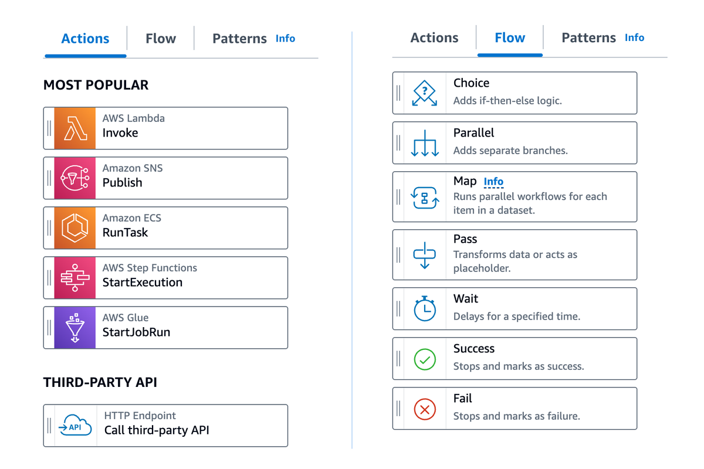

# Discovering workflow states to use in Step Functions

_States_ are elements in your state machine. A state is referred to by
its _name_, which can be any string, but which must be unique within the
scope of the entire state machine.

States take input from the invocation or a previous state. States can filter the input and
then manipulate the output that is sent to the next state.

The following is an example state named `HelloWorld` that invokes an AWS Lambda
function.

```
"HelloWorld": {
  "Type": "Task",
  "Resource": "arn:aws:lambda:`region`:123456789012:function:HelloFunction",
  "Next": "AfterHelloWorldState",
  "Comment": "Run the HelloWorld Lambda function"
}
```

Individual states can make decisions based on their input, perform actions from those
inputs, and pass output to other states. In AWS Step Functions, you define your workflows in the Amazon States Language
(ASL). The Step Functions console provides a graphical representation of your state machine to help
visualize your application's logic.

The following screenshot shows some of the most popular **Actions** and the seven **Flow** states from Workflow Studio:


States share many common features:

- A `Type` field indicating what type of state it is.
- An optional `Comment` field to hold a human-readable comment about, or
  description of, the state.
- Each state (except `Succeed` or `Fail` states) requires a
  `Next` field that specifies the next state in the workflow. `Choice` states can actually have more than one `Next` within each Choice Rule. Alternatively, a state can become a terminal state by setting the `End` field to true.
  Certain state types require additional fields, or may redefine common field usage.

**To access log information for workflows**

- After you have created and run Standard workflows, you can access information
  about each state, its input and output, when it was active and for how long, by viewing the
  Execution Details page in the Step Functions console.
- After you have created and Express Workflow executions and if logging is enabled,
  you can see execution history in the Step Functions console or Amazon CloudWatch Logs.
  For information about viewing and debugging executions, see [Viewing workflow runs](concepts-view-execution-details.md "concepts-view-execution-details.md") and [Using CloudWatch Logs to log execution history in Step Functions](cw-logs.md "cw-logs.md").

## Reference list of workflow states

States are separated in Workflow Studio into **Actions**, also known as **Task states**, and seven **Flow states**. Using **Task states**, or actions in Workflow Studio, you can call third party services, invoke functions, and use hundreds of AWS service endpoints. With **Flow states**, you can direct and control your workflow. All states take input from the previous state, and many provide input filtering, and filtering/transformation for output that is passed to the next state in your workflow.

- [Task workflow state](state-task.md "state-task.md"): Add a single unit of work to be performed by your state machine.
- [Choice workflow state](state-choice.md "state-choice.md"): Add a choice between
  branches of execution to your workflow.
- [Parallel workflow state](state-parallel.md "state-parallel.md"): Add parallel
  branches of execution to your workflow.
- [Map workflow state](state-map.md "state-map.md"): Dynamically iterate steps
  for each element of an input array. Unlike a `Parallel` flow state, a
  `Map` state will execute the same steps for multiple entries of an array in
  the state input.
- [Pass workflow state](state-pass.md "state-pass.md"): Pass state input
  through to the output. Optionally, filter, transform, and add fixed data into the output.
- [Wait workflow state](state-wait.md "state-wait.md"): Pause your workflow
  for a certain amount of time or until a specified time or date.
- [Succeed workflow state](state-succeed.md "state-succeed.md"): Stops your workflow
  with a success.
- [Fail workflow state](state-fail.md "state-fail.md"): Stops your workflow with
  a failure.
