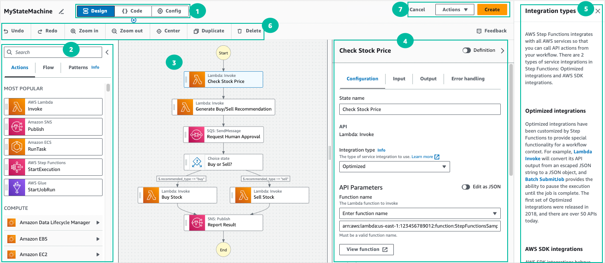
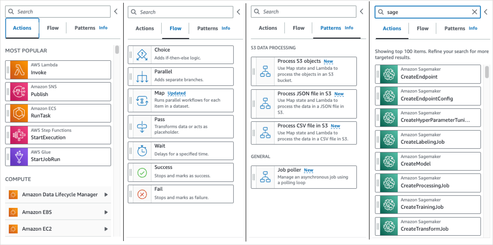
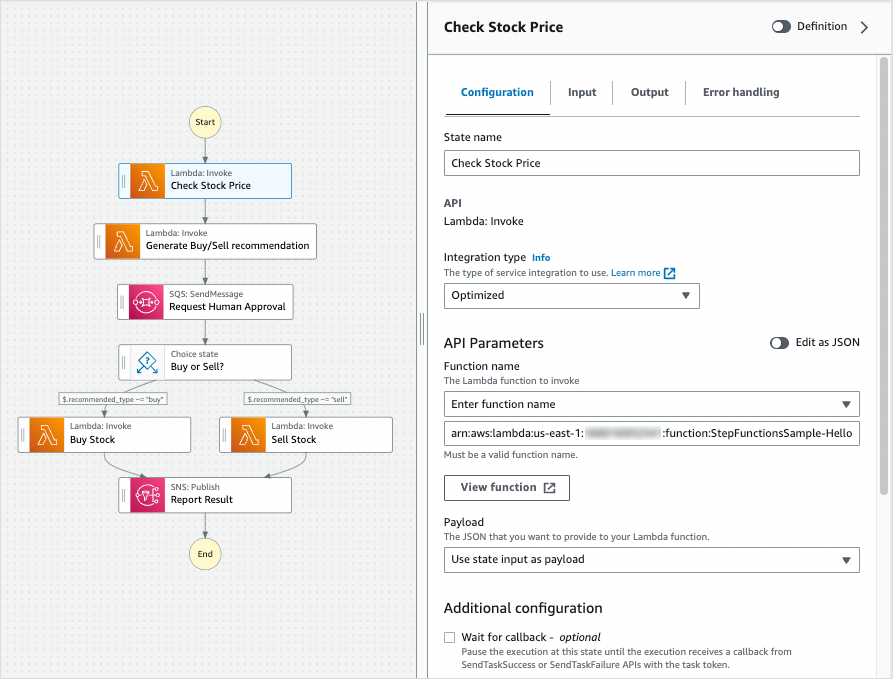
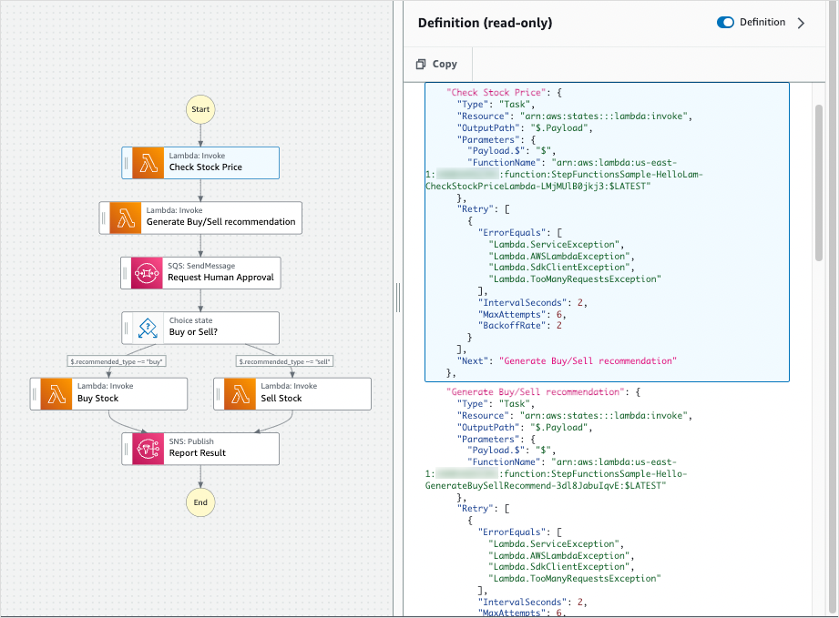
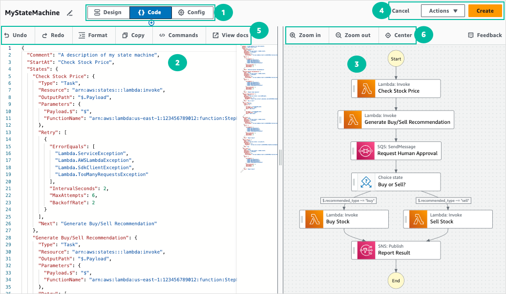

# Developing workflows in Step Functions Workflow Studio

When editing a workflow in the AWS Step Functions console, you'll use a visual tool called Workflow Studio. With Workflow Studio, you can drag-and-drop states onto a canvas to build your workflows. You can add, edit, and configure states, set input and output filters, transform results, and set up error handling.

As you modify states in your workflow, Workflow Studio will validate and auto-generate the state
machine definition. You can review the generated code, edit the configuration, and even
modify the text definition with the built-in code editor. When you're finished, you can save
your workflow, run it, and then examine the results.

You can access Workflow Studio from the Step Functions console, when you create or edit a workflow.

You can also use Workflow Studio from **within**
AWS Infrastructure Composer, a visual designer to create infrastructure as code with AWS Serverless Application Model
and AWS CloudFormation. To discover the benefits of this approach, see [Using Workflow Studio in Infrastructure Composer](use-wfs-in-app-composer.md "use-wfs-in-app-composer.md").

Workflow Studio has three modes: **Design**, **Code**, and
**Config**. In _Design mode_, you can
drag-and-drop states onto the canvas. _Code mode_ provides
a built-in code editor for editing your workflow definitions within the console. In
_Config mode_, you can manage your workflow
configuration.

###### Working with Workflow Studio in Visual Studio Code

With the AWS toolkit, you can use Workflow Studio from within VS Code to visualize, build, and even test individual states in your state machines. You provide state inputs and set variables, start the test, then you can see how your data is transformed. You can adjust the workflow and re-test. When finished, you can apply the changes to update the state machine. For more information, see [Working with Workflow Studio](../../../toolkit-for-vscode/latest/userguide/stepfunctions-workflowstudio.md "../../../toolkit-for-vscode/latest/userguide/stepfunctions-workflowstudio.md") in the AWS Toolkit for Visual Studio Code.

## Design mode

Design mode provides a graphical interface to visualize your workflows as you build
their prototypes. The following image shows the states browser, workflow canvas,
inspector, and contextual help panels in the **Design** mode of
Workflow Studio.

1. Mode buttons switch between the three modes. You cannot switch modes if your ASL workflow definition is invalid.
2. The [States browser](#workflow-studio-components-states "#workflow-studio-components-states") contains the following
   three tabs:
   - The **Actions** tab provides a list of AWS APIs
     that you can drag and drop into your workflow graph in the canvas.
     Each action represents a [Task workflow state](state-task.md "state-task.md") state.
   - The **Flow** tab provides a list of flow states
     that you can drag and drop into your workflow graph in the
     canvas.
   - The **Patterns** tab provides several
     ready-to-use, reusable building blocks that you can use for a
     variety of use cases. For example, you can use these patterns to
     iteratively process data in an Amazon S3 bucket.

3. The [Canvas and workflow
   graph](#workflow-studio-components-grapheditor "#workflow-studio-components-grapheditor") is where you drag
   and drop states into your workflow graph, change the order of states, and
   select states to configure or view.
4. The [Inspector
   panel](#workflow-studio-components-formdefinition "#workflow-studio-components-formdefinition") panel is where
   you can view and edit the properties of any state you've selected on the
   canvas. Turn on the **Definition** toggle to view the Amazon States Language
   code for your workflow, with the currently selected state highlighted.
5. **Info** links open a panel with contextual information
   when you need help. These panels also include links to related topics in the
   Step Functions documentation.
6. Design toolbar – Contains a set of buttons to perform common
   actions, such as undo, delete, and zoom in.
7. Utility buttons – A set of buttons to perform tasks, such as saving your workflows or exporting their ASL definitions in a JSON or YAML file.

### States browser

From the States browser, you can select states to drag and drop on to your
workflow canvas. The **Actions** tab provides a list of task states
that connect to 3rd party HTTP endpoints and AWS APIs. The
**Flow** tab provides a list of states with which you can direct
and control your workflow. Flow states include: Choice, Parallel, Map, Pass, Wait,
Success, and Fail. The **Patterns** tab provides ready-to-use,
reusable pre-defined building blocks. You can search among all state types with the
search box at the top of the panel.

### Canvas and workflow

graph

After you choose a state to add to your workflow, you can drag it to the
canvas and drop it into your workflow graph. You can also drag and drop states to
move them within your workflow. If your workflow is large, you can zoom in or out to
view different parts of your workflow graph in the canvas.

### Inspector

panel

You can configure any states that you add to your workflow from the
**Inspector** panel on the right. Choose the state you want to
configure, and you will see its configuration options in the
**Inspector** panel. To see the auto-generated [ASL definition](concepts-amazon-states-language.md "concepts-amazon-states-language.md")
for your workflow code, turn on the **Definition** toggle. The ASL
definition associated with the state you've selected will appear highlighted.

## Code mode

In **Code** mode of Workflow Studio, you can use an integrated code editor to
view, write, and edit the [Using Amazon States Language to define Step Functions workflows](concepts-amazon-states-language.md "concepts-amazon-states-language.md") (ASL) definition of your workflows
within the Step Functions console. The following screenshot shows the components in the
**Code** mode.

1. Mode buttons switch between the three modes. You cannot switch modes if your ASL workflow definition is invalid.
2. The [Code editor](#wfs-interface-code-editor "#wfs-interface-code-editor") is where you write and edit the
   [ASL definition](concepts-amazon-states-language.md "concepts-amazon-states-language.md") of your workflows within the Workflow Studio. The code editor
   also provides features, such as syntax highlighting and
   auto-completion.
3. [Graph visualization](#wfs-interface-code-graph-viz "#wfs-interface-code-graph-viz") – Shows a real-time
   graphical visualization of your workflow.
4. Utility buttons – A set of buttons to perform tasks, such as saving your workflows or exporting their ASL definitions in a JSON or YAML file.
5. Code toolbar – Contains a set of buttons to perform common actions,
   such as undoing an action or formatting the code.
6. Graph toolbar – Contains a set of buttons to perform common
   actions, such as zooming in and zooming out the workflow graph.

### Code editor

The code editor provides an IDE-like experience to write and edit your
workflow definitions using JSON within the Workflow Studio. The code editor includes
several features, such as syntax highlighting, auto-complete suggestions,
[ASL definition](concepts-amazon-states-language.md "concepts-amazon-states-language.md") validation, and context-sensitive help display. As you
update your workflow definition, the [Graph visualization](#wfs-interface-code-graph-viz "#wfs-interface-code-graph-viz") renders a real-time graph of your
workflow. You can also see the updated workflow graph in the [Design mode](#wfs-interface-design-mode "#wfs-interface-design-mode").

If you select a state in the [Design mode](#wfs-interface-design-mode "#wfs-interface-design-mode") or the graph visualization pane, the
ASL definition of that state appears highlighted in the code editor. The ASL
definition of your workflow is automatically updated if you reorder, delete, or
add a state in the **Design** mode or the graph visualization
pane.

The code editor can make suggestions to auto-complete fields and
states.

- To see a list of fields you can include within a specific state, press
  `Ctrl+Space`.
- To generate a code snippet for a new state in your workflow press
  `Ctrl+Space` after the current state's
  definition.
- To display a list of all available commands and **keyboard shortcuts**, press `F1`.

### Graph visualization

The graph visualization panel shows your workflow in a graphical format. When you
write your workflow definitions in the [Code editor](#wfs-interface-code-editor "#wfs-interface-code-editor") of Workflow Studio, the graph visualization pane
renders a real-time graph of your workflow.

As you reorder, delete, or duplicate a state in the graph visualization pane, the
workflow definition in the Code editor is automatically updated. Similarly, as you
update your workflow definitions, reorder, delete, or add a state in the Code
editor, the visualization is automatically updated.

If the JSON in the ASL definition of your workflow is invalid, the graph
visualization panel pauses the rendering and displays a status message at the
bottom of the pane.

## Config mode

In the **Config** mode of Workflow Studio, you can manage the general
configuration of your state machines. In this mode, you can specify settings, such as
the following:

- **Details**: Set the workflow **name** and **type**. Note that both
  **cannot** be changed after you create the state
  machine.
- **Permissions** : you can create a new role (recommended),
  choose an existing role, or enter an ARN for a specific role. If you select the
  option to create a new role, Step Functions creates an execution role for your state
  machines using least privileges. The generated IAM roles are valid for the
  AWS Region in which you create the state machine. Prior to creation, you can
  review the permissions that Step Functions will automatically generate for your state
  machine.
- **Logging**: You can enable and set a log level for your
  state machine. Step Functions logs the execution history events based on your selection.
  You can optionally use a customer managed key to encrypt your logs. For more
  information about log levels, see [Log levels for Step Functions execution events](cw-logs.md#cloudwatch-log-level "cw-logs.md#cloudwatch-log-level").

In **Additional configuration**, you can set one or more of the following
**optional** configuration options:

- **Enable X-Ray tracing**: You can send traces to
  X-Ray for state machine executions, even when a trace ID is not
  passed by an upstream service. For more information, see [Trace Step Functions request data in AWS X-Ray](concepts-xray-tracing.md "concepts-xray-tracing.md").
- **Publish version on creation**: A
  _version_ is a numbered, immutable snapshot of a state
  machine that you can run. Choose this option to publish a version of your state
  machine while creating the state machine. Step Functions publishes version 1 as the first
  revision of the state machine. For more information about versions, see [State machine versions in Step Functions workflows](concepts-state-machine-version.md "concepts-state-machine-version.md").
- **Encrypt with customer managed key** : You can
  provide a key that you mange directly to encrypt your data. For information, see [Data at rest encryption](encryption-at-rest.md "encryption-at-rest.md")
- **Tags**: Choose this box to add tags that can help you track
  and manage the costs associated with your resources, and provide better security
  in your IAM policies. For more information about tags, see [Tagging state machines and activities in Step Functions](sfn-best-practices.md#concepts-tagging "sfn-best-practices.md#concepts-tagging").
