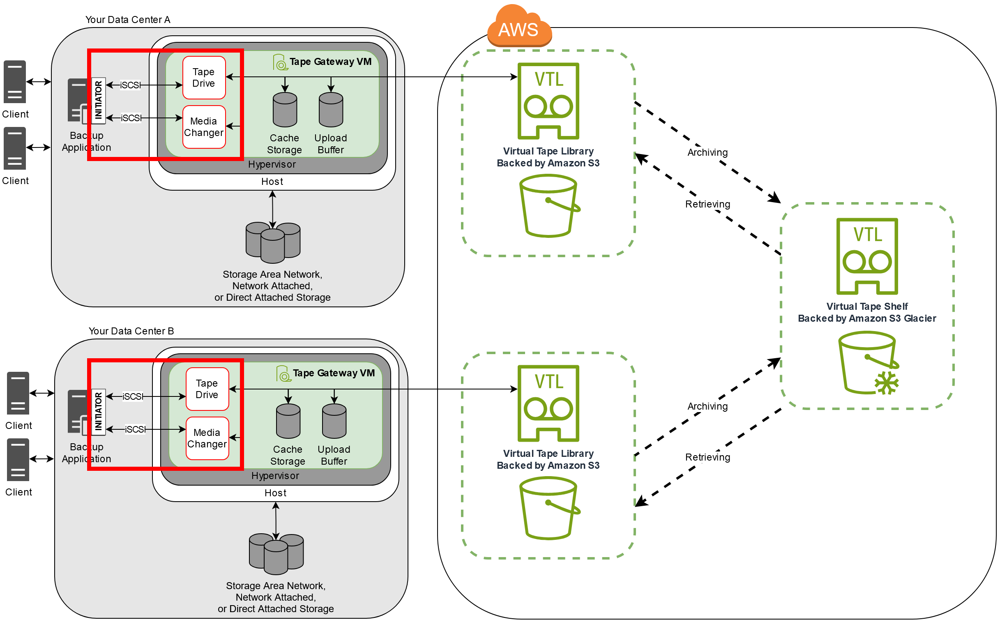

# Connecting your VTL devices to a Windows

client

A Tape Gateway exposes several tape drives and a media changer, referred to
collectively as VTL devices, as iSCSI targets. For more information, see [Requirements for setting up
Tape Gateway](Requirements.md "Requirements.md").

###### Note

You connect only one application to each iSCSI target.

The following diagram highlights the iSCSI target in the larger picture of the Storage Gateway
architecture. For more information on Storage Gateway architecture, see [How
Tape Gateway works (architecture)](StorageGatewayConcepts.md "StorageGatewayConcepts.md").

###### To connect your Windows client to the VTL devices

1. On the **Start** menu of your Windows client computer, enter
   `iscsicpl.exe` in the **Search Programs and
   files** box, locate the iSCSI initiator program, and then run
   it.

###### Note

You must have administrator rights on the client computer to run the iSCSI
initiator. 2. If prompted, choose **Yes** to start the Microsoft iSCSI
initiator service. 3. In the **iSCSI Initiator Properties** dialog box, choose the
**Discovery** tab, and then choose **Discover
Portal**. 4. In the **Discover Target Portal** dialog box, enter the IP
address of your Tape Gateway for **IP address or DNS name**,
and then choose **OK**. To get the IP address of your gateway,
check the **Gateway** tab on the Storage Gateway console. If you
deployed your gateway on an Amazon EC2 instance, you can find the public IP or DNS
address in the **Description** tab on the Amazon EC2 console.

###### Warning

For gateways that are deployed on an Amazon EC2 instance, accessing the gateway
over a public internet connection is not supported. The Elastic IP address
of the Amazon EC2 instance cannot be used as the target address. 5. Choose the **Targets** tab, and then choose
**Refresh**. All 10 tape drives and the media changer
appear in the **Discovered targets** box. The status for the
targets is **Inactive**. 6. Select the first device and choose **Connect**. You connect
the devices one at a time. 7. In the **Connect to Target** dialog box, choose
**OK**. 8. Repeat steps 6 and 7 for each of the devices to connect all of them, and then
choose **OK** in the **iSCSI Initiator
Properties** dialog box.
On a Windows client, the driver provider for the tape drive must be Microsoft. Use the
following procedure to verify the driver provider, and update the driver and provider if
necessary.

###### To verify the driver provider and (if necessary) update the provider and driver

on a Windows client

1. On your Windows client, start Device Manager.
2. Expand **Tape drives**, choose the context (right-click) menu
   for a tape drive, and choose **Properties**.
3. In the **Driver** tab of the **Device
   Properties** dialog box, verify that **Driver
   Provider** is **Microsoft**.
4. If **Driver Provider** is not **Microsoft**,
   set the value as follows:
   1. Choose **Update Driver**.
   2. In the **Update Driver Software** dialog box, choose
      **Browse my computer for driver software**.
   3. In the **Update Driver Software** dialog box, choose
      **Let me pick from a list of device drivers on my
      computer**.
   4. Select **LTO Tape drive** and choose
      **Next**.
   5. Choose **Close** to close the
      **Update Driver Software** window, and verify that
      the **Driver Provider** value is now set to
      **Microsoft**.

5. Repeat steps 4.1 through 4.5 to update all the tape drives.
