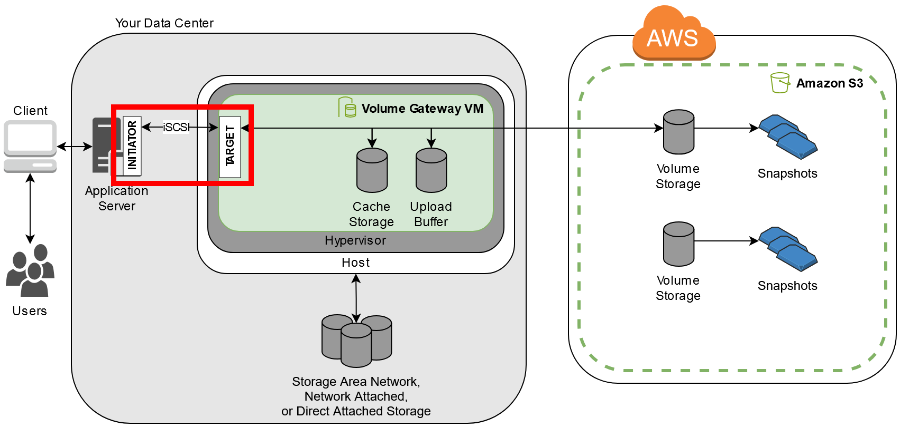

# Connecting to your volumes from a Windows

client

A Volume Gateway exposes volumes you have created for the gateway as iSCSI targets.
For more information, see [Connecting your volumes to your client](GettingStartedAccessVolumes.md "GettingStartedAccessVolumes.md").

###### Note

To connect to your volume target, your gateway must have an upload buffer
configured. If an upload buffer is not configured for your gateway, then the status
of your volumes is displayed as UPLOAD BUFFER NOT CONFIGURED. To configure an upload
buffer for a gateway in a stored volumes setup, see [To configure additional upload
buffer or cache storage for your gateway](ConfiguringLocalDiskStorage.md#GatewayWorkingStorageCachedTaskBuffer "ConfiguringLocalDiskStorage.md#GatewayWorkingStorageCachedTaskBuffer"). To configure an upload
buffer for a gateway in a cached volumes setup, see [To configure additional upload
buffer or cache storage for your gateway](ConfiguringLocalDiskStorage.md#GatewayWorkingStorageCachedTaskBuffer "ConfiguringLocalDiskStorage.md#GatewayWorkingStorageCachedTaskBuffer").

The following diagram highlights the iSCSI target in the larger picture of the Storage Gateway
architecture. For more information, see [How Volume Gateway
works](StorageGatewayConcepts.md "StorageGatewayConcepts.md").

You can connect to your volume from either a Windows or Red Hat Linux client. You can
optionally configure CHAP for either client type.

Your gateway exposes your volume as an iSCSI target with a name you specify, prepended
by `iqn.1997-05.com.amazon:`. For example, if you specify a target name of
`myvolume`, then the iSCSI target you use to connect to the volume is
`iqn.1997-05.com.amazon:myvolume`. For more information about how to
configure your applications to mount volumes over iSCSI, see Connecting to your volumes from a Windows
client.

| To                                                           | See                                                                                                                                       |
| ------------------------------------------------------------ | ----------------------------------------------------------------------------------------------------------------------------------------- | -------------------------------------------------------------------------------------------------------------------------------------------------------------------------------------------------------------------------------------------------------------------------------------------------------------------------------------------------------------------------------------------------------------------------------------------------------------------------------------------------------------------------------------------------------------------------------------------------------------------------------------------------------------------------------------------------------------------------------------------------------------------------------------------------------------------------------------------------------------------------------------------------------------------------------------------------------------------------------------------------------------------------------------------------------------------------------------------------------------------------------------------------------------------------------------------------------------------------------------------------------------------------------------------------------------------------------------------------------------------------------------------------------------------------------------------------------------------------------------------------------------------------------------------------------------------------------------------------------------------------------------------------------------------------------------------------------------------------------------------------------------------------------------------------------------------------------------------------------------------------------------------------------------------------------------------------------------------------------------------------------------------------------------------------------------------------------------------------------------------------------------------------------------------------------------------------------------------------------------------------------------------------------------------------------------------------------------------------------------------------------------------------------------------------------------------------------------------------------------------------------------------------- |
| Connect to your volume from Windows.                         | [Connecting to a Microsoft Windows Client](GettingStarted-use-volumes.md#issci-windows "GettingStarted-use-volumes.md#issci-windows")     |
| Connect to your volume from Red Hat Linux.                   | [Connecting to a Red Hat Enterprise Linux Client](GettingStarted-use-volumes.md#issci-rhel "GettingStarted-use-volumes.md#issci-rhel")    |
| Configure CHAP authentication for Windows and Red Hat Linux. | [Configuring CHAP Authentication for Your iSCSI Targets](ConfiguringiSCSIClientInitiatorCHAP.md "ConfiguringiSCSIClientInitiatorCHAP.md") | ###### To connect your Windows client to a storage volume 1. On the **Start** menu of your Windows client computer, enter `iscsicpl.exe` in the **Search Programs and files** box, locate the iSCSI initiator program, and then run it. ###### Note You must have administrator rights on the client computer to run the iSCSI initiator. 2. If prompted, choose **Yes** to start the Microsoft iSCSI initiator service. 3. In the **iSCSI Initiator Properties** dialog box, choose the **Discovery** tab, and then choose **Discover Portal**. 4. In the **Discover Target Portal** dialog box, enter the IP address of your iSCSI target for **IP address or DNS name**, and then choose **OK**. To get the IP address of your gateway, check the **Gateway** tab on the Storage Gateway console. If you deployed your gateway on an Amazon EC2 instance, you can find the public IP or DNS address in the **Description** tab on the Amazon EC2 console. The IP address now appears in the **Target portals** list on the **Discovery** tab. ###### Warning For gateways that are deployed on an Amazon EC2 instance, accessing the gateway over a public internet connection is not supported. The Elastic IP address of the Amazon EC2 instance cannot be used as the target address. 5. Connect the new target portal to the storage volume target on the gateway: 1. Choose the **Targets** tab. The new target portal is shown with an inactive status. The target name shown should be the same as the name that you specified for your storage volume in step 1. 2. Select the target, and then choose **Connect**. If the target name is not populated already, enter the name of the target as shown in step 1. In the **Connect to Target** dialog box, select **Add this connection to the list of Favorite Targets**, and then choose **OK**. 3. In the **Targets** tab, ensure that the target **Status** has the value **Connected**, indicating the target is connected, and then choose **OK**. You can now initialize and format this storage volume for Windows so that you can begin saving data on it. You do this by using the Windows Disk Management tool. ###### Note Although it is not required for this exercise, we highly recommend that you customize your iSCSI settings for a real-world application as discussed in [Customizing Your Windows iSCSI Settings](recommendediSCSISettings.md#CustomizeWindowsiSCSISettings "recommendediSCSISettings.md#CustomizeWindowsiSCSISettings"). |
