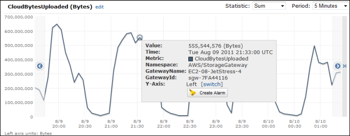

# Measuring Performance Between Your Gateway and

AWS

Data throughput, data latency, and operations per second are three measures that you
can use to understand how your application storage using the Storage Gateway is performing.
These three values can be measured using the Storage Gateway metrics provided for you when
you use the correct aggregation statistic. The following table summarizes the metrics
and corresponding statistic to use to measure the throughput, latency, and input/output
operations per second (IOPS) between your gateway and AWS.

| Item of Interest       | How to Measure                                                                                                                                                                                                                                                                                        |
| ---------------------- | ----------------------------------------------------------------------------------------------------------------------------------------------------------------------------------------------------------------------------------------------------------------------------------------------------- | ----------------------------------------------------------------------------------------------------------------------------------------------------------------------------------------------------------------------------------------------------------------------------------------------------------------------------------------------------------------------------------------------------------------------------------------------------------------------------------------------------------------------------------------------------------------------------------------------------------------------------------------------------------------------------------------------------------------------------------------------------------------------------------------------------------------------------------------------------------------------------------------------------------------------------------------------------------------------------------------------------------------------------------------------------------------------------------------------------------------------------------------------------------------------------------------------------------------------------------------------------------------------------------------------------------------------------------------------------------------------------------------------------------------------------------------------------------------------------------------------------------------------------------------------------------------------------------------------------------------------------------------------------------------------------------------------------------------------------------------------------------------------------------------------------------------------------------------------------------------------------------------------------------------------------------------------------------------------------------------------------------------------------------------------------------------------------------------------------------------------------------------------------------------------------------------------------------------------------------------------------------------------------------------------------------------------------------------------------------------------------------------------------------------------------------------------------------------------------------------------------------------------------------------------------------------------------------------------------------------------------------------------------------------------------------------------------------------------------------------------------------------------------------------------------------------------------------------------------------------------------------------------------------------------------------------------------------------------------------------------------------------------------------------------------------------------------------------------------------------------------------------------------------------------------------------------------------------------------------------------------------------------------------------------------------------------------------------------------------------------------------------------------------------------------------------------------------------------------------------------------------------------------------------------------------------------------------------------------------------------------------------------------------------------------------------------------------------------------------------------------------------------------------------------------------------------------------------------------------------------------------------------------------------------------------------------------------------------------------------------------------------------------------------------------------------------------------------------------------------------------------------------------------------------------------------------------------------------------------------------------------------------------------------------------------------------------------------------------------------------------------------------------------------------------------------------------------------------------------------------------------------------------------------------------------------------------------------------------------------------------------------------------------------------------------------------------- |
| Throughput             | Use the `ReadBytes` and `WriteBytes` metrics with the `Sum` CloudWatch statistic. For example, the `Sum` value of the `ReadBytes` metric over a sample period of 5 minutes divided by 300 seconds gives you the throughput as a rate in bytes per second.                                             |
| Latency                | Use the `ReadTime` and `WriteTime` metrics with the `Average` CloudWatch statistic. For example, the `Average` value of the `ReadTime` metric gives you the latency per operation over the sample period of time.                                                                                     |
| IOPS                   | Use the `ReadBytes` and `WriteBytes` metrics with the `Samples` CloudWatch statistic. For example, the `Samples` value of the `ReadBytes` metric over a sample period of 5 minutes divided by 300 seconds gives you IOPS.                                                                             |
| Throughput to AWS      | Use the `CloudBytesDownloaded` and `CloudBytesUploaded` metrics with the `Sum` CloudWatch statistic. For example, the `Sum` value of the `CloudBytesDownloaded` metric over a sample period of 5 minutes divided by 300 seconds gives you the throughput from AWS to the gateway as bytes per second. |
| Latency of data to AWS | Use the `CloudDownloadLatency` metric with the `Average` statistic. For example, the `Average` statistic of the `CloudDownloadLatency` metric gives you the latency per operation.                                                                                                                    | ###### To measure the upload data throughput from a gateway to AWS 1. Open the CloudWatch console at [https://console.aws.amazon.com/cloudwatch/](https://console.aws.amazon.com/cloudwatch/ "https://console.aws.amazon.com/cloudwatch/"). 2. Choose **Metrics**, then choose the **All metrics** tab and then choose **Storage Gateway**. 3. Choose the **Gateway metrics** dimension, and find the volume that you want to work with. 4. Choose the `CloudBytesUploaded` metric. 5. For **Time Range**, choose a value. 6. Choose the `Sum` statistic. 7. For **Period**, choose a value of 5 minutes or greater. 8. In the resulting time-ordered set of data points, divide each data point by the period (in seconds) to get the throughput at that sample period. Moving the cursor over a data point displays information about the data point, including its value and bytes uploaded. Divide this value by the **Period** value (5 minutes) to get the throughput at that sample point. For example, if the throughput from the gateway to AWS is 555,544,576 bytes over a period of 300 seconds, then the approximate throughput per second is 1.85 megabytes per second.  ###### To measure the latency per operation of a gateway 1. Open the CloudWatch console at [https://console.aws.amazon.com/cloudwatch/](https://console.aws.amazon.com/cloudwatch/ "https://console.aws.amazon.com/cloudwatch/"). 2. Choose **Metrics**, then choose the **All metrics** tab and then choose **Storage Gateway**. 3. Choose the **Gateway metrics** dimension, and find the volume that you want to work with. 4. Choose the `ReadTime` and `WriteTime` metrics. 5. For **Time Range**, choose a value. 6. Choose the `Average` statistic. 7. For **Period**, choose a value of 5 minutes to match the default reporting time. 8. In the resulting time-ordered set of points (one for `ReadTime` and one for `WriteTime`), add data points at the same time sample to get to the total latency in milliseconds. ###### To measure the data latency from a gateway to AWS 1. Open the CloudWatch console at [https://console.aws.amazon.com/cloudwatch/](https://console.aws.amazon.com/cloudwatch/ "https://console.aws.amazon.com/cloudwatch/"). 2. Choose **Metrics**, then choose the **All metrics** tab and then choose **Storage Gateway**. 3. Choose the **Gateway metrics** dimension, and find the volume that you want to work with. 4. Choose the `CloudDownloadLatency` metric. 5. For **Time Range**, choose a value. 6. Choose the `Average` statistic. 7. For **Period**, choose a value of 5 minutes to match the default reporting time. The resulting time-ordered set of data points contains the latency in milliseconds. ###### To set an upper threshold alarm for a gateway's throughput to AWS 1. Open the CloudWatch console at [https://console.aws.amazon.com/cloudwatch/](https://console.aws.amazon.com/cloudwatch/ "https://console.aws.amazon.com/cloudwatch/"). 2. Choose **Alarms**. 3. Choose **Create Alarm** to start the Create Alarm wizard. 4. Choose the **Storage Gateway** dimension, and find the gateway that you want to work with. 5. Choose the `CloudBytesUploaded` metric. 6. To define the alarm, define the alarm state when the `CloudBytesUploaded` metric is greater than or equal to a specified value for a specified time. For example, you can define an alarm state when the `CloudBytesUploaded` metric is greater than 10 MB for 60 minutes. 7. Configure the actions to take for the alarm state. For example, you can have an email notification sent to you. 8. Choose **Create Alarm**. ###### To set an upper threshold alarm for reading data from AWS 1. Open the CloudWatch console at [https://console.aws.amazon.com/cloudwatch/](https://console.aws.amazon.com/cloudwatch/ "https://console.aws.amazon.com/cloudwatch/"). 2. Choose **Create Alarm** to start the Create Alarm wizard. 3. Choose the **StorageGateway: Gateway Metrics** dimension, and find the gateway that you want to work with. 4. Choose the `CloudDownloadLatency` metric. 5. Define the alarm by defining the alarm state when the `CloudDownloadLatency` metric is greater than or equal to a specified value for a specified time. For example, you can define an alarm state when the `CloudDownloadLatency` is greater than 60,000 milliseconds for greater than 2 hours. 6. Configure the actions to take for the alarm state. For example, you can have an email notification sent to you. 7. Choose **Create Alarm**. |
