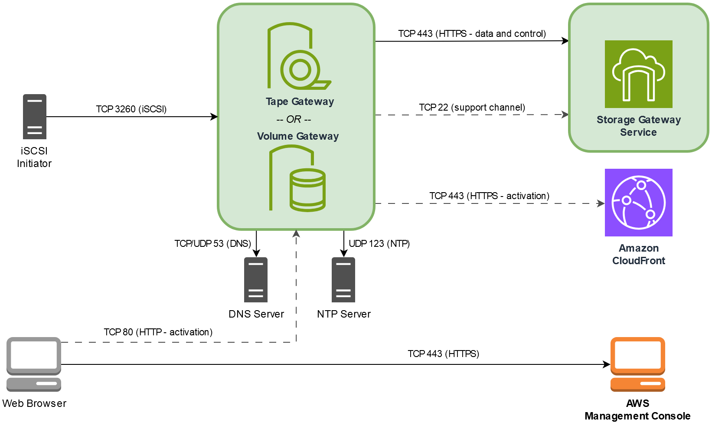
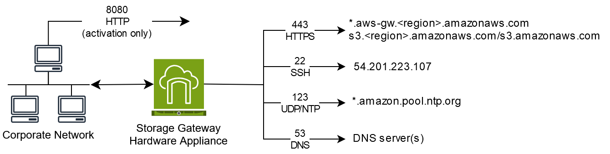

# Requirements for setting up

Volume Gateway

Unless otherwise noted, the following requirements are common to all gateway
configurations.

###### Topics

- [Hardware and storage
  requirements](#requirements-hardware-storage "#requirements-hardware-storage")
- [Network and firewall requirements](#networks "#networks")
- [Supported hypervisors and host requirements](#requirements-host "#requirements-host")
- [Supported iSCSI initiators](#requirements-iscsi-initiators "#requirements-iscsi-initiators")

## Hardware and storage

requirements

This section describes the minimum hardware and settings for your gateway and the
minimum amount of disk space to allocate for the required storage.

### Hardware requirements for VMs

When deploying your gateway, you must make sure that the underlying hardware on
which you deploy the gateway VM can dedicate the following minimum resources:

- Four virtual processors assigned to the VM.
- For Volume Gateway, your hardware should dedicate
  the following amounts of RAM:
  - 16 GiB of reserved RAM for gateways with cache size up to 16
    TiB
  - 32 GiB of reserved RAM for gateways with cache size 16 TiB to 32
    TiB
  - 48 GiB of reserved RAM for gateways with cache size 32 TiB to 64
    TiB

- 80 GiB of disk space for installation of VM image and system data.

For more information, see [Optimizing gateway performance](Performance.md#Optimizing-common "Performance.md#Optimizing-common"). For information about how your hardware
affects the performance of the gateway VM, see [AWS Storage Gateway quotas](resource-gateway-limits.md "resource-gateway-limits.md").

### Requirements for Amazon EC2 instance

types

When deploying your gateway on Amazon Elastic Compute Cloud (Amazon EC2), the instance size must be at
least **xlarge** for your gateway to function. However,
for the compute-optimized instance family the size must be at least **2xlarge**.

###### Note

The Storage Gateway AMI is only compatible with x86-based instances that use Intel or
AMD processors. ARM-based instances that use Graviton processors are not
supported.

For Volume Gateway, your Amazon EC2 instance should dedicate the following
amounts of RAM depending on the cache size you plan to use for your gateway:

- 16 GiB of reserved RAM for gateways with cache size up to 16 TiB
- 32 GiB of reserved RAM for gateways with cache size 16 TiB to 32
  TiB
- 48 GiB of reserved RAM for gateways with cache size 32 TiB to 64
  TiB

Use one of the following instance types recommended for your gateway type.

Recommended for
cached volumes

- General-purpose instance family – **m5 or
  m6** instance type.
- Compute-optimized instance family – **c5, c6, or
  c7** instance types. Choose the **2xlarge**
  instance size or higher to meet the required RAM requirements.
- Memory-optimized instance family – **r5, r6, or
  r7** instance types.
- Storage-optimized instance family – **i3, i4, or
  i7** instance types.

### Storage requirements

In addition to 80 GiB disk space for the VM, you also need additional disks for
your gateway.

The following table recommends sizes for local disk storage for your deployed
gateway.

| Gateway Type          | Cache (Minimum) | Cache (Maximum) | Upload Buffer (Minimum) | Upload Buffer (Maximum) | Other Required Local Disks             |
| --------------------- | --------------- | --------------- | ----------------------- | ----------------------- | -------------------------------------- |
| Cached Volume Gateway | 150 GiB         | 64 TiB          | 150 GiB                 | 2 TiB                   | —                                      |
| Stored Volume Gateway | —               | —               | 150 GiB                 | 2 TiB                   | 1 or more for stored volume or volumes |

###### Note

You can configure one or more local drives for your cache and upload buffer,
up to the maximum capacity.

When adding cache or upload buffer to an existing gateway, it's important
to create new disks in your host (hypervisor or Amazon EC2 instance). Don't
change the size of existing disks if the disks have been previously allocated as
either a cache or upload buffer.

For information about gateway quotas, see [AWS Storage Gateway quotas](resource-gateway-limits.md "resource-gateway-limits.md").

## Network and firewall requirements

Your gateway requires access to the internet, local networks, Domain Name Service
(DNS) servers, firewalls, routers, and so on. Following, you can find information about
required ports and how to allow access through firewalls and routers.

###### Note

In some cases, you might deploy Storage Gateway on Amazon EC2 or use other types of deployment
(including on-premises) with network security policies that restrict AWS IP
address ranges. In these cases, your gateway might experience service connectivity
issues when the AWS IP range values changes. The AWS IP address range values
that you need to use are in the Amazon service subset for the AWS Region that you
activate your gateway in. For the current IP range values, see [AWS IP address
ranges](../../../general/latest/gr/aws-ip-ranges.md "../../../general/latest/gr/aws-ip-ranges.md") in the _AWS General Reference_.

###### Note

Network bandwidth requirements vary based on the quantity of data that is uploaded
and downloaded by the gateway. A minimum of 100Mbps is required to successfully
download, activate, and update the gateway. Your data transfer patterns will
determine the bandwidth necessary to support your workload. In some cases, you might
deploy Storage Gateway on Amazon EC2 or use other types of deployment

###### Topics

- [Port requirements](#requirements-network "#requirements-network")
- [Networking and firewall
  requirements for the Storage Gateway Hardware Appliance](#appliance-network-requirements "#appliance-network-requirements")
- [Allowing AWS Storage Gateway access through
  firewalls and routers](#allow-firewall-gateway-access "#allow-firewall-gateway-access")
- [Configuring security groups for your
  Amazon EC2 gateway instance](#EC2GatewayCustomSecurityGroup-common "#EC2GatewayCustomSecurityGroup-common")

### Port requirements

Volume Gateway requires specific ports to be allowed through your
network security for successful deployment and operation. Some ports are required
for all gateways, while others are required only for specific configurations, such
as when connecting to VPC endpoints.

Port requirements for Volume Gateway

| Network Element   | From               | To                                 | Protocol      | Port | Inbound | Outbound | Required | Notes                                                                                                                                                                                                                                                                                                                                                                                                                                                                     |
| ----------------- | ------------------ | ---------------------------------- | ------------- | ---- | ------- | -------- | -------- | ------------------------------------------------------------------------------------------------------------------------------------------------------------------------------------------------------------------------------------------------------------------------------------------------------------------------------------------------------------------------------------------------------------------------------------------------------------------------- |
| Web browser       | Your web browser   | Storage Gateway VM                 | TCP HTTP      | 80   | ✓       | ✓        | ✓        | Used by local systems to obtain the Storage Gateway activation key. Port 80 is used only during activation of a Storage Gateway appliance.<br>A Storage Gateway VM doesn't require port 80 to be publicly accessible. The required level of access to port 80 depends on your network configuration. If you activate your gateway from the Storage Gateway Management Console, the host from which you connect to the console must have access to your gateway's port 80. |
| Web browser       | Storage Gateway VM | AWS                                | TCP HTTPS     | 443  | ✓       | ✓        | ✓        | AWS Management Console (all other operations)                                                                                                                                                                                                                                                                                                                                                                                                                             |
| DNS               | Storage Gateway VM | Domain Name Service (DNS) server   | TCP & UDP DNS | 53   | ✓       | ✓        | ✓        | Used for communication between a Storage Gateway VM and the DNS server for IP name resolution.                                                                                                                                                                                                                                                                                                                                                                            |
| NTP               | Storage Gateway VM | Network Time Protocol (NTP) server | TCP & UDP NTP | 123  | ✓       | ✓        | ✓        | Used by on-premises systems to synchronize VM time to the host time. A Storage Gateway VM is configured to use the following NTP servers:<br>• 0.amazon.pool.ntp.org<br>• 1.amazon.pool.ntp.org<br>• 2.amazon.pool.ntp.org<br>• 3.amazon.pool.ntp.org<br>NoteNot required for gateways hosted on Amazon EC2.                                                                                                                                                              |
| Storage Gateway   | Storage Gateway VM | Support Endpoint                   | TCP SSH       | 22   | ✓       | ✓        | ✓        | Allows Support to access your gateway to help you with troubleshooting gateway issues. You don't need this port open for the normal operation of your gateway, but it is required for troubleshooting. For a list of support endpoints, see [Support endpoints](../../../general/latest/gr/awssupport.md "../../../general/latest/gr/awssupport.md").                                                                                                                     |
| Storage Gateway   | Storage Gateway VM | AWS                                | TCP HTTPS     | 443  | ✓       | ✓        | ✓        | Management control                                                                                                                                                                                                                                                                                                                                                                                                                                                        |
| Amazon CloudFront | Storage Gateway VM | AWS                                | TCP HTTPS     | 443  | ✓       | ✓        | ✓        | For activation                                                                                                                                                                                                                                                                                                                                                                                                                                                            |
| VPC               | Storage Gateway VM | AWS                                | TCP HTTPS     | 443  | ✓       | ✓        | ✓\*      | Management control<br>\*Required only when using VPC endpoints                                                                                                                                                                                                                                                                                                                                                                                                            |
| VPC               | Storage Gateway VM | AWS                                | TCP HTTPS     | 1026 |         | ✓        | ✓\*      | Control Plane endpoint<br>\*Required only when using VPC endpoints                                                                                                                                                                                                                                                                                                                                                                                                        |
| VPC               | Storage Gateway VM | AWS                                | TCP HTTPS     | 1027 |         | ✓        | ✓\*      | Anon Control Plane (for activation)<br>\*Required only when using VPC endpoints                                                                                                                                                                                                                                                                                                                                                                                           |
| VPC               | Storage Gateway VM | AWS                                | TCP HTTPS     | 1028 |         | ✓        | ✓\*      | Proxy endpoint<br>\*Required only when using VPC endpoints                                                                                                                                                                                                                                                                                                                                                                                                                |
| VPC               | Storage Gateway VM | AWS                                | TCP HTTPS     | 1031 |         | ✓        | ✓\*      | Data Plane<br>\*Required only when using VPC endpoints                                                                                                                                                                                                                                                                                                                                                                                                                    |
| VPC               | Storage Gateway VM | AWS                                | TCP HTTPS     | 2222 |         | ✓        | ✓\*      | SSH Support Channel for VPCe<br>\*Required only for opening support channel when using VPC endpoints                                                                                                                                                                                                                                                                                                                                                                      |
| VPC               | Storage Gateway VM | AWS                                | TCP HTTPS     | 443  | ✓       | ✓        | ✓\*      | Management control<br>\*Required only when using VPC endpoints                                                                                                                                                                                                                                                                                                                                                                                                            |
| iSCSI Client      | iSCSI client       | Storage Gateway VM                 | TCP           | 3260 | ✓       | ✓        | ✓        | For local systems to connect to iSCSI targets exposed by the gateway.                                                                                                                                                                                                                                                                                                                                                                                                     |

The following illustration shows network traffic flow for a basic Volume Gateway deployment.



### Networking and firewall

requirements for the Storage Gateway Hardware Appliance

Each Storage Gateway Hardware Appliance requires the following network services:

- **Internet access** – an always-on
  network connection to the internet through any network interface on the
  server.
- **DNS services** – DNS services for
  communication between the hardware appliance and DNS server.
- **Time synchronization** – an
  automatically configured Amazon NTP time service must be reachable.
- **IP address** – A DHCP or static IPv4
  address assigned. You cannot assign an IPv6 address.

There are five physical network ports at the rear of the Dell PowerEdge R640
server. From left to right (facing the back of the server) these ports are as
follows:

1. iDRAC
2. `em1`
3. `em2`
4. `em3`
5. `em4`

You can use the iDRAC port for remote server management.



A hardware appliance requires the following ports to operate.

| Protocol | Port | Direction | Source             | Destination             | How Used                  |
| -------- | ---- | --------- | ------------------ | ----------------------- | ------------------------- |
| SSH      | 22   | Outbound  | Hardware appliance | `54.201.223.107`        | Support channel           |
| DNS      | 53   | Outbound  | Hardware appliance | DNS servers             | Name resolution           |
| UDP/NTP  | 123  | Outbound  | Hardware appliance | `*.amazon.pool.ntp.org` | Time synchronization      |
| HTTPS    | 443  | Outbound  | Hardware appliance | `*.amazonaws.com`       | Data transfer             |
| HTTP     | 8080 | Inbound   | AWS                | Hardware appliance      | Activation (only briefly) |

To perform as designed, a hardware appliance requires network and firewall
settings as follows:

- Configure all connected network interfaces in the hardware console.
- Make sure that each network interface is on a unique subnet.
- Provide all connected network interfaces with outbound access to the
  endpoints listed in the diagram preceding.
- Configure at least one network interface to support the hardware
  appliance. For more information, see [Configuring hardware appliance network
  parameters](appliance-configure-network.md "appliance-configure-network.md").

###### Note

For an illustration showing the back of the server with its ports, see [Physically installing your hardware appliance](appliance-rack-mount.md "appliance-rack-mount.md")

All IP addresses on the same network interface (NIC), whether for a gateway or a
host, must be on the same subnet. The following illustration shows the addressing
scheme.


For more information on activating and configuring a hardware appliance, see [Using the Storage Gateway Hardware Appliance](hardware-appliance.md "hardware-appliance.md").

### Allowing AWS Storage Gateway access through

firewalls and routers

Your gateway requires access to the Storage Gateway service endpoints to communicate with
AWS. During gateway setup, select the endpoint type for your gateway based on your
network environment. If you use a firewall or router to filter or limit network
traffic, you must configure your firewall and router to allow these service
endpoints for outbound communication to AWS.

###### Note

If you configure private VPC endpoints for your Storage Gateway to use for connection
and data transfer to and from AWS, your gateway does not require access to the
public internet. For more information, see [Activating a
gateway in a virtual private cloud](gateway-private-link.md "gateway-private-link.md").

###### Important

Depending on your gateway's AWS Region, replace
`region` in the service endpoint with the correct
region string.

#### Endpoint types

###### Standard endpoints

These endpoints support IPv4 traffic between your gateway appliance and AWS.

The following service endpoint is required by all gateways for head-bucket operations.

```
bucket-name.s3.`region`.amazonaws.com:443
```

The following service endpoints are required by all gateways for control path
(`anon-cp`, `client-cp`, `proxy-app`) and data path (`dp-1`) operations.

```
anon-cp.storagegateway.`region`.amazonaws.com:443
client-cp.storagegateway.`region`.amazonaws.com:443
proxy-app.storagegateway.`region`.amazonaws.com:443
dp-1.storagegateway.`region`.amazonaws.com:443
```

The following gateway service endpoint is required to make API calls.

```
storagegateway.`region`.amazonaws.com:443
```

The following example is a gateway service endpoint in the US West (Oregon)
Region (`us-west-2`).

```
storagegateway.us-west-2.amazonaws.com:443
```

###### Dual-stack endpoints

These endpoints support both IPv4 and IPv6 traffic between your gateway appliance and AWS.

The following dual-stack service endpoint is required by all gateways for head-bucket operations.

```
bucket-name.s3.dualstack.`region`.amazonaws.com:443
```

The following dual-stack service endpoints are required by all gateways for control path
(activation, controlplane, proxy) and data path (dataplane) operations.

```
activation-storagegateway.`region`.api.aws:443
controlplane-storagegateway.`region`.api.aws:443
proxy-storagegateway.`region`.api.aws:443
dataplane-storagegateway.`region`.api.aws:443
```

The following gateway dual-stack service endpoint is required to make API calls.

```
storagegateway.`region`.api.aws:443
```

The following example is a gateway dual-stack service endpoint in the US West (Oregon)
Region (`us-west-2`).

```
storagegateway.us-west-2.api.aws:443
```

###### NTP Servers

A Storage Gateway VM requires network access to the following NTP servers.

```
time.aws.com
0.amazon.pool.ntp.org
1.amazon.pool.ntp.org
2.amazon.pool.ntp.org
3.amazon.pool.ntp.org
```

For a complete list of supported AWS Regions and service endpoints, see [Storage Gateway](../../../general/latest/gr/sg.md "../../../general/latest/gr/sg.md") in the
_AWS General Reference_.

### Configuring security groups for your

Amazon EC2 gateway instance

A security group controls traffic to your Amazon EC2 gateway instance. When you configure a
security group, we recommend the following:

- The security group should not allow incoming connections from the outside
  internet. It should allow only instances within the gateway security group to
  communicate with the gateway. If you need to allow instances to connect to the
  gateway from outside its security group, we recommend that you allow connections
  only on ports 3260 (for iSCSI connections) and 80 (for activation).
- If you want to activate your gateway from an Amazon EC2 host outside the gateway
  security group, allow incoming connections on port 80 from the IP address of that
  host. If you cannot determine the activating host's IP address, you can open port
  80, activate your gateway, and then close access on port 80 after completing
  activation.
- Allow port 22 access only if you are using Support for troubleshooting purposes. For
  more information, see [You want Support to help troubleshoot
  your EC2 gateway](troubleshooting-EC2-gateway-issues.md#EC2-EnableAWSSupportAccess "troubleshooting-EC2-gateway-issues.md#EC2-EnableAWSSupportAccess").

In some cases, you might use an Amazon EC2 instance as an initiator (that is, to connect to
iSCSI targets on a gateway that you deployed on Amazon EC2. In such a case, we recommend a
two-step approach:

1. You should launch the initiator instance in the same security group as your
   gateway.
2. You should configure access so the initiator can communicate with your
   gateway.

For information about the ports to open for your gateway, see [Port requirements](#requirements-network "#requirements-network").

## Supported hypervisors and host requirements

You can run Storage Gateway on-premises as either a virtual machine (VM) appliance, or a
physical hardware appliance, or in AWS as an Amazon EC2 instance.

###### Note

When a manufacturer ends general support for a hypervisor version, Storage Gateway
also ends support for that hypervisor version. For detailed information about
support for specific versions of a hypervisor, see the manufacturer's
documentation.

Storage Gateway supports the following hypervisor versions and hosts:

- VMware ESXi Hypervisor (version 7.0 or 8.0) – For this setup, you also
  need a VMware vSphere client to connect to the host.
- Microsoft Hyper-V Hypervisor (version 2019, 2022, or 2025) – For this
  setup, you need a Microsoft Hyper-V Manager on a Microsoft Windows client
  computer to connect to the host.
- Linux Kernel-based Virtual Machine (KVM) – A free, open-source
  virtualization technology. KVM is included in all versions of Linux version
  2.6.20 and newer. Storage Gateway is tested and supported for the CentOS/RHEL 7.7,
  Ubuntu 16.04 LTS, and Ubuntu 18.04 LTS distributions. Any other modern Linux
  distribution may work, but function or performance is not guaranteed. We
  recommend this option if you already have a KVM environment up and running and
  you are already familiar with how KVM works.
- Nutanix AHV (Acropolis Hypervisor) beginning with version 10.0.1.1 – A KVM-based virtualization platform that is integrated into the Nutanix hyper-converged infrastructure (HCI) solution.
- Amazon EC2 instance – Storage Gateway provides an Amazon Machine Image (AMI)
  that contains the gateway VM image. Only file, cached volume, and Tape Gateway
  types can be deployed on Amazon EC2. For information about how to deploy a gateway on
  Amazon EC2, see [Deploy a customized Amazon EC2 instance for
  Volume Gateway](ec2-gateway-common.md "ec2-gateway-common.md").
- Storage Gateway Hardware Appliance – Storage Gateway provides a physical
  hardware appliance as a on-premises deployment option for locations with limited
  virtual machine infrastructure.

###### Note

Storage Gateway doesn’t support recovering a gateway from a VM that was created from
a snapshot or clone of another gateway VM or from your Amazon EC2 AMI. If your gateway VM
malfunctions, activate a new gateway and recover your data to that gateway. For more
information, see [Recovering from an unexpected virtual
machine shutdown](best-practices.md#recover-from-gateway-shutdown "best-practices.md#recover-from-gateway-shutdown").

Storage Gateway doesn’t support dynamic memory and virtual memory ballooning.

## Supported iSCSI initiators

When you deploy a cached volume or stored Volume Gateway, you
can create iSCSI storage volumes on your gateway.

To connect to these iSCSI devices, Storage Gateway supports the following iSCSI
initiators:

- Microsoft Windows Server 2022
- Red Hat Enterprise Linux 8
- Red Hat Enterprise Linux 9
- VMware ESX Initiator, which provides an alternative to using initiators in
  the guest operating systems of your VMs

###### Important

Storage Gateway doesn't support Microsoft Multipath I/O (MPIO) from Windows
clients.

Storage Gateway supports connecting multiple hosts to the same volume if the hosts
coordinate access by using Windows Server Failover Clustering (WSFC). However, you
can't connect multiple hosts to that same volume (for example, sharing a
nonclustered NTFS/ext4 file system) without using WSFC.
