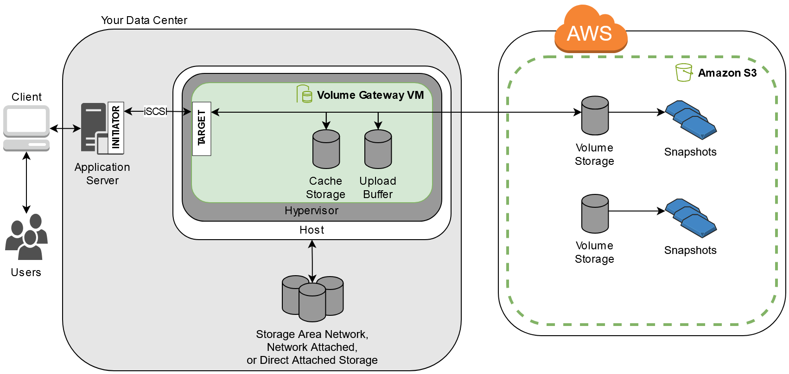
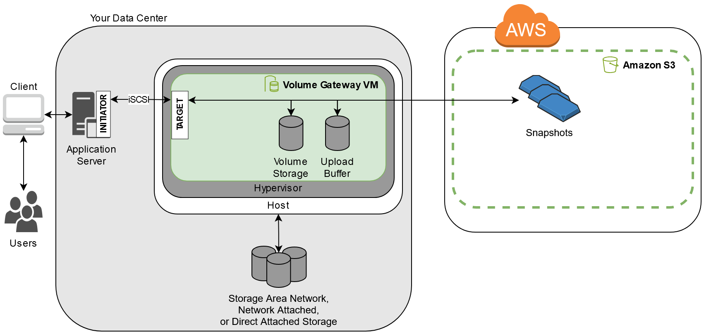

# How Volume Gateway

works

Following, you can find an architectural overview of the Volume Gateway
solution.

## Volume Gateways

For Volume Gateways, you can use either cached volumes or stored volumes.

###### Topics

- [Cached volumes
  architecture](#storage-gateway-cached-concepts "#storage-gateway-cached-concepts")
- [Stored volumes
  architecture](#storage-gateway-stored-volume-concepts "#storage-gateway-stored-volume-concepts")

### Cached volumes

architecture

By using cached volumes, you can use Amazon S3 as your primary data storage, while
retaining frequently accessed data locally in your Storage Gateway. Cached
volumes minimize the need to scale your on-premises storage infrastructure,
while still providing your applications with low-latency access to their
frequently accessed data. You can create storage volumes up to 32 TiB in size
and attach to them as iSCSI devices from your on-premises application servers.
Your gateway stores data that you write to these volumes in Amazon S3 and
retains recently read data in your on-premises Storage Gateway's cache and
upload buffer storage.

Cached volumes can range from 1 GiB to 32 TiB in size and must be rounded to
the nearest GiB. Each gateway configured for cached volumes can support up to 32
volumes for a total maximum storage volume of 1,024 TiB (1 PiB).

In the cached volumes solution, Storage Gateway stores all your on-premises
application data in a storage volume in Amazon S3. The following diagram provides an
overview of the cached volumes deployment.

After you install the Storage Gateway software appliance—the VM—on
a host in your data center and activate it, you use the AWS Management Console to provision
storage volumes backed by Amazon S3. You can also provision storage volumes
programmatically using the Storage Gateway API or the AWS SDK libraries. You then
mount these storage volumes to your on-premises application servers as iSCSI
devices.

You also allocate disks on-premises for the VM. These on-premises disks serve
the following purposes:

- Disks for use by the gateway as cache
  storage – As your applications write data to the
  storage volumes in AWS, the gateway first stores the data on the
  on-premises disks used for cache storage. Then the gateway uploads the
  data to Amazon S3. The cache storage acts as the on-premises durable store
  for data that is waiting to upload to Amazon S3 from the upload
  buffer.

The cache storage also lets the gateway store your application's
recently accessed data on-premises for low-latency access. If your
application requests data, the gateway first checks the cache storage
for the data before checking Amazon S3.

You can use the following guidelines to determine the amount of disk
space to allocate for cache storage. Generally, you should allocate at
least 20 percent of your existing file store size as cache storage.
Cache storage should also be larger than the upload buffer. This
guideline helps make sure that cache storage is large enough to
persistently hold all data in the upload buffer that has not yet been
uploaded to Amazon S3.

- Disks for use by the gateway as the upload
  buffer – To prepare for upload to Amazon S3, your gateway
  also stores incoming data in a staging area, referred to as an
  _upload buffer._ Your gateway uploads this buffer
  data over an encrypted Secure Sockets Layer (SSL) connection to AWS,
  where it is stored encrypted in Amazon S3.

You can take incremental backups, called _snapshots_, of
your storage volumes in Amazon S3. These point-in-time snapshots are also stored in
Amazon S3 as Amazon EBS snapshots. When you take a new snapshot, only the data that has
changed since your last snapshot is stored. When the snapshot is taken, the
gateway uploads the changes up to the snapshot point, then creates the new
snapshot using Amazon EBS. You can initiate snapshots on a scheduled or one-time
basis. A single volume supports queueing multiple snapshots in rapid succession,
but each snapshot must finish being created before the next can be taken. When
you delete a snapshot, only the data not needed for any other snapshots is
removed. For information about Amazon EBS snapshots, see [Amazon EBS
snapshots](../../../AWSEC2/latest/UserGuide/EBSSnapshots.md "../../../AWSEC2/latest/UserGuide/EBSSnapshots.md").

You can restore an Amazon EBS snapshot to a gateway storage volume if you need to
recover a backup of your data. Alternatively, for snapshots up to 16 TiB in
size, you can use the snapshot as a starting point for a new Amazon EBS volume. You
can then attach this new Amazon EBS volume to an Amazon EC2 instance.

All gateway data and snapshot data for cached volumes is stored in Amazon S3 and
encrypted at rest using server-side encryption (SSE). However, you can't
access this data with the Amazon S3 API or other tools such as the Amazon S3 Management
Console.

### Stored volumes

architecture

By using stored volumes, you can store your primary data locally, while
asynchronously backing up that data to AWS. Stored volumes provide your
on-premises applications with low-latency access to their entire datasets. At
the same time, they provide durable, offsite backups. You can create storage
volumes and mount them as iSCSI devices from your on-premises application
servers. Data written to your stored volumes is stored on your on-premises
storage hardware. This data is asynchronously backed up to Amazon S3 as Amazon Elastic Block Store
(Amazon EBS) snapshots.

Stored volumes can range from 1 GiB to 16 TiB in size and must be rounded to
the nearest GiB. Each gateway configured for stored volumes can support up to 32
volumes and a total volume storage of 512 TiB (0.5 PiB).

With stored volumes, you maintain your volume storage on-premises in your data
center. That is, you store all your application data on your on-premises storage
hardware. Then, using features that help maintain data security, the gateway
uploads data to the Amazon Web Services Cloud for cost-effective backup and rapid disaster
recovery. This solution is ideal if you want to keep data locally on-premises,
because you need to have low-latency access to all your data, and also to
maintain backups in AWS.

The following diagram provides an overview of the stored volumes
deployment.

After you install the Storage Gateway software appliance—the VM—on a host
in your data center and activated it, you can create gateway _storage
volumes_. You then map them to on-premises direct-attached storage
(DAS) or storage area network (SAN) disks. You can start with either new disks
or disks already holding data. You can then mount these storage volumes to your
on-premises application servers as iSCSI devices. As your on-premises
applications write data to and read data from a gateway's storage volume,
this data is stored and retrieved from the volume's assigned disk.

To prepare data for upload to Amazon S3, your gateway also stores incoming data in
a staging area, referred to as an _upload buffer_. You can
use on-premises DAS or SAN disks for working storage. Your gateway uploads data
from the upload buffer over an encrypted Secure Sockets Layer (SSL) connection
to the Storage Gateway service running in the Amazon Web Services Cloud. The service then stores
the data encrypted in Amazon S3.

You can take incremental backups, called _snapshots_, of
your storage volumes. The gateway stores these snapshots in Amazon S3 as Amazon EBS
snapshots. When you take a new snapshot, only the data that has changed since
your last snapshot is stored. When the snapshot is taken, the gateway uploads
the changes up to the snapshot point, then creates the new snapshot using Amazon EBS.
You can initiate snapshots on a scheduled or one-time basis. A single volume
supports queueing multiple snapshots in rapid succession, but each snapshot must
finish being created before the next can be taken. When you delete a snapshot,
only the data not needed for any other snapshot is removed.

You can restore an Amazon EBS snapshot to an on-premises gateway storage volume if
you need to recover a backup of your data. You can also use the snapshot as a
starting point for a new Amazon EBS volume, which you can then attach to an Amazon EC2
instance.
